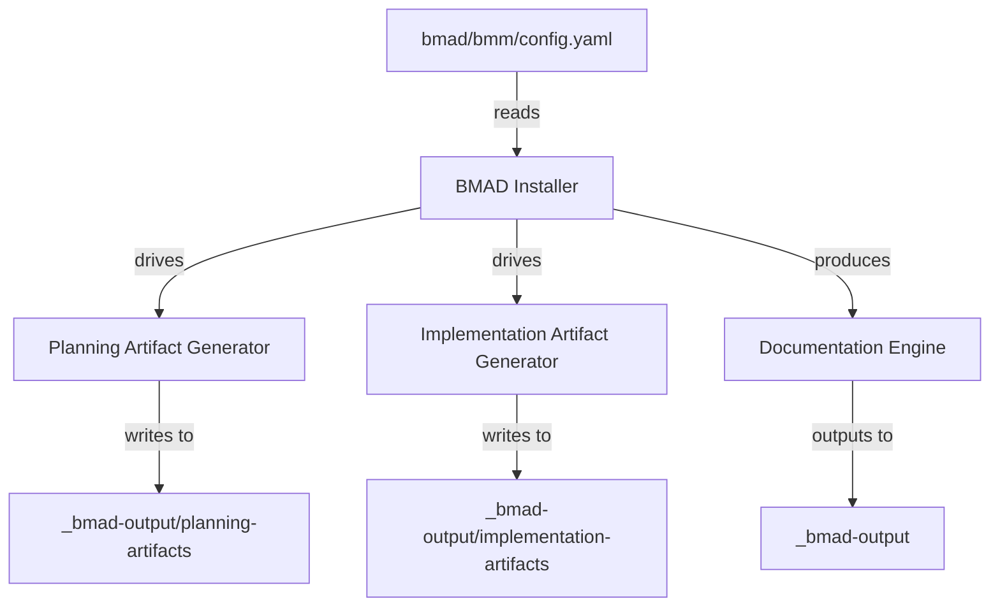

# Other — bmm

# Other — bmm

## Overview
The **bmm** module is a configuration package that supplies static, project‑specific settings to the BMAD (Business Model Automation & Design) tooling chain. It does not contain executable code; instead, it provides a YAML file (`bmad/bmm/config.yaml`) that is read by the BMAD installer and downstream generators to tailor artifacts, language settings, and output locations for the *aigency-router-v2* project.

## Configuration File (`bmad/bmm/config.yaml`)

| Key | Type | Description | Default / Example |
|-----|------|-------------|-------------------|
| `user_skill_level` | string | Indicates the expected proficiency of the end‑user. Used by BMAD to adjust the verbosity and complexity of generated documentation and planning artifacts. | `intermediate` |
| `planning_artifacts` | string (template) | Path template where BMAD will write planning‑phase artifacts (e.g., architecture diagrams, requirement matrices). The placeholder `{project-root}` is resolved at runtime to the root directory of the repository. | `"{project-root}/_bmad-output/planning-artifacts"` |
| `implementation_artifacts` | string (template) | Destination for implementation‑phase outputs such as code scaffolds, CI/CD pipelines, and deployment manifests. | `"{project-root}/_bmad-output/implementation-artifacts"` |
| `project_knowledge` | string (template) | Directory that holds project documentation (README, design docs, etc.) which BMAD may reference when generating contextual content. | `"{project-root}/docs"` |
| `user_name` | string | Human‑readable identifier for the primary stakeholder. Appears in generated reports and artifact headers. | `REID` |
| `project_name` | string | Canonical name of the software project. Used throughout generated artifacts to ensure consistent branding. | `aigency-router-v2` |
| `communication_language` | string | Language for any conversational UI or chat‑based assistance generated by BMAD. | `English` |
| `document_output_language` | string | Language for generated documentation (e.g., design docs, user guides). | `English` |
| `output_folder` | string (template) | Root folder for all BMAD‑produced output. All other paths are relative to this location. | `"{project-root}/_bmad-output"` |
| `# Version` | comment | BMAD installer version that produced this file. Helpful for debugging compatibility issues. | `6.6.0` |
| `# Date` | comment | Timestamp of generation. | `2026-04-29T13:22:20.696Z` |

### Template Resolution
All path values containing `{project-root}` are interpolated by the BMAD runtime before any file system interaction. The placeholder resolves to the absolute path of the repository root, ensuring that the configuration works regardless of where the project is cloned.

## How the Module Is Consumed

1. **BMAD Installer** – When the BMAD installer runs, it reads `bmad/bmm/config.yaml` to determine where to place generated artifacts and which language settings to apply.
2. **Artifact Generators** – Subsequent stages (planning, implementation) query the resolved configuration values to write files into the appropriate directories.
3. **Documentation Engine** – The documentation generator uses `communication_language` and `document_output_language` to produce localized content.
4. **User Interaction** – Any chat‑based assistants or UI components reference `user_name` and `user_skill_level` to personalize prompts and explanations.

Because the module contains only static data, there are no internal function calls, outgoing API calls, or runtime execution flows associated with it.

## Integration Points

*The diagram illustrates the one‑way flow from the configuration file into the BMAD toolchain. No other modules import or modify this file directly.*

## Extending or Modifying the Configuration

- **Adding New Keys**: If a new BMAD component requires additional settings, extend the YAML with a top‑level key and update the component’s loader to read it. Keep keys snake_case for consistency.
- **Changing Paths**: Adjust the template strings to point to alternative directories. Ensure that any custom paths still respect the `{project-root}` placeholder unless you deliberately want an absolute location.
- **Version Management**: Increment the `# Version` comment when making breaking changes to the schema. This aids downstream tooling in detecting incompatibilities.

## Best Practices

1. **Keep the file in version control** – The configuration is part of the project’s source and should be committed alongside code.
2. **Avoid hard‑coding absolute paths** – Rely on `{project-root}` to maintain portability across environments (local dev, CI, production).
3. **Document changes** – When modifying any field, add a comment explaining the rationale to aid future contributors.
4. **Validate after edits** – Run the BMAD installer with the `--dry-run` flag to ensure the updated configuration parses correctly.

## Troubleshooting

| Symptom | Likely Cause | Remedy |
|---------|--------------|--------|
| Generated artifacts appear in the wrong directory | `{project-root}` not resolved (e.g., environment variable missing) | Verify that the BMAD runner is launched from the repository root or set the `PROJECT_ROOT` environment variable explicitly. |
| Documentation language is not English | `document_output_language` overridden by a downstream script | Search the codebase for any runtime overrides of `document_output_language` and reconcile them with the config file. |
| BMAD installer fails with “missing key” error | A required key was removed or renamed | Re‑add the missing key or update the installer to match the new schema. |

## Related Files

- `bmad/README.md` – Overview of the BMAD toolchain and how configuration files are structured.
- `bmad/bmm/README.md` – Project‑specific notes for the *aigency-router-v2* implementation (if present). 

--- 

*End of documentation for the Other — bmm module.*