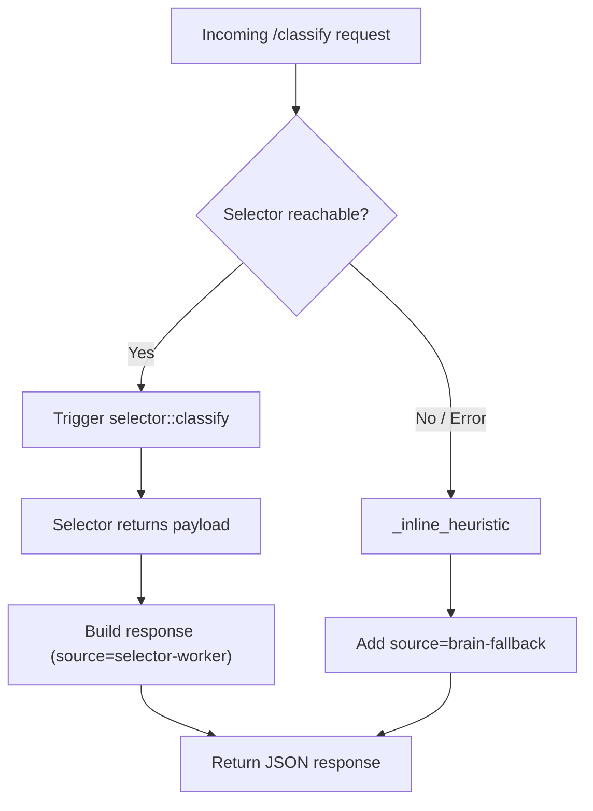

# Other — brain

# brain‑worker (Other — brain)

## Overview

`brain-worker` is a lightweight AI‑routing worker that decides whether an incoming LLM request is **SIMPLE** or **COMPLEX**.  
It prefers delegating the decision to a dedicated *selector* service (via the `iii-sdk` trigger).  
If the selector is unavailable, times out, or returns an incomplete payload, the worker falls back to an **inline heuristic** that runs locally.

The worker is packaged as a Python module (`src/`) and is exercised by a comprehensive test suite (`src/test_brain.py`). The production code lives in `src/main.py` (not shown here) and provides:

* `_inline_heuristic(payload: dict) -> dict` – pure‑Python classification logic.
* `SELECTOR_TIMEOUT_MS` – timeout sent to the selector worker (default 2000 ms).
* `logger` – structured logger used for observability.

The test suite validates both the inline heuristic and the delegation path, ensuring deterministic behaviour for developers extending the worker.

---

## Public API (exposed via HTTP)

| Endpoint | Method | Description | Return fields |
|----------|--------|-------------|---------------|
| `/classify` | `POST` | Classify a request either via selector or fallback. | `classification`, `confidence`, `model`, `message_count`, `source` |
| `/status`   | `GET`  | Health check for the worker. | `status` (`"healthy"`), `worker` (`"brain"`), `engine_url` (WebSocket URL of the selector engine) |

> **Note**: The actual HTTP routing is defined in `src/main.py`. The tests invoke the core logic directly, bypassing the HTTP layer.

---

## Core Components

### 1. Inline Heuristic (`_inline_heuristic`)

```python
def _inline_heuristic(payload: dict) -> dict:
    """
    Pure‑Python fallback used when the selector worker cannot be reached.

    Expected keys in *payload*:
        - "model": str (optional, defaults to "unknown")
        - "messages": list[dict] (optional, defaults to [])

    Returns a dict with:
        - classification: "SIMPLE" if len(messages) <= 1 else "COMPLEX"
        - confidence: 0.9 for SIMPLE, 0.75 for COMPLEX
        - model: payload.get("model", "unknown")
        - message_count: len(messages)
    """
```

* **Decision rule** – The heuristic treats any request containing **more than one message** as *COMPLEX*; otherwise it is *SIMPLE*.
* **Confidence values** – Fixed at `0.9` for SIMPLE and `0.75` for COMPLEX, matching the expectations in the test suite.
* **Defaults** – Missing `model` defaults to `"unknown"`; missing `messages` defaults to an empty list.

### 2. Selector Delegation (`classify` handler)

The `classify` handler (implemented in `src/main.py`) follows this flow:

```python
def classify(data: dict) -> dict:
    try:
        result = iii.trigger({
            "function_id": "selector::classify",
            "payload": data,
            "timeout_ms": SELECTOR_TIMEOUT_MS,
        })
        logger.info("Classification delegated to selector-worker")
        return {
            "classification": result.get("classification", "COMPLEX"),
            "confidence": result.get("confidence", 0.5),
            "model": result.get("model", data.get("model", "unknown")),
            "message_count": len(data.get("messages", [])),
            "source": "selector-worker",
        }
    except Exception as e:
        logger.warning(
            "Selector worker unavailable (%s), using brain-fallback", e
        )
        fallback = _inline_heuristic(data)
        fallback["source"] = "brain-fallback"
        return fallback
```

* **Trigger payload** – Sends a JSON RPC request to the selector worker with a fixed `function_id`.
* **Timeout** – Controlled by `SELECTOR_TIMEOUT_MS` (2 seconds in the test suite).
* **Success path** – Returns the selector’s classification, injecting the `source: "selector-worker"` flag.
* **Failure path** – Catches any exception (including `TimeoutError`), logs a warning, and falls back to `_inline_heuristic`.

### 3. Status Handler (`status`)

```python
def status() -> dict:
    return {
        "status": "healthy",
        "worker": "brain",
        "engine_url": "ws://127.0.0.1:49134",
    }
```

The handler is deliberately simple; it confirms the worker is alive and reports the WebSocket address of the selector engine.

---

## Execution Flow



* The diagram shows the two mutually exclusive branches: selector delegation vs. fallback heuristic.

---

## Testing Strategy

The test suite (`src/test_brain.py`) validates both branches:

| Test | What it verifies |
|------|-------------------|
| `test_classify_single_message` | Inline heuristic classifies a single‑message payload as SIMPLE (confidence 0.9). |
| `test_classify_multi_message` | Inline heuristic classifies a multi‑message payload as COMPLEX (confidence 0.75). |
| `test_classify_empty_messages` | Empty `messages` list still yields SIMPLE. |
| `test_classify_missing_fields` | Missing `model` and `messages` default to `"unknown"` and `0` respectively. |
| `test_status_returns_healthy` | `/status` returns the expected health payload. |
| `test_delegation_success_returns_selector_worker_source` | When the mocked selector returns a full payload, the response source is `"selector-worker"`. |
| `test_delegation_timeout_falls_back_to_brain_fallback` | A `TimeoutError` triggers the fallback path. |
| `test_delegation_error_falls_back_to_brain_fallback` | Any generic exception (e.g., `ConnectionError`) also triggers fallback. |
| `test_delegation_passes_payload_to_trigger` | Confirms the exact request structure sent to the selector (function_id, payload, timeout). |
| `test_delegation_uses_defaults_when_selector_result_incomplete` | Missing fields in the selector response are filled with safe defaults (`confidence=0.5`, model from input). |

The helper `_make_classify_with_mock_iii` builds a `classify` function with a mocked `iii.trigger` implementation, allowing deterministic unit tests without a real selector service.

---

## Extending the Worker

### Adding Real Selector Integration

1. **Install the SDK** – The `iii-sdk` dependency is already declared in `pyproject.toml`. Ensure the version matches the selector service contract.
2. **Configure the Engine URL** – Update `engine_url` in the `status` handler to point at the production selector endpoint.
3. **Fine‑tune Timeouts** – Adjust `SELECTOR_TIMEOUT_MS` if the selector’s latency profile changes.

### Improving the Inline Heuristic

* **Feature enrichment** – Incorporate additional payload fields (e.g., token count, user role) to make a more nuanced decision.
* **Dynamic confidence** – Replace static confidence values with a calibrated model or lookup table.
* **Unit tests** – Add new test cases covering the enriched heuristic logic.

### Logging & Observability

* Use `logger.info` for successful delegations and `logger.warning` for fallback events.
* Consider adding structured fields (`event="classification_fallback"`, `reason="timeout"`) to aid downstream log analysis.

---

## Development Setup

```bash
# Clone the repository and cd into workers/brain
git clone <repo-url>
cd workers/brain

# Install dependencies (pdm is the build backend)
pdm install --dev

# Run the test suite
pytest
```

The tests run under `asyncio` mode and require Python 3.12+.

---

## Dependency Summary

| Dependency | Version constraint |
|------------|--------------------|
| `iii-sdk`  | >=0.17.0 |
| `pytest`   | >=8.0 (dev) |
| `pytest-asyncio` | >=0.23 (dev) |

All runtime dependencies are declared in `pyproject.toml`; the `requirements.txt` mirrors the SDK requirement for environments that prefer `pip`.

---