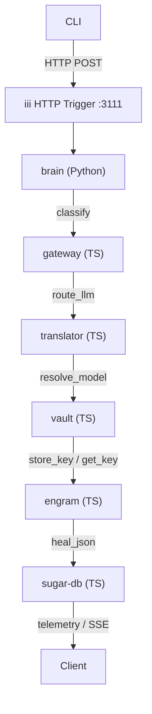

# Other — CLAUDE.md

# Other — CLAUDE.md

## Overview
`CLAUDE.md` is a living reference document that consolidates three cross‑cutting concerns for the **Aigency OS** codebase:

1. **Persistent memory (ICM)** – how to record and retrieve long‑term knowledge.
2. **Agent architecture** – a high‑level description of the worker topology, key TypeScript/Python entry points, and required development commands.
3. **GitNexus integration** – mandatory safety checks (impact analysis, change detection) and tooling shortcuts for navigating the repository.

Developers should treat this file as the *single source of truth* for operational policies and for understanding the end‑to‑end flow of a request through the system.

---

## 1. Persistent Memory (ICM)

### 1.1 Purpose
ICM (`icm` CLI) stores structured memories that survive process restarts and are shared across all workers. It is used for:

* Post‑mortem error analysis
* Design decision tracking
* Capturing user preferences
* Summarising large task progress

### 1.2 Mandatory Interaction Pattern
| Event | CLI Command | Example |
|------|-------------|---------|
| **Error resolved** | `icm store -t errors-resolved -c "<description>" -i high -k "<kw1>,<kw2>"` | `icm store -t errors-resolved -c "NullPointer on user payload" -i high -k "nullpointer,bug"` |
| **Architecture/design decision** | `icm store -t decisions-{project} -c "<description>" -i high` | `icm store -t decisions-router -c "Prefer failover over retry" -i high` |
| **User preference discovered** | `icm store -t preferences -c "<description>" -i critical` | `icm store -t preferences -c "User prefers Claude over Llama3" -i critical` |
| **Significant task completed** | `icm store -t context-{project} -c "<summary>" -i high` | `icm store -t context-router -c "Deployed v2.1, all tests green" -i high` |
| **Long conversation (>≈20 tool calls) without a store** | Store a progress summary before replying | `icm store -t progress -c "Reached step 5 of 7, awaiting user input" -i high` |

> **Rule:** The `icm store` command **must be executed *before*** sending any response to the user. Do not defer or batch stores.

### 1.3 Retrieval Commands
```bash
icm recall "query"                        # free‑text search
icm recall "query" -t "topic-name"        # filter by topic
icm recall-context "query" --limit 5      # returns a prompt‑ready snippet
```

### 1.4 Prohibited Stores
* Trivial logs (e.g., build output, `git status`)
* Information already present in `CLAUDE.md`
* Ephemeral state that does not add long‑term value

### 1.5 Maintenance
```bash
icm update <id> -c "updated content"   # edit an existing memory
icm health                              # run topic hygiene audit
icm topics                               # list all topics
```

---

## 2. Aigency OS – Agent Architecture

### 2.1 High‑Level Flow
```
CLI → iii HTTP Trigger (3111) → brain (Python) → gateway (TS) → translator (TS)
      → vault (TS) → engram (TS) → SugarDB (TS) → provider APIs
```

### 2.2 Worker Matrix

| Worker | Language | Port / Protocol | Primary Source File | Core Handlers |
|--------|----------|-----------------|---------------------|---------------|
| **brain** | Python | WS 49134 | `workers/brain/src/main.py` | `brain::classify`, `brain::status` |
| **gateway** | TypeScript | HTTP 3111 | `workers/gateway/src/index.ts` | `gateway::route_llm`, `gateway::stream_llm`, `gateway::status` |
| **vault** | TypeScript | WS 49134 | `workers/vault/src/vault.ts` | `vault::store_key`, `vault::get_key`, `vault::list_providers`, `vault::status` |
| **engram** | TypeScript | WS 49134 | `workers/engram/src/pipeline.ts` | `engram::heal_json`, `engram::status` |
| **translator** | TypeScript | WS 49134 | `workers/translator/src/index.ts` | `translator::resolve_model`, `translator::status` |
| **sugar-db** | TypeScript | WS 49134 | `workers/sugar-db/src/db.ts` | telemetry & SSE dashboard |

### 2.3 Core Patterns

#### 2.3.1 Worker Registration
All TypeScript workers import `registerWorker` from `iii-sdk` and register their handlers at module load time:

```ts
import { registerWorker } from 'iii-sdk';

registerWorker('gateway::route_llm', async ({ action, data, callback }) => {
  // routing logic …
});
```

The registration contract is:
* **Synchronous** – registration occurs before the Engine starts.
* **Signature** – `{ action: string, data: any, callback: (err?: Error, result?: any) => void }`.

#### 2.3.2 Structured Logging
Every worker emits JSON logs with a fixed schema:

```json
{
  "event": "route_attempt",
  "timestamp": "2026-06-18T12:34:56.789Z",
  "model": "claude-3-opus",
  "provider": "anthropic",
  "failoverTriggered": false,
  "durationMs": 124
}
```

These logs are consumed by the telemetry pipeline (`sugar-db`) and are **not** meant for human reading.

#### 2.3.3 Encrypted Vault Format
Binary layout (identical in Python & Node):

```
[salt 16B][iv 12B][authTag 16B][ciphertext]
```

Both sides use the same KDF (`PBKDF2-HMAC-SHA256, 100k iterations`) and AES‑256‑GCM.

#### 2.3.4 SSE Streaming
Workers that stream LLM responses emit Server‑Sent Events:

```
data: {"chunk":"..."}\n\n
...
data: [DONE]\n\n
```

The gateway buffers provider chunks, re‑orders them if needed, and forwards the unified stream to the client.

#### 2.3.5 Failover Triggers
| HTTP status | Action |
|-------------|--------|
| 429 (rate‑limit) | Immediate failover to next provider |
| 403 (revoked key) | Mark key as *cooldown* and rotate |
| 500 / 503 (server error) | Retry with exponential back‑off, then failover |

Cooldown periods are stored in the vault and consulted before selecting a provider.

### 2.4 Development Commands

```bash
# Start the full stack (Engine + all workers)
iii start

# Open the Engine console (debug UI)
iii console   # defaults to :3113

# Run all TypeScript tests
pnpm -r --filter '@aigency/*' test

# Run Python unit tests for the brain worker
pytest workers/brain/src/test_brain.py

# Full end‑to‑end verification (starts workers, issues curl requests, checks SSE, builds dashboard)
bash scripts/verify-s06.sh

# Run the dashboard locally
cd dashboard && pnpm run dev
```

### 2.5 Mermaid Diagram (Worker Interaction)



*The diagram shows a single request path; auxiliary flows (e.g., health checks, key rotation) follow the same registration pattern.*

---

## 3. GitNexus – Code Intelligence & Safety

### 3.1 Index Overview
The repository is indexed as **aigency-router-v2** (`1188 symbols, 2311 relationships`). The index powers the following commands:

| Command | Description |
|---------|-------------|
| `impact({target:"symbol", direction:"upstream"})` | Returns callers, blast radius, and risk level. |
| `detect_changes({scope:"compare", base_ref:"main"})` | Diff‑aware impact check; aborts on unexpected scope changes. |
| `query({query:"concept"})` | Full‑text search across symbols and execution flows. |
| `context({name:"symbol"})` | Detailed view: callers, callees, participating flows. |
| `rename({old:"symbol", new:"symbol"})` | Symbol‑aware rename that updates the call graph. |

### 3.2 Mandatory Workflow

1. **Before any edit** – run `impact` on the target symbol. If the risk is `HIGH` or `CRITICAL`, abort or discuss mitigation.
2. **After editing** – run `detect_changes` to ensure only the intended symbols were touched.
3. **Before commit** – re‑run `detect_changes` against the target branch (`main` by default). The CI pipeline also enforces this step.
4. **When exploring unfamiliar code** – prefer `query` and `context` over raw `grep` to avoid missing indirect relationships.

### 3.3 Prohibited Actions
* Direct `sed`/`find‑and‑replace` on symbols without invoking `rename`.
* Ignoring a `HIGH` risk warning from `impact`.
* Committing without a successful `detect_changes` run.

### 3.4 Refreshing the Index
If the index becomes stale:

```bash
node .gitnexus/run.cjs analyze   # auto‑selects a runner
# or, if the script is missing:
npx gitnexus analyze
```

---

## 4. How the Pieces Fit Together

1. **ICM** provides a durable knowledge base that workers can query (e.g., the brain may recall a past design decision to influence classification).
2. **Workers** communicate via the `iii` Engine; each worker’s public API is defined by its `registerWorker` handlers. The gateway orchestrates provider selection, the vault secures API keys, and the engram worker guarantees JSON payload integrity.
3. **GitNexus** safeguards the codebase: any change to a worker’s handler, the vault format, or the ICM integration must pass impact analysis and change detection before it lands.

When adding a new provider or a new classification rule:

* Add the handler registration in the appropriate worker (`registerWorker('gateway::route_llm', …)`).
* Update the **ICM** topic `decisions-{project}` with a rationale.
* Run the full **GitNexus** safety workflow to verify that no unintended downstream workers are affected.

---

## 5. Quick Reference Cheat‑Sheet

| Area | Command / File | Key Item |
|------|----------------|----------|
| **ICM Store** | `icm store …` | Must run *before* responding |
| **ICM Recall** | `icm recall …` | Use for prompt injection |
| **Brain** | `workers/brain/src/main.py` | `brain::classify` |
| **Gateway** | `workers/gateway/src/index.ts` | `gateway::route_llm` |
| **Vault** | `workers/vault/src/vault.ts` | `vault::store_key` |
| **Engram** | `workers/engram/src/pipeline.ts` | `engram::heal_json` |
| **Translator** | `workers/translator/src/index.ts` | `translator::resolve_model` |
| **Telemetry** | `workers/sugar-db/src/db.ts` | SSE dashboard |
| **GitNexus Impact** | `impact({target:"symbol"})` | Run before any edit |
| **GitNexus Detect** | `detect_changes({scope:"compare"})` | Run before commit |
| **Start Stack** | `iii start` | Spins up Engine + all workers |
| **Run Tests** | `pnpm -r --filter '@aigency/*' test` | TypeScript |
| | `pytest workers/brain/src/test_brain.py` | Python |

--- 

*End of `CLAUDE.md` documentation.*