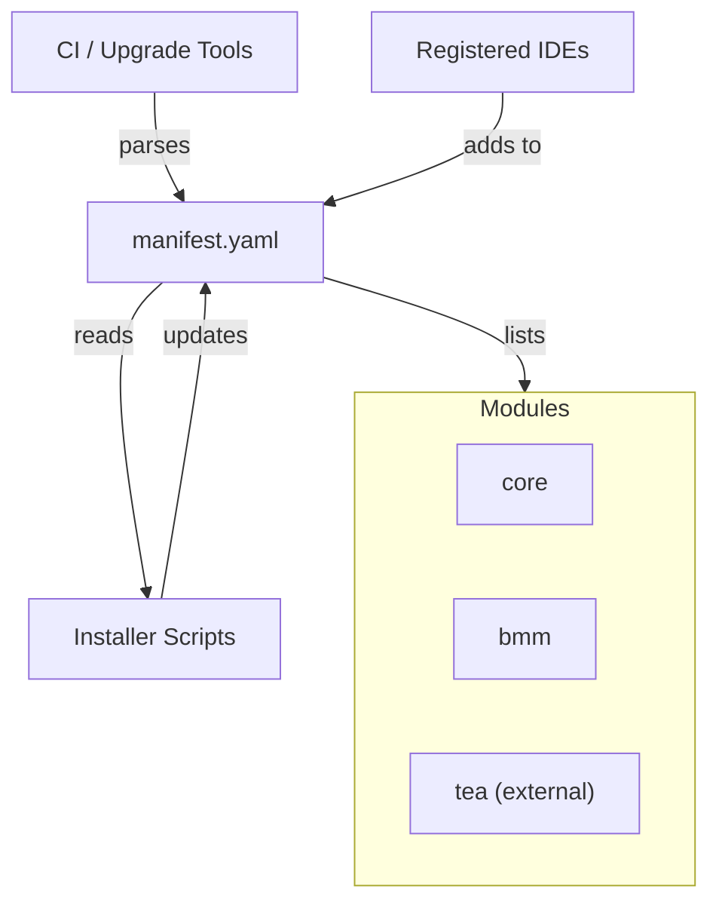

# Other — _config

# Other — `_config` Module

## Overview
The `_config` module stores the **manifest.yaml** file that records the installation state of the Bmad platform. It is a declarative, version‑controlled snapshot of:

* The Bmad runtime version.
* Installation timestamps.
* All installed modules (core, bmm, external packages, etc.).
* The IDEs that have interacted with the installation.

The manifest is read‑only at runtime; it is used by tooling (installers, upgrade scripts, CI pipelines) to verify consistency, generate reports, and drive automated migrations.

---

## File Layout
```
_bmad/
└─ _config/
   └─ manifest.yaml
```

Only `manifest.yaml` lives in this directory. No executable code resides here, so the module has **no internal, outgoing, or incoming calls**.

---

## Manifest Schema

| Top‑level key | Type | Description |
|--------------|------|-------------|
| `installation` | Mapping | Global installation metadata. |
| `modules`      | List of Mappings | One entry per installed module. |
| `ides`         | List of strings | IDE identifiers that have accessed the installation. |

### `installation`
```yaml
installation:
  version: <string>          # Bmad runtime version (e.g., "6.6.0")
  installDate: <ISO‑8601>    # When the platform was first installed
  lastUpdated: <ISO‑8601>    # Timestamp of the most recent manifest change
```

### `modules`
Each element describes a single module:

```yaml
- name: <string>            # Logical name (e.g., "core", "bmm", "tea")
  version: <string>         # Module version (semantic or tag)
  installDate: <ISO‑8601>   # When this module was added
  lastUpdated: <ISO‑8601>   # When its entry was last refreshed
  source: <"built-in"|"external"> # Origin of the module
  npmPackage: <string|null> # NPM package name if external, otherwise null
  repoUrl: <string|null>    # Git repository URL if external, otherwise null
  # Optional fields for external modules only
  channel: <string>         # Release channel (e.g., "stable")
  sha: <string>             # Git commit SHA for reproducibility
```

### `ides`
A simple list of IDE identifiers that have been registered with the installation. This list is primarily for telemetry and does not affect runtime behavior.

---

## How the Manifest Is Used

1. **Installation verification** – Install scripts compare the `version` and `modules` entries against the expected bundle to detect drift.
2. **Upgrade planning** – Upgrade tools read `lastUpdated` timestamps to decide whether a module needs migration.
3. **Dependency resolution** – External tooling (e.g., CI pipelines) can locate the exact NPM package and Git SHA for reproducible builds.
4. **Telemetry** – The `ides` array helps the platform understand which development environments are in use, informing future IDE integrations.

Because the manifest is static data, it is never imported or required by JavaScript/TypeScript code at runtime. Instead, utilities read it as plain YAML.

---

## Reading the Manifest (Example)

```ts
import fs from 'fs';
import yaml from 'js-yaml';

export interface Manifest {
  installation: {
    version: string;
    installDate: string;
    lastUpdated: string;
  };
  modules: Array<{
    name: string;
    version: string;
    installDate: string;
    lastUpdated: string;
    source: 'built-in' | 'external';
    npmPackage: string | null;
    repoUrl: string | null;
    channel?: string;
    sha?: string;
  }>;
  ides: string[];
}

/**
 * Load and parse the manifest.yaml file.
 */
export function loadManifest(): Manifest {
  const raw = fs.readFileSync('_bmad/_config/manifest.yaml', 'utf8');
  return yaml.load(raw) as Manifest;
}
```

The function above is a typical pattern for any tooling that needs to introspect the installation state.

---

## Contributing Guidelines

### Adding a New Module
1. **Update `manifest.yaml`** – Append a new entry to the `modules` list with the required fields. For external modules, include `npmPackage`, `repoUrl`, `channel`, and `sha`.
2. **Version bump** – Increment the top‑level `installation.version` if the addition changes the platform contract.
3. **Timestamp** – Set `installDate` to the current ISO‑8601 timestamp and copy it to `lastUpdated`.
4. **Run CI validation** – A repository‑wide lint step checks that the YAML conforms to the schema.

### Updating an Existing Module
* Modify the `version`, `lastUpdated`, and optionally `sha` fields.
* Keep `installDate` unchanged to preserve the original installation moment.

### Removing a Module
* Delete the corresponding entry from the `modules` array.
* Ensure no downstream scripts still reference the removed module.

### IDE List Maintenance
The `ides` array is automatically appended by the platform when a new IDE registers. Manual edits are discouraged; if you need to purge stale entries, run the provided `scripts/clean-ides.ts` utility.

---

## Architecture Diagram



*The diagram shows the manifest as the central data artifact, with installers, CI tools, and IDEs as the only actors that read or mutate it.*

---

## Version History (as of this release)

| Release | Bmad Version | Manifest `installation.version` |
|---------|--------------|---------------------------------|
| 6.6.0  | 6.6.0        | 6.6.0                           |
| 1.15.1 | 6.6.0        | 6.6.0 (tea external)            |

Future releases should follow the same schema, adding new fields only when absolutely necessary and documenting them in this file.

---

## FAQ

**Q: Can I programmatically modify the manifest at runtime?**  
A: No. The manifest is intended to be immutable during normal execution. All changes should be made by the installer or upgrade scripts.

**Q: What happens if the manifest is missing or corrupted?**  
A: Installation tools will abort with a clear error message. Restoring from version control or re‑running the installer will regenerate a valid manifest.

**Q: Do I need to commit `manifest.yaml` to source control?**  
A: Yes. It is the single source of truth for the platform’s composition and must be version‑controlled alongside the codebase.

---