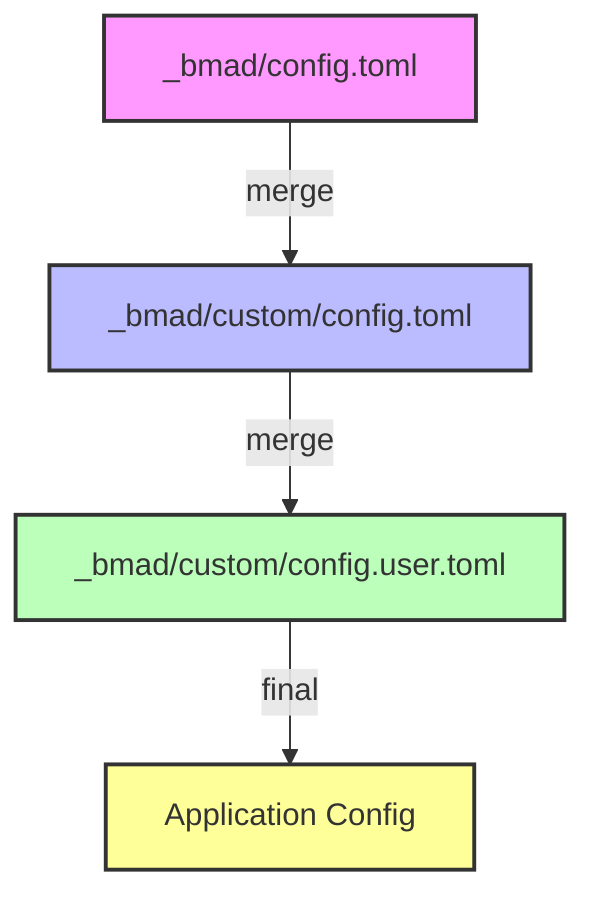

# Other — custom

# Other — custom

## Overview
The **custom** module provides project‑wide and per‑developer configuration overrides for the core `_bmad/config.toml` file. It contains two TOML files:

| File | Purpose | VCS status |
|------|---------|------------|
| `_bmad/custom/config.toml` | Team/enterprise overrides that are committed to the repository and applied to every developer. | Tracked |
| `_bmad/custom/config.user.toml` | Personal overrides that are **git‑ignored** and apply only to the local developer’s environment. | Untracked |

These files are merged with the base configuration at runtime to produce the final configuration object used by the application.

## Configuration Merge Process
The configuration loader (located in the core `_bmad` package) follows a deterministic merge order:

```
base config (_bmad/config.toml)
   └─► merge custom config (_bmad/custom/config.toml)   // team overrides
          └─► merge user config (_bmad/custom/config.user.toml) // personal overrides
```

The resulting configuration is a **deep‑merge** of the three sources:

* **Deep‑merge** – Nested tables are merged recursively. Keys that exist in a later source replace the corresponding values from earlier sources, while keys that are absent are left untouched.
* **Keyed table merge** – For tables that are indexed by a key (e.g., `[agents.<agent-id>]`), entries are merged by their key. Adding a new keyed entry in an override file does not replace the whole table; it only adds or updates the specific entry.

The precedence hierarchy is:

1. **User config** (`config.user.toml`) – highest priority.
2. **Team config** (`config.toml`) – medium priority.
3. **Base config** – lowest priority.

## File Format
Both files use **TOML** syntax. They should follow the same schema as the base configuration, which includes sections such as `agents`, `services`, `features`, etc. Only the sections that need overriding should be present; omitted sections are inherited unchanged.

### Example – Team Override
```toml
# _bmad/custom/config.toml
[agents.bmad-agent-pm]
description = "Prefers short, bulleted PRDs over narrative drafts."
```

### Example – Personal Override
```toml
# _bmad/custom/config.user.toml
[services.logging]
level = "debug"
output = "/tmp/bmad.log"
```

## Adding or Modifying Overrides

1. **Identify the target key** in the base config you wish to change (e.g., `agents.bmad-agent-pm.description`).
2. **Create or edit** the appropriate file:
   * Use `config.toml` for changes that should be shared across the team.
   * Use `config.user.toml` for changes that are personal or environment‑specific.
3. **Follow TOML syntax** and preserve the hierarchical structure.
4. **Commit** `config.toml` with a clear commit message describing the rationale. Do **not** commit `config.user.toml`; it should remain in `.gitignore`.
5. **Run the test suite** (if any) to ensure the merged configuration does not break existing functionality.

## Interaction with the Rest of the Codebase
The custom module does not contain executable code; it is purely data. The only runtime interaction occurs in the configuration loader, typically implemented as:

```python
def load_config():
    base = toml.load("_bmad/config.toml")
    team = toml.load("_bmad/custom/config.toml")
    user = toml.load("_bmad/custom/config.user.toml", fallback={})
    return deep_merge(base, team, user)
```

* **Incoming calls** – None (the module is not imported directly).
* **Outgoing calls** – None (the module does not invoke other code).
* **Execution flow** – The loader reads the files in the order shown above and produces a single dictionary that is then passed to the rest of the application.

## Version‑Control Guidelines

| Action | File | Recommended Practice |
|--------|------|----------------------|
| Add a new team‑wide setting | `config.toml` | Commit with a descriptive message. |
| Change a setting that only you need | `config.user.toml` | Keep local; do not commit. |
| Remove a deprecated override | `config.toml` | Delete and commit the removal. |
| Rename a key | Both files (if present) | Update both to keep merge semantics consistent. |

## FAQ

**Q: What happens if a key exists in both `config.toml` and `config.user.toml`?**  
A: The value from `config.user.toml` wins because user overrides have the highest precedence.

**Q: Can I delete a key from the base config?**  
A: TOML does not support explicit deletion. To effectively “remove” a key, set its value to `null` in the highest‑priority file, and ensure the loader treats `null` as a deletion (the loader implementation must support this behavior).

**Q: Are there any performance concerns with deep‑merging?**  
A: The merge occurs once at startup. The overhead is negligible for typical configuration sizes (a few hundred keys).

**Q: How do I validate my TOML files?**  
A: Use any TOML linter (`toml-cli`, `tomllint`, etc.) or run the project's configuration validation script, e.g., `python -m bmad.config.validate`.

## Architecture Diagram



The diagram illustrates the linear merge order that produces the final configuration used throughout the codebase.