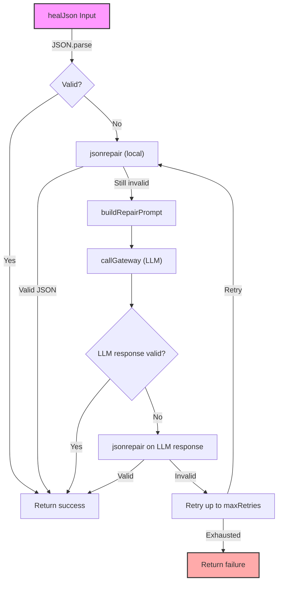

# Other — engram

# Engram Worker – “Other” Module  

## Overview  

The **Engram** worker provides a small but critical set of utilities for handling *JSON drift* – the situation where a downstream system returns malformed or non‑JSON data.  
Its core responsibilities are:

* **healJson** – Detects malformed JSON, attempts local repair with `jsonrepair`, falls back to an LLM gateway, retries up to a configurable limit, and emits structured telemetry events.  
* **EngramPipeline** – A lightweight, ordered pipeline that runs a series of `PipelineStage` objects.  
* **DriftCorrectorStage** – A ready‑made pipeline stage that wraps `healJson` for easy integration.  
* **registerEngramFunctions** – Registers the worker’s public functions (`status`, `record`, `recall`, `heal_json`) with an `iii-sdk`‑compatible SDK.  

All components are pure TypeScript and are deliberately dependency‑injected so they can be unit‑tested in isolation and swapped for custom implementations (e.g., a different LLM gateway or a bespoke JSON repair library).

---

## Installation  

```bash
# The package is private to the monorepo; add it as a workspace dependency
npm install @aigency/engram
```

The module is an ES‑module (`"type": "module"`).  
Typical development commands are defined in `package.json`:

| Script | Description |
|--------|-------------|
| `npm run dev` | Runs the worker entry point (`src/index.ts`) with `tsx`. |
| `npm test` | Executes the test suite (`heal-json.test.ts`, `pipeline.test.ts`, `index.test.ts`). |

---

## Core API  

### `healJson(input, deps) → Promise<HealResult>`  

```ts
type HealInput = {
  jsonString: string;          // JSON (or broken JSON) to be parsed
  maxRetries?: number;        // Optional – defaults to 3
  model?: string;             // LLM model identifier (passed to the gateway)
};

type HealJsonDeps = {
  callGateway?: (model: string, messages: Message[]) => Promise<string>;
  jsonrepair?: (s: string) => string;   // Defaults to the `jsonrepair` package
  log?: (event: Record<string, unknown>) => void; // Structured logger
};

type HealResult =
  | { success: true; data: unknown; attempts: number }
  | {
      success: false;
      error: string;
      attempts: number;
      partial?: string;   // The last LLM response when retries are exhausted
    };
```

#### Behaviour  

1. **Fast‑path** – Tries `JSON.parse`. If it succeeds, returns `{ success:true, data, attempts:0 }` without invoking any dependency.  
2. **Local repair** – On parse failure, calls `deps.jsonrepair` (or the bundled `jsonrepair`).  
   * If the repair yields valid JSON, returns success with `attempts:0`.  
   * Emits telemetry events `drift_detected` and `drift_healed` (method `local_jsonrepair`).  
3. **LLM fallback** – If local repair throws or still produces invalid JSON, the function:
   * Builds a system‑+ user‑message pair via `buildRepairPrompt(brokenString)`.  
   * Calls `deps.callGateway(model, messages)`.  
   * Attempts to parse the LLM response. If parsing fails, runs `jsonrepair` on the response (method `llm+jsonrepair`).  
   * Retries up to `maxRetries`. Each attempt increments `attempts`.  
   * On success, emits `drift_healed` with `method: 'llm'` or `'llm+jsonrepair'`.  
   * On exhausting retries, returns `{ success:false, error, attempts, partial }` and emits `drift_failed`.  
4. **Error handling** – If `callGateway` itself throws, the function aborts immediately, returns a failure result, and logs `drift_failed` with `reason: 'gateway_error'`.  

All telemetry events are logged via `deps.log` (if supplied) and are also emitted through the SDK’s `log_event` wrapper (see *Telemetry* below).

---

### `buildRepairPrompt(brokenJson) → Message[]`  

Creates the prompt sent to the LLM gateway.

* **Message[0]** – `role: 'system'` – contains a short instruction that the LLM must return *only* valid JSON.  
* **Message[1]** – `role: 'user'` – embeds the original `brokenJson` string.  

The function is deliberately tiny; its purpose is to keep the prompt construction in one place so tests can assert that the broken string appears in the user message.

---

### `JsonDriftError`  

A custom error class used internally to differentiate JSON‑drift failures from generic runtime errors. It carries the original malformed string and the number of attempts made. Consumers typically catch the generic `Error` returned by `healJson`; the class is exported for advanced error‑handling scenarios.

---

## Dependency Injection  

`healJson` receives a `HealJsonDeps` object. The module supplies sensible defaults:

* **`callGateway`** – If omitted, `healJson` immediately fails with *“No gateway caller”*. This forces callers (e.g., the worker registration code) to provide a concrete LLM routing function.  
* **`jsonrepair`** – Defaults to the `jsonrepair` npm package. Tests replace it with a mock that throws to force the LLM path.  
* **`log`** – Optional structured logger. When present, each drift‑related event (`drift_detected`, `drift_healing`, `drift_healed`, `drift_failed`) is emitted with a timestamp and contextual fields (`attempts`, `model`, `method`).  

Because the dependencies are plain functions, they can be swapped for:

* A sandboxed LLM client in CI.  
* A custom JSON‑repair algorithm for domain‑specific syntax.  
* A centralized logging service (e.g., Winston, Bunyan).  

---

## Telemetry & Structured Logging  

The worker emits four distinct telemetry events:

| Event | When emitted | Payload fields |
|-------|--------------|----------------|
| `drift_detected` | First parse failure | `{ attempts, model?, sourceWorker: 'engram' }` |
| `drift_healing` | Before each LLM call | `{ attemptNumber, model }` |
| `drift_healed` | After a successful repair | `{ attempts, model, method: 'local_jsonrepair' | 'llm' | 'llm+jsonrepair' }` |
| `drift_failed` | On unrecoverable error or max‑retry exhaustion | `{ attempts, reason: 'gateway_error' | 'max_retries_exceeded' }` |

The `log` dependency receives the same payloads, allowing downstream observability pipelines to ingest them. All events include a `timestamp` (ISO string) automatically added by the logger wrapper.

---

## Engram Pipeline  

### `EngramPipeline`  

A minimal orchestrator for sequential processing:

```ts
class EngramPipeline {
  addStage(stage: PipelineStage): this;   // registers a stage, returns the pipeline for chaining
  process(input: unknown, ctx: PipelineContext): Promise<PipelineResult>;
}
```

* **`PipelineStage`** – `{ name: string; process: (input, ctx) => Promise<unknown> }`.  
* **`PipelineContext`** – `{ requestId: string; metadata: Record<string, unknown>; log: (...args) => void }`.  
* **`PipelineResult`** – On success: `{ success:true; data; stages: string[] }`. On failure: `{ success:false; error; failedStage }`.

The pipeline guarantees that the supplied `ctx` is passed unchanged to each stage, enabling consistent request‑scoped logging and metadata propagation.

### `DriftCorrectorStage`  

A ready‑made stage that delegates to `healJson`:

```ts
class DriftCorrectorStage implements PipelineStage {
  name = 'drift_corrector';
  constructor(opts?: {
    maxRetries?: number;
    model?: string;
    deps?: Partial<HealJsonDeps>;
  });
  process(input: string, ctx: PipelineContext): Promise<unknown>;
}
```

* Validates that `input` is a non‑null string; otherwise throws a descriptive error.  
* Calls `healJson` with the injected `deps`, `maxRetries`, and `model`.  
* Returns the parsed JSON object on success, or propagates the failure as an exception (so the pipeline can surface the error).  

The stage is deliberately thin – it does not add extra logic beyond what `healJson` already provides, making it a perfect drop‑in for any pipeline that needs JSON drift correction.

---

## Function Registration  

### `registerEngramFunctions(sdk)`  

Registers the worker’s public RPCs with an `iii-sdk`‑compatible SDK instance:

| Function name | Description |
|---------------|-------------|
| `engram::status` | Returns `{ worker: 'engram', status: 'healthy', uptime: number }`. |
| `engram::record` | Persists an event (`{ event, data }`) and returns `{ recorded: true, event, worker, timestamp }`. |
| `engram::recall` | Placeholder that returns `{ results: [], query, worker }`. |
| `engram::heal_json` | Exposes the `healJson` logic over the SDK. |

The registration code also wires telemetry: each function call triggers a `log_event` with the appropriate `eventClass` (`DRIFT_HEALED`, `DRIFT_FAILED`, etc.) via the SDK’s `trigger` method.

### `buildHealJsonDeps(sdk)`  

Factory helper that builds a `HealJsonDeps` object from the SDK:

* `callGateway` – wraps `sdk.trigger('gateway', 'route_llm', ...)` and extracts the LLM response string.  
* `log` – forwards to `sdk.trigger('sugar-db', 'log_event', ...)`.  

Consumers can call `buildHealJsonDeps` when they need a ready‑made dependency set for `healJson`.

---

## Example Usage  

```ts
import { registerEngramFunctions, buildHealJsonDeps } from '@aigency/engram';
import { createSdk } from 'iii-sdk'; // hypothetical SDK factory

// 1️⃣ Initialise the SDK (provided by the host runtime)
const sdk = await createSdk();

// 2️⃣ Register all engram functions
registerEngramFunctions(sdk);

// 3️⃣ Use heal_json directly (e.g., from another service)
const healJson = sdk.registered.get('engram::heal_json')!;

const result = await healJson({
  jsonString: "{'name': 'broken', value: 42,}",
  maxRetries: 2,
  model: 'gpt-4o-mini',
});

if (result.success) {
  console.log('Recovered JSON:', result.data);
} else {
  console.error('Could not recover JSON:', result.error);
}
```

**Pipeline integration**

```ts
import { EngramPipeline, DriftCorrectorStage } from '@aigency/engram';

const pipeline = new EngramPipeline()
  .addStage(new DriftCorrectorStage({
    maxRetries: 3,
    model: 'mistral-7b',
    deps: buildHealJsonDeps(sdk),
  }))
  // add more custom stages here …

const ctx = { requestId: 'req-123', metadata: {}, log: console.log };
const outcome = await pipeline.process('{broken json}', ctx);

if (outcome.success) {
  console.log('Final payload:', outcome.data);
}
```

---

## Testing  

The module ships with a comprehensive test suite covering:

* **`healJson`** – all success/failure paths, retry logic, telemetry emission, and custom dependency injection.  
* **`EngramPipeline`** – stage ordering, error propagation, context passing, and chaining API.  
* **`DriftCorrectorStage`** – integration with `healJson`, input validation, and error handling.  
* **SDK registration** – ensures all expected functions are registered and that telemetry is emitted correctly.

Run the tests with:

```bash
npm test
```

The tests use Node’s built‑in `test` runner (`node:test`) and `mock.fn` for spies, guaranteeing that the module works in a pure‑Node environment without external test frameworks.

---

## Architecture Diagram  



*The diagram illustrates the decision flow inside `healJson`. Each branch emits telemetry events (`drift_detected`, `drift_healing`, `drift_healed`, `drift_failed`).*

---

## Extending the Module  

* **Custom LLM gateway** – Provide a `callGateway` that talks to your own model server; ensure it returns a raw string response.  
* **Alternative JSON repair** – Swap `jsonrepair` with a domain‑specific sanitizer (e.g., one that knows about trailing commas in a particular DSL).  
* **Additional pipeline stages** – Implement `PipelineStage` objects and register them with `EngramPipeline` to compose richer processing pipelines (e.g., validation, enrichment, persistence).  

All extensions should respect the existing telemetry contract to keep observability consistent across the worker.

---