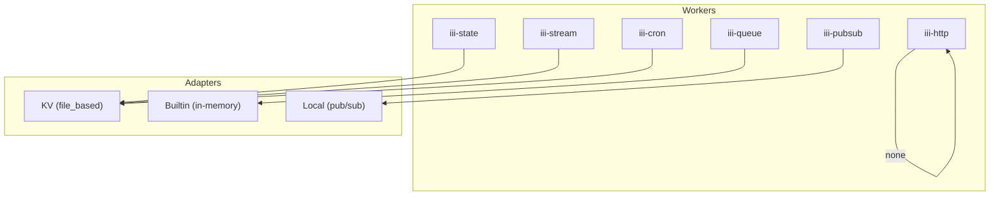

# Other — iii.config.yaml

# Other — `iii.config.yaml`

## Overview
`iii.config.yaml` is the central configuration file for the **iii** service suite. It defines the set of workers that are instantiated at runtime, along with their individual settings and the adapters they rely on. The file is read by the bootstrap layer of the application (typically `src/bootstrap.ts` or equivalent) which parses the YAML, validates the schema, and creates the corresponding worker instances.

## Configuration Schema

```yaml
workers:
  - name: <string>                # Unique identifier for the worker
    config:                       # Optional, worker‑specific configuration
      <key>: <value>              # Arbitrary key/value pairs, interpreted by the worker
```

- **`workers`** – top‑level list; order is not significant.
- **`name`** – must match a registered worker implementation (e.g., `iii-http`, `iii-state`).
- **`config`** – optional map; each worker defines its own accepted keys. Unknown keys are ignored by the generic loader but may cause validation errors if strict schema checking is enabled.

## Workers

| Worker | Purpose | Key Configuration Options | Adapter |
|--------|---------|---------------------------|---------|
| `iii-http` | HTTP API gateway | `port`, `host`, `default_timeout`, `concurrency_request_limit`, `cors` | N/A (built‑in) |
| `iii-state` | Persistent key/value store for application state | `adapter.name`, `adapter.config.store_method`, `adapter.config.file_path` | `kv` (file‑based) |
| `iii-stream` | Stream ingestion service | `port`, `host`, `adapter.name`, `adapter.config.store_method`, `adapter.config.file_path` | `kv` (file‑based) |
| `iii-queue` | In‑process job queue | `adapter.name` | `builtin` |
| `iii-pubsub` | Local publish/subscribe bus | `adapter.name` | `local` |
| `iii-cron` | Scheduled task runner | `adapter.name` | `kv` (default storage) |
| `sugar-db` | Database connector (no explicit config in this file) | – | – |
| `iii-observability` | Metrics & tracing exporter | `enabled`, `service_name`, `exporter`, `metrics_enabled` | – |

### `iii-http`
- **`port`** (default `3111`): TCP port the HTTP server binds to.
- **`host`** (default `0.0.0.0`): Network interface.
- **`default_timeout`** (ms): Global request timeout; `300000` ms = 5 min.
- **`concurrency_request_limit`**: Maximum simultaneous requests; `2048` is the hard cap.
- **`cors`**: Cross‑origin resource sharing configuration.
  - `allowed_origins`: `['*']` permits any origin.
  - `allowed_methods`: `[GET, POST, PUT, DELETE, OPTIONS]`.

### `iii-state` & `iii-stream`
Both workers use the **KV adapter** with a file‑backed store:
- **`store_method`**: Must be `file_based`.
- **`file_path`**: Relative path to the storage file (`./data/state` or `./data/streams`).

The KV adapter implements a simple key/value interface (`get`, `set`, `delete`) backed by JSON on disk. It is shared across workers that need durable persistence.

### `iii-queue`
Uses the **builtin** adapter, which provides an in‑memory priority queue. No external dependencies; suitable for short‑lived jobs.

### `iii-pubsub`
The **local** adapter implements a lightweight in‑process pub/sub bus. It is used for event propagation between workers without network overhead.

### `iii-cron`
Relies on the **kv** adapter for persisting schedule state (e.g., last run timestamps). No additional configuration is required beyond the adapter name.

### `sugar-db`
Placeholder for a database connection. The absence of a `config` block means the worker falls back to its own defaults or environment variables (e.g., `DATABASE_URL`). Adding a `config` map here follows the same pattern as other workers.

### `iii-observability`
Controls runtime telemetry:
- **`enabled`**: Boolean toggle.
- **`service_name`**: Identifier reported to exporters (`aigency-router`).
- **`exporter`**: Currently only `memory` is supported; other exporters (Prometheus, OpenTelemetry) can be added by extending the observability module.
- **`metrics_enabled`**: Enables collection of custom metrics.

## Adapters Overview



The diagram shows each worker’s dependency on an adapter. Workers without an explicit adapter (e.g., `iii-http`) are self‑contained.

## Integration Points

1. **Bootstrap Loader**  
   The entry point (`src/bootstrap.ts`) loads `iii.config.yaml` using `yaml.load` and validates it against a JSON schema (`schemas/iii-config.schema.json`). Validation errors abort startup, ensuring misconfiguration is caught early.

2. **Worker Registry**  
   Each worker registers itself in `src/workers/registry.ts` keyed by the `name` field. The bootstrap code iterates over `workers` and invokes `registry.create(name, config)`.

3. **Adapter Factory**  
   The adapter layer (`src/adapters/factory.ts`) maps `adapter.name` strings to concrete classes (`KvAdapter`, `BuiltinQueueAdapter`, `LocalPubSubAdapter`). The factory reads the nested `adapter.config` map and passes it to the constructor.

4. **Observability Hook**  
   If `iii-observability.enabled` is true, the bootstrap injects a `MetricsProvider` into each worker via dependency injection. Workers emit counters (`http_requests_total`, `queue_jobs_processed`, etc.) that the provider aggregates.

## Extending the Configuration

- **Add a New Worker**  
  1. Implement the worker class and register it in `registry.ts`.  
  2. Add a YAML entry under `workers` with a unique `name`.  
  3. Define any required `config` keys; update the JSON schema accordingly.

- **Introduce a New Adapter**  
  1. Create the adapter class implementing the required interface (`IAdapter`).  
  2. Register the adapter in `adapter/factory.ts` under a new `name`.  
  3. Add any adapter‑specific configuration fields to the schema.

- **Custom CORS Policies**  
  Modify the `cors.allowed_origins` list to restrict origins, or add `allowed_headers` and `exposed_headers` keys if the HTTP worker supports them.

## Validation & Defaults

| Field | Default | Source |
|-------|---------|--------|
| `port` (http/stream) | `3111` / `3112` | YAML |
| `host` | `0.0.0.0` | YAML |
| `default_timeout` | `300000` ms | YAML |
| `concurrency_request_limit` | `2048` | YAML |
| `adapter.name` (state/stream/cron) | `kv` | YAML |
| `store_method` | `file_based` | YAML |
| `exporter` (observability) | `memory` | YAML |
| `metrics_enabled` | `true` | YAML |

If a field is omitted, the worker’s constructor applies its internal defaults. The schema enforces required fields (`name` for each worker, `adapter.name` where applicable).

## Runtime Behavior

1. **Load** – YAML is parsed into a plain JavaScript object.
2. **Validate** – JSON schema validation runs; errors are logged and cause process exit.
3. **Instantiate** – For each worker entry:
   - Resolve the worker class via the registry.
   - Resolve the adapter (if any) via the factory.
   - Pass the `config` map to the worker’s constructor.
4. **Start** – Workers expose a `start()` method; the bootstrap calls it sequentially. Workers that depend on others (e.g., `iii-stream` may publish to `iii-pubsub`) are started in the order they appear, but the system is tolerant to any order because dependencies are resolved at runtime.

## Common Pitfalls

- **File Path Permissions** – The KV adapters write to `./data/*`. Ensure the process has write permission on the directory; otherwise the worker will fail to start.
- **Port Collisions** – `3111` and `3112` are hard‑coded defaults. Adjust them if other services on the host already occupy those ports.
- **CORS Over‑Permissive** – `allowed_origins: ['*']` opens the API to any origin. For production, replace with a whitelist.
- **Observability Disabled** – Setting `iii-observability.enabled: false` removes all metric collection; this may hinder debugging in production environments.

## Summary

`iii.config.yaml` is a declarative manifest that drives the composition of the **iii** service ecosystem. By defining workers, their configuration, and the adapters they rely on, it enables a modular, extensible architecture where each component can be swapped or tuned without code changes. Proper validation, clear defaults, and a well‑documented schema make it straightforward for developers to add new capabilities or adjust existing ones.