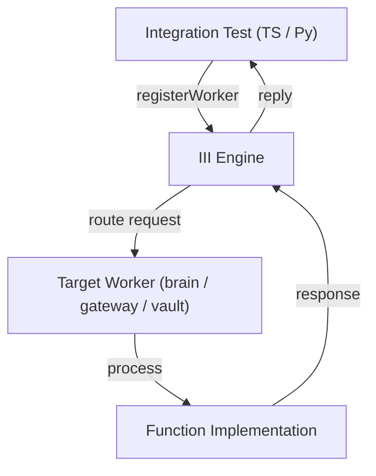

# Other — integration

# Other — integration

## Overview

The **integration** module contains end‑to‑end tests that verify cross‑worker communication through the III engine.  
It exercises both the TypeScript SDK (`iii-sdk`) and the Python SDK (`iii`) to ensure that:

* Workers can invoke functions on other workers (TS → Python, TS → TS, Python → TS, Python → Python).
* The vault worker correctly encrypts, stores, retrieves, reports status, and locks secrets.

These tests run against a live III engine and the actual worker processes, providing confidence that the public SDKs and the engine routing logic work together as expected.

---

## Repository layout

```
tests/
└─ integration/
   ├─ package.json          # npm package for the TS integration tests
   ├─ test-cross-worker.ts # TS → Python & TS → TS calls
   ├─ test-vault-integration.ts # TS → vault calls
   └─ test_cross_worker.py # Python → TS & Python → Python calls
```

*`package.json`* defines the npm scripts used to run the TypeScript tests and pulls in `iii-sdk` as a dependency.

---

## Core concepts

| Concept | Description |
|---------|-------------|
| **Engine URL** | The WebSocket address of the running III engine. Default: `ws://127.0.0.1:49134`. Can be overridden with the `III_URL` environment variable. |
| **Worker registration** | `registerWorker(engineUrl, options)` creates a client that connects to the engine, registers the test worker, and returns an object with `trigger` and `shutdown` methods. |
| **`trigger`** | Sends a request to the engine to invoke a remote function. The call is typed as `trigger<Req, Res>(payload)`. The payload must contain `function_id`, `payload`, and optionally `timeoutMs`. |
| **Function IDs** | `<worker>::<function>` strings that the engine uses to route the request (e.g., `brain::classify`, `gateway::echo`). |
| **Shutdown** | Gracefully closes the WebSocket connection and deregisters the test worker. |

---

## Test setup & lifecycle

Both the TypeScript and Python test files follow the same lifecycle:

1. **Before all tests** – Register a worker with a unique name (`integration-test-ts`, `integration-test-vault`, `integration-test-py`).  
   ```ts
   iii = registerWorker(ENGINE_URL, { workerName: 'integration-test-ts' })
   await new Promise(r => setTimeout(r, 500)) // give the engine time to register
   ```

2. **After all tests** – Call `iii.shutdown()` to clean up the connection.

3. **Each test** – Calls `iii.trigger` with a specific `function_id` and asserts the shape and content of the response.

The Python tests use a `pytest` fixture that yields a registered worker and automatically shuts it down after the module finishes.

---

## TypeScript test suite (`test-cross-worker.ts`)

### Purpose

* Verify that a TypeScript worker can:
  * Call a Python worker (`brain::classify`).
  * Call another TypeScript worker (`gateway::echo`).
  * Query status functions (`brain::status`).

### Key test cases

| Test | Function ID | Request payload | Expected response fields |
|------|-------------|----------------|--------------------------|
| `brain::classify` | `brain::classify` | `{ model: 'gpt-4', messages: [{role:'user',content:'hello'}] }` | `classification: 'SIMPLE'`, `model: 'gpt-4'`, `message_count: 1`, `confidence: number > 0` |
| `gateway::echo` | `gateway::echo` | `{ message: 'integration-test-ping' }` | `echo: same string`, `worker: 'gateway'`, `timestamp: number` |
| `brain::status` | `brain::status` | `{}` | `status: 'healthy'`, `worker: 'brain'` |

### Example usage

```ts
const result = await iii.trigger<
  { model: string; messages: Array<{ role: string; content: string }> },
  { classification: string; confidence: number; model: string; message_count: number }
>({
  function_id: 'brain::classify',
  payload: { model: 'gpt-4', messages: [{ role: 'user', content: 'hello' }] },
  timeoutMs: 5000,
});
```

---

## TypeScript vault test suite (`test-vault-integration.ts`)

### Purpose

* Exercise the `vault` worker’s cryptographic API:
  * `vault::store` – encrypt and store a provider API key.
  * `vault::retrieve` – decrypt and return the stored key.
  * `vault::status` – report the number of stored keys and whether the vault is unlocked.
  * `vault::lock` – lock the vault.

### Key test cases

| Test | Function ID | Request payload | Expected response fields |
|------|-------------|----------------|--------------------------|
| `vault::store` | `vault::store` | `{ providerId, apiKey }` | `stored: true`, `id: string`, `worker: 'vault'` |
| `vault::retrieve` | `vault::retrieve` | `{ providerId }` | `key: original apiKey`, `worker: 'vault'` |
| `vault::status` | `vault::status` | `{}` | `worker: 'vault'`, `status: 'healthy'`, `unlocked: true`, `keyCount: number ≥ 1`, `providers: string[]` |
| `vault::lock` | `vault::lock` | `{}` | `locked: true`, `worker: 'vault'` |

### Example usage

```ts
const storeRes = await iii.trigger<
  { providerId: string; apiKey: string },
  { stored: boolean; id: string; worker: string }
>({
  function_id: 'vault::store',
  payload: { providerId: TEST_PROVIDER, apiKey: TEST_API_KEY },
  timeoutMs: 5000,
});
```

---

## Python test suite (`test_cross_worker.py`)

### Purpose

* Verify that a Python worker can:
  * Call a TypeScript worker (`gateway::echo`).
  * Call another Python worker (`brain::classify`).
  * Query status functions on both workers.

### Test flow

```python
iii = register_worker(ENGINE_URL, InitOptions(worker_name='integration-test-py'))

# gateway::echo
result = iii.trigger({
    'function_id': 'gateway::echo',
    'payload': {'message': 'py-integration-ping'},
})
# → asserts echo, worker, timestamp

# brain::classify
result = iii.trigger({
    'function_id': 'brain::classify',
    'payload': {
        'model': 'claude-3',
        'messages': [{'role': 'user', 'content': 'hello'},
                     {'role': 'assistant', 'content': 'hi'}],
    },
})
# → asserts classification, model, message_count, confidence

# status checks for brain and gateway
```

The fixture `worker` registers the test worker once per module and shuts it down after all tests.

---

## Running the integration tests

### Prerequisites

1. **III engine** must be running and listening on the WebSocket address (`ws://127.0.0.1:49134` by default).  
2. All target workers (`brain`, `gateway`, `vault`) must be started and registered with the engine.  
3. Python virtual environment for the `brain` worker (used by the Python test) must be activated (`workers/brain/.venv`).

### Commands

```bash
# From the repository root
pnpm install          # install dev dependencies for the TS tests
pnpm run test         # runs both TS and Python suites
```

*The `test:ts` script uses `tsx` to execute the TypeScript test files directly; `test:py` changes directory into the `brain` worker, activates its virtualenv, and runs the Python test file.*

You can override the engine URL:

```bash
III_URL=ws://my-host:12345 pnpm run test
```

---

## Architecture diagram



*The diagram shows the high‑level flow: a test registers a client, sends a `trigger` request, the engine routes it to the appropriate worker, the worker executes the function, and the response propagates back to the test.*

---

## Key files & exported symbols

| File | Exported symbols | Role |
|------|------------------|------|
| `tests/integration/package.json` | `scripts.test`, `scripts.test:ts`, `scripts.test:py` | npm scripts that orchestrate the test runs |
| `tests/integration/test-cross-worker.ts` | `registerWorker` (from `iii-sdk`), `iii.trigger`, `iii.shutdown` | TS cross‑worker verification |
| `tests/integration/test-vault-integration.ts` | Same SDK symbols | TS vault API verification |
| `tests/integration/test_cross_worker.py` | `register_worker`, `InitOptions` (from `iii`), `worker.trigger`, `worker.shutdown` | Python cross‑worker verification |

---

## Extending the integration suite

1. **Add a new worker function** – Create a test case that calls `iii.trigger` with the new `function_id` and assert the expected response shape.  
2. **Support additional languages** – Follow the pattern used in the existing TS and Python files: register a worker, call `trigger`, and clean up with `shutdown`.  
3. **Increase coverage** – Add negative tests (e.g., timeouts, malformed payloads) to ensure robust error handling in the engine.

When adding new tests, keep the following in mind:

* Use a unique `workerName` to avoid collisions with other concurrent test runs.  
* Respect the `timeoutMs` parameter; the default of 5 seconds is sufficient for most operations.  
* Clean up with `shutdown` to prevent dangling WebSocket connections.

---