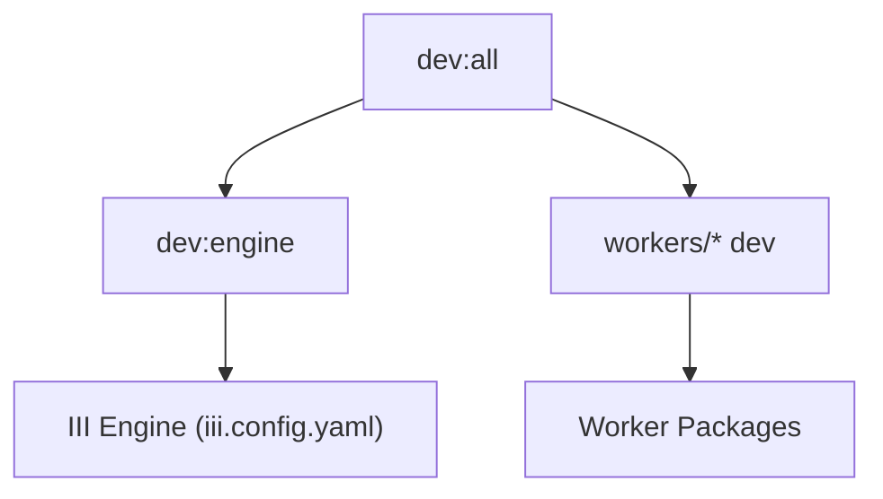

# Other — package.json

# `package.json` – Project Metadata & Build Configuration

## Overview
`package.json` is the central manifest for the **aigency-router-v2** monorepo. It defines the package name, version, description, and the scripts used to develop, test, and build the entire codebase. The file also declares development dependencies, the required Node.js version, and PNPM‑specific settings.

## Core Fields

| Field | Value | Meaning |
|-------|-------|---------|
| `name` | `aigency-router-v2` | Identifier used by the package manager. |
| `version` | `0.1.0` | Current semantic version of the repository. |
| `private` | `true` | Prevents accidental publishing to the npm registry. |
| `description` | `Aigency OS — autonomous agent swarm orchestration on iii primitives` | Human‑readable summary of the project’s purpose. |
| `engines.node` | `>=20.0.0` | Minimum Node.js runtime required. |
| `packageManager` | `pnpm@11.7.0` | Enforces the PNPM version for reproducible installs. |

## Scripts

The `scripts` section provides shortcuts for common development tasks. All scripts are executed via `pnpm run <script>`.

| Script | Command | Description |
|--------|---------|-------------|
| `dev:engine` | `iii --config iii.config.yaml` | Starts the **III** engine using the configuration file `iii.config.yaml`. |
| `dev:all` | `concurrently "pnpm dev:engine" "pnpm --filter './workers/*' dev"` | Runs the engine and all worker packages in parallel. Utilises `concurrently` to keep both processes alive and output interleaved. |
| `test` | `pnpm -r run test` | Executes the `test` script of every workspace (recursive). |
| `build` | `pnpm -r run build` | Executes the `build` script of every workspace (recursive). |

### Script Interaction Diagram

*The diagram shows that `dev:all` spawns two parallel processes: the core III engine and the development servers of all worker packages.*

## Development Dependencies

| Package | Version | Role |
|---------|---------|------|
| `@iii-dev/observability` | `^0.17.0` | Instrumentation and telemetry for the III runtime. |
| `@shelve/cli` | `^5.2.0` | CLI utilities for data persistence layers. |
| `@types/node` | `^22.0.0` | TypeScript type definitions for Node.js APIs. |
| `concurrently` | `^9.0.0` | Runs multiple commands concurrently (used in `dev:all`). |
| `iii-sdk` | `^0.17.0` | SDK for interacting with the III engine. |
| `tsx` | `^4.22.4` | TypeScript execution environment for `.tsx`/`.ts` files without pre‑compilation. |
| `typescript` | `^5.7.0` | TypeScript compiler and language services. |

These dependencies are **devOnly**; they are not bundled into the production runtime.

## PNPM Configuration

```json
"pnpm": {
  "onlyBuiltDependencies": [
    "better-sqlite3"
  ]
}
```

- `onlyBuiltDependencies` tells PNPM to treat `better-sqlite3` as a *built* (native) dependency, avoiding unnecessary reinstallations across workspaces. This improves install speed for native modules that are compiled once per platform.

## Usage Guide

### Installing the Repository
```bash
pnpm install
```
PNPM will respect the `packageManager` field and install all workspace dependencies, applying the `onlyBuiltDependencies` rule.

### Development Workflow
1. **Start the full stack**  
   ```bash
   pnpm dev:all
   ```
   - The III engine runs with the configuration in `iii.config.yaml`.
   - All worker packages under `./workers/*` start their own dev servers.

2. **Run a single component**  
   - Engine only: `pnpm dev:engine`  
   - Specific worker: `pnpm --filter ./workers/<worker-name> dev`

3. **Testing**  
   ```bash
   pnpm test
   ```
   Executes the `test` script defined in each workspace (e.g., Jest, Vitest, etc.).

4. **Building**  
   ```bash
   pnpm build
   ```
   Triggers the `build` script of each workspace, typically producing compiled JavaScript bundles and type declarations.

### Adding a New Dependency
```bash
pnpm add <package> -D   # for dev dependencies
pnpm add <package>       # for runtime dependencies (rare in this repo)
```
After adding, run `pnpm install` to update the lockfile.

## Contribution Notes

- **Version Bumping**: Follow conventional commits. The `version` field should be updated via `pnpm version <type>` (e.g., `pnpm version patch`).
- **Script Extensions**: When adding new scripts, keep the naming convention `dev:*`, `test`, `build`, etc., and document them here.
- **Workspace Consistency**: All new packages must be added to the monorepo’s `pnpm-workspace.yaml` (not shown) and should inherit the same Node.js engine constraint.

## Related Files

- `iii.config.yaml` – Configuration for the III engine referenced by `dev:engine`.
- `pnpm-workspace.yaml` – Defines the workspace layout (workers, shared libs, etc.).
- Individual `package.json` files under `./workers/*` – Contain component‑specific scripts and dependencies.