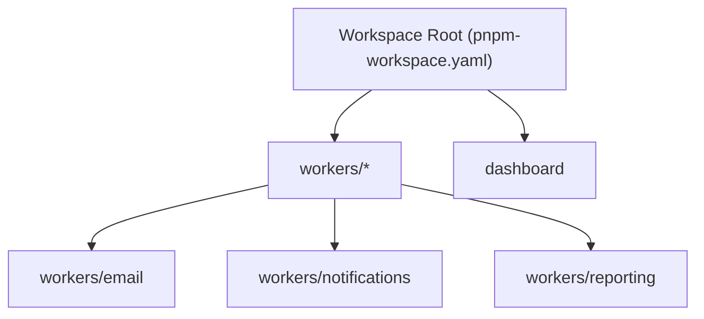

# Other — pnpm-workspace.yaml

# Other — `pnpm-workspace.yaml`

## Overview
`pnpm-workspace.yaml` defines the workspace configuration for the monorepo when using **pnpm** as the package manager. It tells pnpm which directories belong to the workspace, and it configures build‑time behavior for native dependencies. This file lives at the repository root and is read automatically by pnpm during install, add, and remove operations.

## Key Sections

| Section | Description | Typical Values |
|---------|-------------|----------------|
| `packages` | Glob patterns that locate the workspace packages. | `'workers/*'`, `'dashboard'` |
| `allowBuilds` | Controls whether pnpm is allowed to compile native modules for specific dependencies. | `better-sqlite3: true/false`, `esbuild: false`, `protobufjs: false` |
| `onlyBuiltDependencies` | Lists dependencies that must be built (i.e., compiled from source) even when `allowBuilds` is otherwise restrictive. | `- better-sqlite3` |

### `packages`
- **`'workers/*'`** – Includes every sub‑folder under `workers/` as an individual package (e.g., `workers/email`, `workers/notifications`).
- **`'dashboard'`** – Includes the top‑level `dashboard` folder as a package.

These patterns are resolved relative to the workspace root. Any folder that contains a `package.json` matching a pattern becomes part of the workspace, enabling intra‑repo linking and shared `node_modules`.

### `allowBuilds`
pnpm can be instructed to skip building native modules for speed or reproducibility. The keys are dependency names; the boolean value indicates whether building is permitted:

- **`better-sqlite3`** – Set to `true` to allow compilation of the native SQLite bindings; set to `false` to skip building and use a pre‑built binary (if available).
- **`esbuild`**, **`protobufjs`** – Explicitly disabled (`false`). These packages will not be compiled from source even if a build script is present.

### `onlyBuiltDependencies`
When `allowBuilds` disables most native builds, this list forces pnpm to still compile the listed dependencies. In this configuration, `better-sqlite3` is required to be built regardless of the global `allowBuilds` setting.

## Interaction with the Codebase

- **Workspace Packages** – The `workers/*` and `dashboard` packages are the primary runtime components of the project. They share a common `node_modules` directory managed by pnpm, which reduces duplication and speeds up installs.
- **Native Dependency Management** – The `allowBuilds` and `onlyBuiltDependencies` sections directly affect CI pipelines and local development environments. For example, CI may set `better-sqlite3: false` to avoid costly compilation, while a developer who needs SQLite features will enable it locally.
- **No Runtime Calls** – This file is purely declarative; it does not contain executable code, nor does it import or export any symbols. Consequently, there are no internal or external call graphs associated with it.

## Usage Guidelines

1. **Adding a New Package**  
   - Create the folder (e.g., `workers/reporting`) with its own `package.json`.  
   - Ensure the folder matches one of the glob patterns in `packages`. No further changes to `pnpm-workspace.yaml` are required.

2. **Modifying Build Permissions**  
   - To enable building for a new native dependency, add an entry under `allowBuilds` with a `true` value.  
   - If the dependency must always be built, also add it to `onlyBuiltDependencies`.

3. **Running pnpm Commands**  
   - `pnpm install` – Reads this file to resolve workspace packages and apply build rules.  
   - `pnpm add <pkg> -w` – Adds a dependency to the workspace root; the `allowBuilds` rules will be applied during installation.

## Example Scenario

```yaml
# pnpm-workspace.yaml
packages:
  - 'workers/*'
  - 'dashboard'
allowBuilds:
  better-sqlite3: true   # enable native build for SQLite
  esbuild: false         # never compile esbuild from source
  protobufjs: false      # never compile protobufjs from source
onlyBuiltDependencies:
  - better-sqlite3
```

In this setup:
- All worker services and the dashboard share the same lockfile and `node_modules`.
- `better-sqlite3` will be compiled, ensuring the latest SQLite features are available.
- `esbuild` and `protobufjs` will use pre‑built binaries, reducing install time.

## Architecture Diagram



The diagram illustrates the hierarchical relationship between the workspace root, the package glob patterns, and the concrete package directories that become part of the pnpm workspace.

## Best Practices

- **Keep `allowBuilds` Minimal** – Only enable native builds when absolutely necessary to keep CI fast and deterministic.
- **Version Control** – Commit `pnpm-workspace.yaml` alongside `package.json` files to ensure reproducible environments.
- **Consistency** – Align the `onlyBuiltDependencies` list with the entries in `allowBuilds` to avoid contradictory settings.

--- 

*End of documentation for `Other — pnpm-workspace.yaml`.*