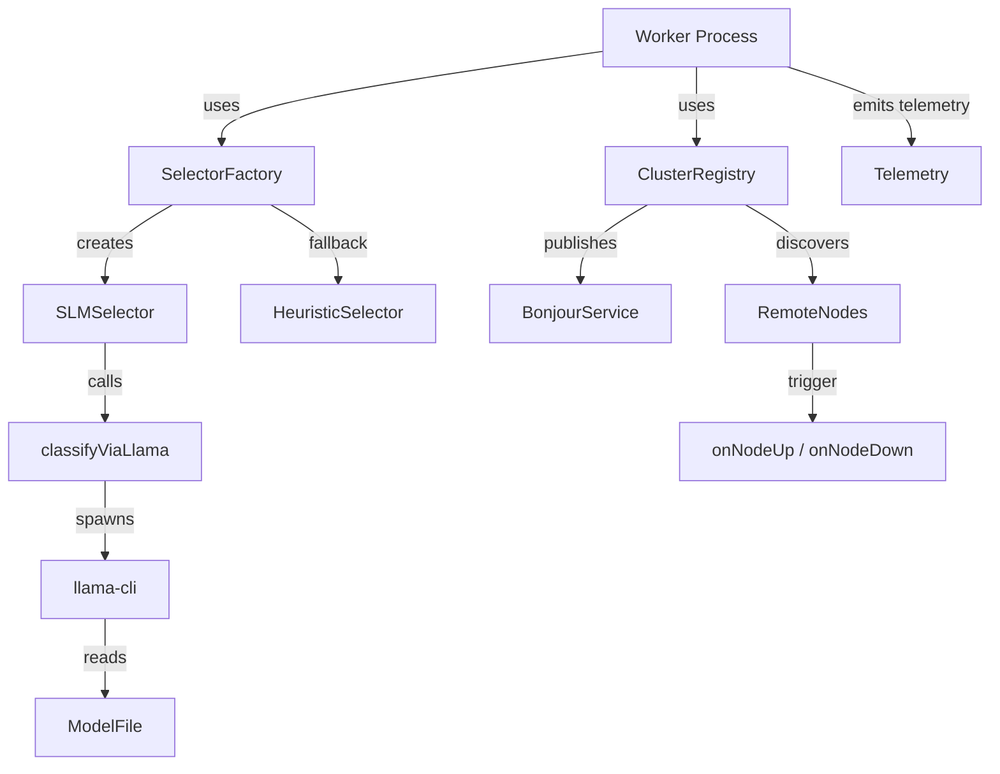

# Other — shared

# @aigency/shared – Overview

The **@aigency/shared** package contains utilities that are used by both the worker processes and the vault.  
It provides three orthogonal concerns:

1. **Cluster discovery & health‑checking** – `ClusterRegistry`
2. **Local LLM inference via the `llama-cli` binary** – `classifyViaLlama`, `extractClassificationJson`, `isLlamaBinaryAvailable`, `isModelAvailable`, `getDefaultModelPath`
3. **Selector abstraction** – `createSelector`, `createSelectorAsync`, `SLMSelector`, `HeuristicSelector`

All components are deliberately lightweight, have no side‑effects at import time, and expose a small, well‑typed public API that can be mocked in unit tests (see the test suites for examples).

---

## 1. Cluster discovery – `ClusterRegistry`

### Purpose
`ClusterRegistry` advertises the local worker on the network via **bonjour‑service** and discovers remote workers that publish the same service type (`_aigency-slm._tcp`). It maintains an in‑memory map of live nodes and emits lifecycle callbacks (`onNodeUp`, `onNodeDown`) as nodes appear, disappear, or become stale.

### Constructor
```ts
new ClusterRegistry(
  opts: {
    port?: number;                     // TCP port the local worker listens on (default: 0 → random)
    telemetryDeps?: { trigger: TelemetryTrigger };
    sourceWorker?: string;             // Identifier used in telemetry events
    healthCheckIntervalMs?: number;    // Interval for stale‑node pruning (default: 5000)
    staleThresholdMs?: number;         // Time after lastSeen before a node is considered stale (default: 30000)
  },
  bonjourFactory: { create: () => BonjourInstance }
)
```
*`BonjourInstance`* is the object returned by `bonjour-service` (or a mock in tests). The factory is injected to allow deterministic unit testing.

### Lifecycle
| Method | Description |
|--------|-------------|
| `await start()` | Publishes the local service (`bonjour.publish({ name: 'aigency-node-<uuid>', type: '_aigency-slm._tcp', port })`) and begins browsing for remote services (`bonjour.find({ type })`). |
| `await stop()` | Stops publishing, stops browsing, and calls `bonjour.destroy()`. All node state is cleared. |
| `getNodes(): Array<{ id: string; host: string; port: number }>` | Returns a snapshot of currently known nodes. The `id` is `<host>:<port>`. |
| `onNodeUp(node)` | Optional callback invoked **once** when a new node is first discovered. Subsequent duplicate announcements only refresh the node’s `lastSeen` timestamp. |
| `onNodeDown(node)` | Optional callback invoked when a node is removed (stale or explicit removal). |

### Health‑checking
A periodic timer (default 5 s) walks the node map and removes any entry whose `lastSeen` is older than `staleThresholdMs`. Removal triggers `onNodeDown` and emits a telemetry event `CLUSTER_NODE_LOST` with `{ nodeId, reason: 'stale' }`.

### Telemetry
`ClusterRegistry` uses the injected `telemetryDeps.trigger` to emit:
* `CLUSTER_NODE_DISCOVERED` – when a new node is first seen.
* `CLUSTER_NODE_LOST` – when a node is pruned as stale.

Both events include the node identifier and the source worker (if provided).

### Example usage
```ts
import { ClusterRegistry } from '@aigency/shared/cluster-registry';

const registry = new ClusterRegistry(
  { port: 4321, telemetryDeps: { trigger: myTrigger }, sourceWorker: 'worker-1' },
  () => bonjour() // real factory in production
);

registry.onNodeUp = (node) => console.log('Node up:', node);
registry.onNodeDown = (node) => console.log('Node down:', node);

await registry.start();
// … later …
await registry.stop();
```

---

## 2. Local LLM inference – `llama-client.ts`

### Public API
| Export | Signature | Description |
|--------|-----------|-------------|
| `classifyViaLlama(modelPath: string, prompt: string, opts?: { timeoutMs?: number; binaryPath?: string })` | `Promise<string>` | Spawns `llama-cli` with the supplied model and prompt, waits for the process to exit (or timeout), extracts the JSON classification payload, and returns the raw JSON string. |
| `extractClassificationJson(rawOutput: string)` | `string` | Parses mixed stdout/stderr output, isolates the first well‑formed JSON object that contains a `"classification"` field, validates that the value is either `"simple"` or `"complex"`, and returns the JSON string. Throws on malformed or missing JSON. |
| `isLlamaBinaryAvailable(binaryPath?: string)` | `boolean` | Checks `fs.existsSync` for the `llama-cli` binary (default path is resolved from `process.env.PATH`). |
| `isModelAvailable(modelPath?: string)` | `boolean` | Checks `fs.existsSync` for the GGUF model file. |
| `getDefaultModelPath()` | `string` | Returns `process.env.SLM_MODEL_PATH` if set; otherwise returns a hard‑coded fallback path (`.../.models/qwen2.5-0.5b-instruct-q4_k_m.gguf`). |

### Process spawning details
* `spawn('llama-cli', args, { stdio: ['ignore', 'pipe', 'pipe'] })` is used.
* Default arguments include:
  * `-n 64` (max tokens)
  * `--temp 0` (temperature)
  * `-t 4` (threads)
  * `--no-display-prompt`
  * `--log-disable`
* The function attaches listeners to `stdout`, `stderr`, and the `exit` event.
* A timeout timer (default 30 s) aborts the child process and rejects with `Error('timeout …')`.

### Error handling
* **ENOENT** – emitted when the binary cannot be found; the promise rejects with a clear “binary not found” message.
* **Non‑zero exit code** – rejects with `Error('exited with code X')`.
* **Invalid JSON** – `extractClassificationJson` throws; the error propagates up as “no valid classification json”.

### Example usage
```ts
import { classifyViaLlama, isLlamaBinaryAvailable, isModelAvailable, getDefaultModelPath } from '@aigency/shared/llama-client';

if (!isLlamaBinaryAvailable() || !isModelAvailable()) {
  throw new Error('LLM binary or model missing');
}

const model = getDefaultModelPath();
const rawResult = await classifyViaLlama(model, 'Is this request simple?', { timeoutMs: 5000 });
const classification = JSON.parse(rawResult).classification; // 'simple' | 'complex'
```

---

## 3. Selector abstraction – `selector-factory.ts` & `slm-selector.ts`

### Goal
Provide a **factory** that returns a selector implementation capable of classifying a request as `"simple"` or `"complex"`.

*If the local LLM binary and model are present, the factory returns an `SLMSelector` that delegates to `classifyViaLlama`.  
Otherwise it falls back to a `HeuristicSelector` (imported from the vault) which uses a rule‑based heuristic.*

### Factory functions
```ts
createSelector(opts?: {
  timeoutMs?: number;          // Passed to SLMSelector; default 30 000
  preferSlm?: boolean;         // If false, skip probing for LLM binary/model
  modelPath?: string;          // Override default model path
}): Selector
```

```ts
createSelectorAsync(opts?: {
  timeoutMs?: number;
  preferSlm?: boolean;
  modelPath?: string;
}): Promise<Selector>
```
Both functions return an object that implements:
```ts
interface Selector {
  classify(request: LlmRequest): Promise<'simple' | 'complex'>;
  isAvailable(): boolean;
}
```

### Probing logic (synchronous factory)
```ts
if (opts?.preferSlm !== false) {
  const binaryOk = isLlamaBinaryAvailable();
  const modelOk = isModelAvailable(opts?.modelPath ?? getDefaultModelPath());
  if (binaryOk && modelOk) {
    return new SLMSelector({ timeoutMs: opts?.timeoutMs, telemetryDeps, sourceWorker });
  }
}
return new HeuristicSelector(); // fallback
```
When `preferSlm` is `false`, the binary/model checks are **not** performed, avoiding unnecessary filesystem I/O.

### `SLMSelector` (workers/shared/slm-selector.ts)

#### Constructor
```ts
new SLMSelector(opts?: {
  telemetryDeps?: { trigger: TelemetryTrigger };
  sourceWorker?: string;
  timeoutMs?: number;          // Passed to classifyViaLlama
  modelPath?: string;
})
```

#### Methods
| Method | Signature | Description |
|--------|-----------|-------------|
| `classify(request)` | `Promise<'simple' | 'complex'>` | Serialises the request into a prompt, calls `classifyViaLlama`, parses the JSON, and returns the `classification` field. Emits telemetry `SLM_CLASSIFY` on success. |
| `isAvailable()` | `boolean` | Returns `true` iff both the `llama-cli` binary and the model file are present (same checks used by the factory). |

#### Telemetry payload (on success)
```ts
{
  eventClass: 'SLM_CLASSIFY',
  sourceWorker: <sourceWorker>,
  payload: {
    classification: 'simple' | 'complex',
    model: '<model‑name>',               // derived from model filename
    requestMessageCount: number,
    latencyMs: number
  }
}
```

### `HeuristicSelector`
The fallback implementation lives in the vault (`../vault/src/selector.ts`). It implements the same `Selector` interface but decides classification based on request length, presence of `enforce_json`, etc. The exact heuristic is outside the scope of this module.

### Example usage
```ts
import { createSelector } from '@aigency/shared/selector-factory';

const selector = createSelector({ timeoutMs: 2000 });
const classification = await selector.classify(myRequest);
console.log('Request is', classification);
```

---

## 4. Integration diagram



*The diagram shows the primary data flow: a worker starts a `ClusterRegistry` for peer discovery, creates a selector via the factory, and the selector may invoke the local LLM binary. All components emit telemetry events that are consumed by the central telemetry pipeline.*

---

## 5. Testing strategy

All public APIs are exercised with **node:test** suites that:

* **Mock** `bonjour-service` (via a factory returning a `MockBonjourInstance`) to verify publishing, browsing, and cleanup.
* **Mock** `child_process.spawn` and `fs.existsSync` to simulate the LLM binary, model presence, and various error conditions.
* **Assert** telemetry emission by providing a stub `trigger` that records payloads.
* **Validate** that duplicate node announcements only refresh `lastSeen` without re‑firing `onNodeUp`.
* **Confirm** that `createSelector` respects the `preferSlm` flag and correctly falls back to `HeuristicSelector`.

These tests serve as both documentation and regression guards; new contributors should add analogous tests when extending functionality.

---

## 6. Extending the module

* **Adding a new discovery protocol** – implement a new `BonjourInstance`‑compatible wrapper (e.g., mDNS, Consul) and inject it via the factory argument to `ClusterRegistry`.
* **Supporting additional LLM binaries** – expose a new `classifyVia<Engine>` function, update `is<Engine>BinaryAvailable`, and extend `SLMSelector` to select the appropriate engine based on configuration.
* **Enriching telemetry** – augment the payload objects in `ClusterRegistry` or `SLMSelector` and update the corresponding test expectations.

All extensions should follow the existing pattern of **dependency injection** (factory or stub) to keep the module testable and side‑effect free.