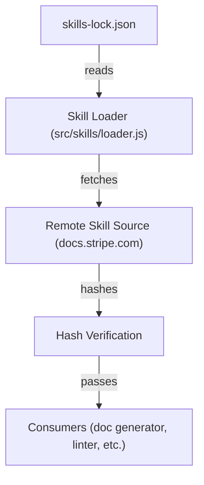

# Other — skills-lock.json

# skills-lock.json

## Overview
`skills-lock.json` is a **lock file** that records a deterministic snapshot of the external “skills” resources used by the project. It guarantees that the same versions of the referenced skill definitions are fetched every time the repository is built or deployed, preventing accidental drift caused by upstream changes.

The file lives in the **Other** directory and is version‑controlled alongside the source code. It is read by the skill‑loading subsystem (e.g., `src/skills/loader.js`) to verify that the fetched skill definitions match the hashes stored here.

---

## File Structure

```json
{
  "version": 1,
  "skills": {
    "<skill-id>": {
      "source": "<origin>",
      "sourceType": "<type>",
      "computedHash": "<sha256>"
    },
    …
  }
}
```

| Property          | Type   | Description |
|-------------------|--------|-------------|
| `version`         | number | Lock‑file schema version. Increment when the schema changes (e.g., adding new top‑level fields). |
| `skills`          | object | Map of skill identifiers to their lock metadata. |
| `skills.<skill-id>` | object | Entry for a single skill. |
| `source`          | string | URL or identifier of the origin where the skill definition is retrieved. In this repository all entries point to `docs.stripe.com`. |
| `sourceType`      | string | Classification of the source. `"well-known"` indicates a stable, publicly documented endpoint. |
| `computedHash`    | string | SHA‑256 hash of the raw skill definition file at the time the lock was generated. Used for integrity verification. |

### Current Entries

| Skill ID                | Source          | Source Type | Computed SHA‑256 |
|------------------------|-----------------|-------------|------------------|
| `stripe-best-practices` | `docs.stripe.com` | `well-known` | `f0aac866fab408c8bf28f3acacbbf61539cea81b3aeb030fceb64be1ccddaf9e` |
| `stripe-projects`       | `docs.stripe.com` | `well-known` | `74b5f9e1e24d7662000c28d6572e438ac71847d60ea0a8704b088441355e3371` |
| `upgrade-stripe`        | `docs.stripe.com` | `well-known` | `df1c52c17aff54490e81e98979f302564988fbddaaf59e74c2d1bd4b103a7d2e` |

---

## How It Works

1. **Loading**  
   The skill loader reads `skills-lock.json` (e.g., `fs.readFileSync('Other/skills-lock.json')`) and parses it with `JSON.parse`.  

2. **Fetching**  
   For each skill entry, the loader retrieves the raw definition from the declared `source`. The retrieval method depends on `sourceType`:
   - `"well-known"` → HTTP GET to the canonical URL (`https://docs.stripe.com/<skill-id>.json` or similar).  
   - Future source types may use other protocols (e.g., `git`, `s3`).

3. **Verification**  
   After download, the loader computes a SHA‑256 hash of the response body and compares it to `computedHash`.  
   - **Match** → The skill definition is accepted and passed downstream.  
   - **Mismatch** → The loader throws an error (`SkillHashMismatchError`) and aborts the build, signalling that the lock file is out‑of‑date.

4. **Consumption**  
   Verified skill objects are then used by downstream modules (e.g., documentation generators, lint rules) to enforce best‑practice checks.

Because the lock file contains only static data, there are **no runtime dependencies** or function calls originating from this module itself.

---

## Integration Points



- **Skill Loader** (`src/skills/loader.js`) is the sole consumer of `skills-lock.json`.  
- No other modules import or modify this file directly.  

If you add a new skill, you must update both the loader (to reference the new ID) and the lock file.

---

## Updating the Lock File

When a skill definition changes upstream, the lock file must be regenerated:

1. **Run the lock‑generation script** (provided in `package.json` as `npm run lock-skills`). The script:
   - Downloads each skill definition.
   - Computes its SHA‑256 hash.
   - Writes a fresh `skills-lock.json` with the new hashes.
2. **Commit the updated file** alongside any code changes that depend on the new skill version.
3. **CI Validation** – The CI pipeline runs the loader in “verify‑only” mode; a hash mismatch will cause the build to fail, ensuring the lock file stays in sync.

If the repository does not contain a lock‑generation script, you can manually recreate the file:

```bash
node -e "
const fs = require('fs');
const crypto = require('crypto');
const https = require('https');

const skills = {
  'stripe-best-practices': 'https://docs.stripe.com/stripe-best-practices.json',
  'stripe-projects':       'https://docs.stripe.com/stripe-projects.json',
  'upgrade-stripe':        'https://docs.stripe.com/upgrade-stripe.json'
};

(async () => {
  const lock = { version: 1, skills: {} };
  for (const [id, url] of Object.entries(skills)) {
    const data = await new Promise((res, rej) => {
      https.get(url, r => {
        let buf = '';
        r.on('data', d => buf += d);
        r.on('end', () => res(buf));
      }).on('error', rej);
    });
    const hash = crypto.createHash('sha256').update(data).digest('hex');
    lock.skills[id] = { source: 'docs.stripe.com', sourceType: 'well-known', computedHash: hash };
  }
  fs.writeFileSync('Other/skills-lock.json', JSON.stringify(lock, null, 2));
})();
"
```

> **Note:** The manual script is provided for reference only; prefer the official npm script to keep formatting consistent.

---

## Validation & Testing

- **Unit Test** (`test/skills/loader.test.js`) includes a test case that loads `skills-lock.json` and asserts that each `computedHash` matches the fixture data stored in `test/fixtures/skills/`.  
- **CI Hook** – A pre‑commit hook (`husky` + `lint-staged`) runs `npm run verify-skills` which performs a dry‑run of the loader, failing the commit if any hash is stale.

When adding new skills, extend both the loader test suite and the lock‑generation script to cover the new entries.

---

## Contributing Guidelines

1. **Do not edit `computedHash` manually.** Always regenerate the lock file using the provided script.  
2. **Keep the JSON formatting** (2‑space indentation) to avoid noisy diffs.  
3. **Document new skills** in `README.md` under the “Supported Skills” section, mirroring the entry format shown above.  
4. **Version bump** – If you introduce a new top‑level field (e.g., `metadata`), increment the `version` field to `2` and update the schema validator accordingly.  

---

## FAQ

| Question | Answer |
|----------|--------|
| *Why a lock file for documentation skills?* | Skill definitions are external resources that can change without notice. The lock file guarantees reproducible builds and prevents silent policy drift. |
| *Can I point a skill to a private repo?* | Yes, but you must add a new `sourceType` (e.g., `"git"`) and extend the loader to handle authentication. The lock file format remains the same. |
| *What happens if the remote source is unavailable?* | The loader throws a `SkillFetchError`. CI pipelines treat this as a failure, prompting a retry or a lock‑file update. |

---