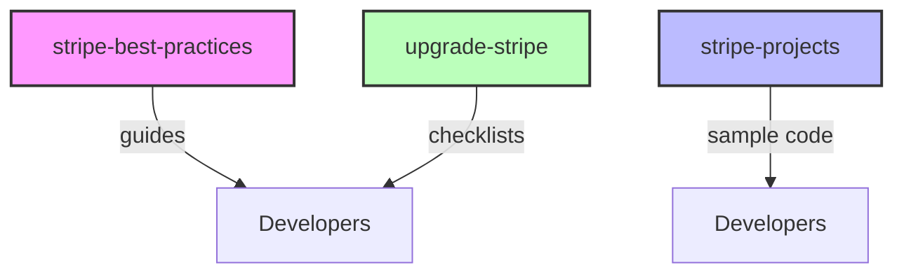

# Other — skills

# Other — skills

## Overview

The **Other — skills** module is a collection of reference material that supports developers working with Stripe integrations. It groups together three distinct skill‑sets:

| Skill set | Description |
|-----------|-------------|
| `stripe-best-practices` | Guidelines and patterns for building robust, secure, and maintainable Stripe integrations. |
| `stripe-projects` | Example project structures, sample code snippets, and walkthroughs that illustrate common Stripe use‑cases. |
| `upgrade-stripe` | Step‑by‑step instructions for migrating existing Stripe implementations to newer API versions or SDK releases. |

These assets are primarily documentation (Markdown, HTML, or plain‑text) rather than executable code. They are intended to be read, referenced, and extended by developers who need to deepen their Stripe expertise or onboard new team members.

## Directory Layout

```
skills/
├── stripe-best-practices/
│   └── *.md          # Best‑practice guides
├── stripe-projects/
│   └── */            # Example projects (code, configs, README)
└── upgrade-stripe/
    └── *.md          # Upgrade checklists and migration notes
```

* Each sub‑directory is self‑contained; there are no cross‑references or imports between them.
* The module does not expose any runtime APIs, classes, or functions. Consequently, there are no internal, outgoing, or incoming calls in the call graph.

## Purpose & Usage

### Stripe Best Practices

- **Goal:** Provide a canonical source of recommended patterns (e.g., handling webhooks, idempotency, error handling, PCI compliance).
- **Typical consumption:** Developers read the Markdown files while designing new payment flows or performing code reviews.

### Stripe Projects

- **Goal:** Offer ready‑made project skeletons that demonstrate how to integrate Stripe with various back‑end languages and front‑end frameworks.
- **Typical consumption:** Clone a project folder, run the provided setup scripts, and experiment with the sample code. The projects can also serve as a starting point for new services.

### Upgrade Stripe

- **Goal:** Document the steps required to upgrade a codebase to a newer Stripe API version or SDK, including breaking changes, deprecation notices, and testing strategies.
- **Typical consumption:** Follow the checklist when planning a version bump; use the migration notes to adjust code and configuration.

## Contributing Guidelines

1. **Add new content**  
   - Create a new Markdown file in the appropriate sub‑directory.  
   - Follow the existing naming convention (`<topic>.md` for guides, `README.md` for project roots).  

2. **Update existing guides**  
   - Keep the style consistent: use headings (`##`), bullet lists, and code fences.  
   - Reference the official Stripe documentation where applicable.  

3. **Version control**  
   - All changes are tracked via Git.  
   - Use conventional commit messages (`feat: add …`, `docs: update …`).  

4. **Review process**  
   - Submit a pull request.  
   - At least one reviewer from the payment‑team must approve.  

## Integration with the Codebase

Although the **Other — skills** module does not contain executable code, it plays a critical role in the overall development workflow:

- **Onboarding:** New engineers are directed to the `stripe-best-practices` guides during their first week.
- **Documentation generation:** A CI job aggregates the Markdown files into a static site (`/docs/stripe-skills.html`) for internal consumption.
- **Quality gates:** The CI pipeline includes a lint step that checks for broken links and Markdown syntax errors within this module.

### Mermaid Overview (optional)



The diagram illustrates that each skill sub‑module serves developers directly; there are no runtime dependencies between them.

## Maintenance

- **Periodic review:** Every six months, the payment‑team reviews the content for relevance against the latest Stripe releases.
- **Deprecation handling:** When a Stripe feature is retired, the corresponding sections in `stripe-best-practices` and `upgrade-stripe` must be updated or removed.
- **Documentation build:** The CI job that publishes the static site should be monitored for failures; a broken build indicates a possible syntax error in the Markdown files.

---

*End of documentation for the **Other — skills** module.*