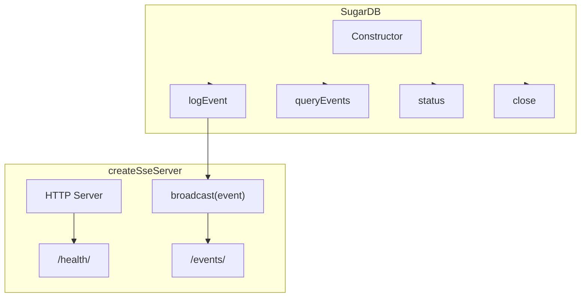

# Other — sugar-db

# @aigency/sugar-db

## Overview

`@aigency/sugar-db` provides a lightweight SQLite‑backed event store and a Server‑Sent Events (SSE) server for broadcasting those events to downstream consumers. It is deliberately minimal:

* **`SugarDB`** – a thin wrapper around a `better-sqlite3` database that stores event logs, supports filtered queries, and reports simple status metrics.
* **`createSseServer`** – an HTTP server exposing an `/events` stream (SSE) and a `/health` endpoint. Connected clients receive any event broadcast via the server’s `broadcast` function.

Both components are designed for use in worker processes where a small, self‑contained persistence layer is sufficient.

## Installation

```bash
npm install @aigency/sugar-db
```

The package is **private** (intended for internal use) and ships as an ES module (`"type": "module"`).

## API Reference

### `class SugarDB`

```ts
new SugarDB(path: string)
```

* **`path`** – Filesystem path to the SQLite database. Use `':memory:'` for an in‑memory database (as in the test suite).

#### Methods

| Method | Signature | Description |
|--------|-----------|-------------|
| `logEvent` | `logEvent(event: LogEventInput): LogEventResult` | Inserts a new event row. Returns the generated `log_id` and the ISO‑8601 `timestamp` of insertion. |
| `queryEvents` | `queryEvents(filter?: QueryFilter): LogEventRow[]` | Retrieves events matching optional filters. Results are ordered by `timestamp` descending. |
| `status` | `status(): DBStatus` | Returns a snapshot of the database: total row count and the timestamp of the most recent event (or `null` if empty). |
| `close` | `close(): void` | Closes the underlying SQLite connection. Must be called when the DB is no longer needed (e.g., after each test). |

#### Types

```ts
interface LogEventInput {
  event_class: string;          // e.g. "route.start"
  source_worker: string;        // e.g. "gateway"
  payload_snapshot: object | string; // JSON‑serializable object or pre‑stringified JSON
}

interface LogEventResult {
  log_id: number;               // Auto‑incremented primary key (> 0)
  timestamp: string;            // ISO‑8601 string, e.g. "2024-01-01T00:00:00.000Z"
}

interface QueryFilter {
  event_class?: string;
  source_worker?: string;
  limit?: number;
}

interface LogEventRow extends LogEventResult {
  event_class: string;
  source_worker: string;
  payload_snapshot: string; // always stored as a JSON string
}

interface DBStatus {
  row_count: number;
  last_event_timestamp: string | null;
}
```

#### Behaviour Details

* **Auto‑increment** – Each call to `logEvent` generates a monotonically increasing `log_id`. The test suite verifies that later inserts have larger IDs.
* **Timestamp** – The insertion timestamp is generated by SQLite (`CURRENT_TIMESTAMP`) and returned as an ISO‑8601 string.
* **Payload handling** – If `payload_snapshot` is an object, it is `JSON.stringify`‑ed before storage. If it is already a string, it is stored verbatim. Retrieval via `queryEvents` always yields the raw JSON string; callers must `JSON.parse` if they need the original object.
* **Filtering** – `queryEvents` supports optional `event_class`, `source_worker`, and `limit` filters. When multiple filters are supplied they are combined with `AND`. The result set is sorted by `timestamp DESC`.
* **Status** – `status()` reports the total number of rows (`row_count`) and the timestamp of the newest event (`last_event_timestamp`). If the table is empty, `last_event_timestamp` is `null`.

### `createSseServer`

```ts
function createSseServer(port: number): {
  server: http.Server;
  broadcast: (event: LogEventResult & LogEventRow) => void;
  ready: Promise<number>;
}
```

* **`port`** – Desired listening port. If `0` is passed, the OS selects an available port (useful for tests). The returned `ready` promise resolves with the actual port number once the server is listening.

#### Returned Object

| Property | Type | Description |
|----------|------|-------------|
| `server` | `http.Server` | The underlying Node.js HTTP server. Call `server.close()` to stop listening. |
| `broadcast` | `(event) => void` | Sends a single event to all currently connected SSE clients. The event shape must match the combined `LogEventResult` and `LogEventRow` interfaces (i.e., contain `log_id`, `timestamp`, `event_class`, `source_worker`, `payload_snapshot`). |
| `ready` | `Promise<number>` | Resolves to the bound port number when the server is ready to accept connections. |

#### Endpoints

| Path | Method | Response | Description |
|------|--------|----------|-------------|
| `/events` | `GET` | `text/event-stream` | Opens an SSE stream. Each broadcasted event is emitted as a `data:` line containing a JSON string of the event object. |
| `/health` | `GET` | `application/json` | Returns `{ status: "ok", clients: <number> }`. `clients` is the count of currently connected SSE clients. |
| `*` | any | `404` | Any unknown route returns HTTP 404. |

#### Example Usage

```ts
import { SugarDB } from '@aigency/sugar-db';
import { createSseServer } from '@aigency/sugar-db';

// Initialise DB (persistent file or in‑memory)
const db = new SugarDB('events.sqlite');

// Insert an event and immediately broadcast it
const ev = db.logEvent({
  event_class: 'order.created',
  source_worker: 'order-service',
  payload_snapshot: { orderId: 123, amount: 49.99 },
});

const { server, broadcast, ready } = createSseServer(8080);
await ready; // server is listening

broadcast(ev); // all SSE clients receive the event

// Graceful shutdown
db.close();
server.close();
```

## Architecture Diagram



*The diagram shows the `SugarDB` class handling persistence, while the SSE server consumes events via `broadcast` and serves them over HTTP.*

## Testing

The module ships with a comprehensive test suite (`src/index.test.ts`) that validates:

* Correct insertion and auto‑increment behavior of `logEvent`.
* JSON serialization of object payloads and pass‑through of string payloads.
* Filtering, limiting, and ordering semantics of `queryEvents`.
* Accurate status reporting via `status`.
* SSE server functionality: correct content‑type, event broadcasting, health endpoint, and 404 handling.

Run tests with:

```bash
npm test
```

## Extending the Module

When adding new features:

1. **Maintain the thin abstraction** – keep `SugarDB` focused on CRUD‑style operations; avoid embedding business logic.
2. **Update the test suite** – add unit tests for any new method or endpoint.
3. **Preserve backward compatibility** – existing callers rely on the exact method signatures shown above.
4. **Consider schema migrations** – if the SQLite schema changes, add migration logic inside the `SugarDB` constructor before any queries run.

## License

The package is private to the Aigency organization. Refer to the repository’s root `LICENSE` file for details.