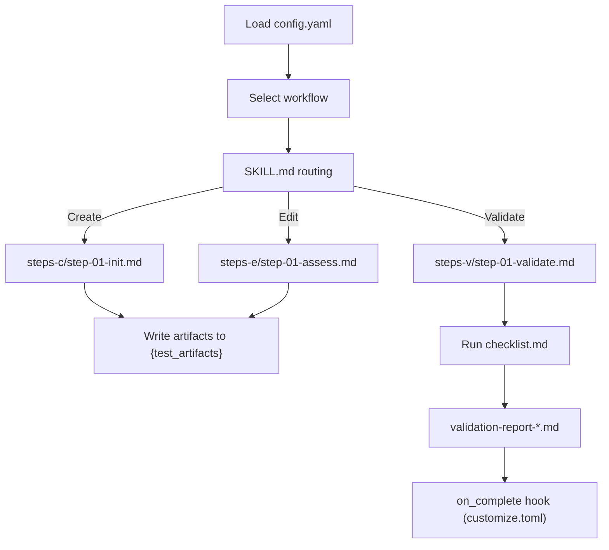

# Other — tea

# Other – TEA Module

## Overview

The **TEA** (Test Architect) module provides a declarative, step‑file driven framework for generating, editing, and validating test artifacts. It is driven by a YAML configuration (`_bmad/tea/config.yaml`) and a collection of workflow directories under `_bmad/tea/workflows/`. Each workflow follows a strict tri‑modal pattern—**Create**, **Edit**, **Validate**—implemented as small, ordered Markdown step files. The design enforces deterministic execution, minimal context per step, and 100 % compliance with the BMad Builder validator.

## Configuration (`_bmad/tea/config.yaml`)

| Key | Description | Default / Example |
|-----|-------------|-------------------|
| `test_artifacts` | Base path for all generated test artifacts. Supports `{project-root}` placeholder. | `"{project-root}/_bmad-output/test-artifacts"` |
| `tea_use_playwright_utils` | Enable Playwright‑based UI utilities. | `true` |
| `tea_use_pactjs_utils` | Enable PactJS utilities (currently disabled). | `false` |
| `tea_pact_mcp` | Pact mock‑control provider; set to `none` when not used. | `none` |
| `tea_browser_automation` | Browser automation mode (`auto`, `headless`, etc.). | `auto` |
| `tea_execution_mode` | Execution mode (`auto`, `manual`). | `auto` |
| `tea_capability_probe` | Probe the environment for required capabilities. | `true` |
| `test_stack_type` | Stack type detection (`auto`, `node`, `java`, …). | `auto` |
| `ci_platform` | CI platform detection (`auto`, `github`, `gitlab`, …). | `auto` |
| `test_framework` | Test framework detection (`auto`, `jest`, `mocha`, …). | `auto` |
| `risk_threshold` | Risk classification used for test prioritisation. | `p1` |
| `test_design_output` | Output folder for the *test‑design* workflow. | `_bmad-output/test-artifacts/test-design` |
| `test_review_output` | Output folder for the *test‑review* workflow. | `_bmad-output/test-artifacts/test-reviews` |
| `trace_output` | Output folder for the *trace* workflow. | `_bmad-output/test-artifacts/traceability` |
| `user_name` | Owner of the generated artifacts. | `REID` |
| `project_name` | Project identifier used in artifact naming. | `aigency-router-v2` |
| `communication_language` | Language for LLM prompts and responses. | `English` |
| `document_output_language` | Language for generated documentation. | `English` |
| `output_folder` | Root folder for all TEA output. Supports `{project-root}` placeholder. | `"{project-root}/_bmad-output"` |

> **Tip:** Adjust the placeholders (`{project-root}`) in a local `customize.toml` if you need a non‑standard layout.

## Workflow Directory Layout

Each workflow lives in `_bmad/tea/workflows/<workflow-name>/` and follows the **step‑file architecture**:

```
<workflow>/
├── SKILL.md                # Canonical entrypoint; routes to create/edit/validate
├── customize.toml          # Per‑workflow overrides (hooks, persistent facts)
├── workflow-plan.md        # Human‑readable design reference (step order, intent)
├── workflow.yaml           # Installer metadata (version, dependencies)
├── instructions.md         # Short summary for quick context
├── checklist.md            # Validation criteria for the workflow outputs
├── steps-c/                # Create‑mode steps (step-01-*.md, step-02-*.md, …)
├── steps-e/                # Edit‑mode steps (step-01-*.md, …)
├── steps-v/                # Validate‑mode steps (step-01-validate.md, …)
├── templates/              # Output templates (e.g., Jinja, Handlebars)
└── validation-report-*.md  # Latest validator output (generated by workflow‑builder)
```

### Core Files

| File | Role |
|------|------|
| **SKILL.md** | Entry point parsed by the BMad runtime. Determines which mode (`c`, `e`, `v`) to execute based on the `mode` fact. |
| **customize.toml** | Allows workflow‑specific configuration: <br>• `on_activate` – hook executed before the first step. <br>• `persistent_facts` – facts that survive across runs. <br>• `on_complete` – hook executed after the final step (e.g., artifact publishing). |
| **workflow-plan.md** | Human‑authored plan that documents the intended step sequence, rationale, and any cross‑step dependencies. |
| **workflow.yaml** | Machine‑readable metadata consumed by the installer (`bmad install`). Includes version, required capabilities, and optional external tools. |
| **instructions.md** | One‑paragraph description used by the UI to surface a quick overview. |
| **checklist.md** | List of assertions that the validator checks after the workflow finishes. Each entry maps to a `validation-report-*.md` entry. |
| **steps‑c/**, **steps‑e/**, **steps‑v/** | Ordered Markdown files that contain the actual LLM‑driven instructions. The naming convention (`step-01-*.md`, `step-01b-*.md`, …) encodes ordering and continuation semantics. |
| **templates/** | Reusable snippets referenced by steps via `{{template:…}}`. Enables consistent artifact formatting across workflows. |
| **validation-report-*.md** | Auto‑generated by `workflow-builder`. Contains pass/fail status for each checklist item and any diagnostic logs. |

## Execution Model

1. **Runtime Initialization** – The BMad engine loads `config.yaml` and resolves placeholders (`{project-root}`) against the current workspace.
2. **Entry Point** – The engine reads `SKILL.md` of the selected workflow. The file contains a mode selector, e.g.:

   ```markdown
   # SKILL.md
   
   {{ load: steps-c/step-01-init.md }}
   
   {{ load: steps-e/step-01-assess.md }}
   
   {{ load: steps-v/step-01-validate.md }}
   
   ```

3. **Step Loading** – Only **one** step file is loaded at a time. The step may:
   - Prompt the LLM for generation.
   - Write output files (using the `{test_artifacts}` variable).
   - Set or update facts that influence subsequent steps.
4. **Sequential Enforcement** – After a step finishes, the engine **must** write any declared outputs **before** loading the next step. The engine aborts if a step attempts to skip ahead or preload future steps.
5. **Validation** – Upon reaching the `steps-v/` directory, the engine runs the checklist defined in `checklist.md`. Results are persisted in `validation-report-*.md`. The workflow is considered successful only if the validator reports **no warnings**.
6. **Completion Hook** – If `customize.toml` defines an `on_complete` hook, it is executed after validation. Typical uses: publishing artifacts, notifying CI, or cleaning temporary state.

### No Internal or External Calls

The TEA module is self‑contained: it does not import other Python/JS modules, nor does it expose functions for external callers. Interaction occurs exclusively through the file‑system and the BMad runtime.

## Contributing Guidelines

| Area | What to Modify | Recommended Practices |
|------|----------------|------------------------|
| **Configuration** | Add new flags to `config.yaml` only when a new capability is required (e.g., a new browser driver). | Keep defaults sensible; document the flag in the module README. |
| **Workflow Design** | Create a new workflow directory under `_bmad/tea/workflows/`. | Follow the standard layout; copy an existing workflow as a template. |
| **Step Files** | Edit or add `step-XX-*.md` files. | • Keep each step under 500 words. <br>• Use explicit `{{ write: path/to/file }}` directives. <br>• Do not embed conditional logic that skips steps. |
| **Templates** | Add reusable snippets to `templates/`. | Name templates with a `*.tmpl.md` suffix; reference them via `{{template:my-template.tmpl.md}}`. |
| **Validation** | Extend `checklist.md` or the validator logic. | Ensure each new checklist item has a corresponding test in `validation-report-*.md`. |
| **Documentation** | Update this module README. | Keep the documentation in sync with any new flags, workflows, or step‑file conventions. |

### Testing Changes

1. Run the installer: `bmad install --module tea`.
2. Execute a workflow in **create** mode: `bmad run test-design --mode create`.
3. Verify that all files appear under the paths defined in `config.yaml`.
4. Run validation: `bmad run test-design --mode validate` and inspect `validation-report-*.md` for warnings.

## Integration Points

- **Playwright Utilities** – Enabled via `tea_use_playwright_utils`. When true, steps may import the `playwright` helper library (`{{ import: playwright }}`) to drive UI interactions.
- **CI Platform Detection** – The `ci_platform` flag influences which CI‑specific scripts are generated (e.g., GitHub Actions vs. GitLab CI). Workflows may reference `{{ ci: script }}` to emit platform‑appropriate files.
- **Risk Threshold** – The `risk_threshold` fact is used by the *nfr-assess* workflow to prioritize non‑functional requirements.

## Architecture Diagram



*The diagram shows the high‑level flow from configuration loading through mode‑specific step execution, artifact generation, validation, and optional completion hooks.*

## Frequently Asked Questions

**Q: Can I run a workflow in a mixed mode (e.g., create then edit without re‑starting)?**  
A: No. The TEA engine enforces a single mode per run. To edit existing artifacts, invoke the workflow with `--mode edit` after a successful `create` run.

**Q: Where do I find the generated test artifacts?**  
A: All artifacts are placed under the path resolved from `test_artifacts` in `config.yaml`. By default this resolves to `<project-root>/_bmad-output/test-artifacts`.

**Q: How do I add a new placeholder variable?**  
A: Extend `config.yaml` with a new key, then reference it in step files using the `{key}` syntax. Ensure the variable is also added to the `customize.toml` schema if you need per‑workflow overrides.

**Q: Is it safe to modify `workflow.yaml`?**  
A: Yes, but only to update metadata (e.g., version, required capabilities). Changing the schema may break the installer if the BMad runtime cannot parse the file.

--- 

*End of TEA module documentation.*