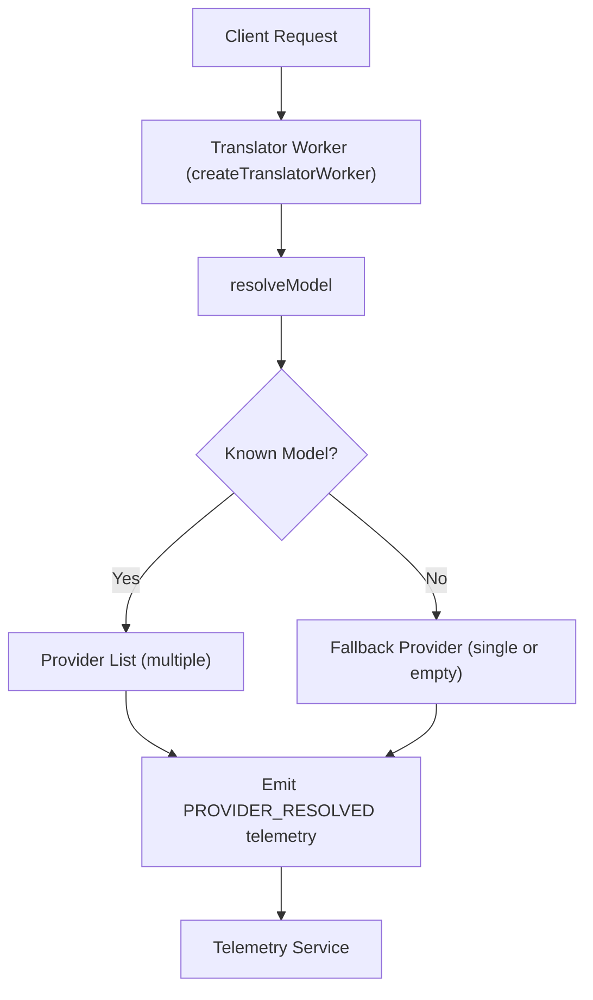

# Other — translator

# @aigency/translator – Translator Worker Module

## Overview
The **translator** worker resolves canonical model identifiers to concrete provider strings and exposes a factory for creating a translator worker instance. It is a self‑contained module that:

* Maps known model names (e.g., `llama3`, `llama3-70b`, `gpt-oss`) to a list of provider identifiers.
* Returns a fallback mapping for unknown or malformed model strings.
* Emits telemetry events (`PROVIDER_RESOLVED`) whenever a model is resolved, allowing downstream observability.

The module is written in TypeScript, compiled to CommonJS via the project’s root `tsconfig.json`, and is intended to be run with `tsx` during development.

---

## Exported API

| Export | Type | Description |
|--------|------|-------------|
| `createTranslatorWorker` | `() => TranslatorWorker` | Factory that creates a new translator worker. The concrete `TranslatorWorker` type is defined in the implementation (not shown) and is responsible for handling translation requests. |
| `resolveModel` | `(model: string) => { model: string; providers: string[]; resolved: boolean }` | Resolves a canonical model name to a list of provider identifiers. Returns an object describing the resolution outcome. |

### `resolveModel(model)`

| Parameter | Type | Description |
|-----------|------|-------------|
| `model` | `string` | The canonical model identifier supplied by the caller. May be an empty string or whitespace. |

**Return value** – an object with three properties:

* `model`: Echoes the input string (or the trimmed version if you prefer to handle whitespace upstream).
* `providers`: An array of provider identifiers. For known models this contains one or more strings; for unknown models it contains the original model string as a single element, or an empty array if the input is empty/whitespace.
* `resolved`: `true` if the model is recognized and a provider list was generated; `false` otherwise.

#### Known Model Resolutions

| Canonical Model | Resolved | Provider List |
|-----------------|----------|---------------|
| `llama3` | `true` | `groq/llama3-8b-8192`, `cerebras/llama3.1-8b`, `together/meta-llama/Meta-Llama-3.1-8B-Instruct-Turbo` |
| `llama3-70b` | `true` | `groq/llama-3.3-70b-versatile`, `together/meta-llama/Llama-3.3-70B-Instruct-Turbo` |
| `gpt-oss` | `true` | `cerebras/gpt-oss-120b`, `groq/openai/gpt-oss-20b`, `together/openai/gpt-oss-120b` |
| *any other non‑empty string* | `false` | `[model]` (the original string) |
| `''` or whitespace only | `false` | `[]` |

#### Example

```ts
import { resolveModel } from '@aigency/translator';

const result = resolveModel('llama3');
/*
{
  model: 'llama3',
  providers: [
    'groq/llama3-8b-8192',
    'cerebras/llama3.1-8b',
    'together/meta-llama/Meta-Llama-3.1-8B-Instruct-Turbo',
  ],
  resolved: true,
}
*/
```

### `createTranslatorWorker()`

The factory returns a worker instance that internally uses `resolveModel` to map incoming translation requests to a concrete provider. The exact shape of the returned object is defined in `src/index.ts` (implementation not shown) but typically includes methods such as `translate`, `initialize`, and `shutdown`.

**Typical usage**

```ts
import { createTranslatorWorker } from '@aigency/translator';

const worker = createTranslatorWorker();
// worker.translate(...);
```

---

## Telemetry Integration

The module relies on the shared telemetry helper (`../../shared/telemetry.ts`). When `resolveModel` produces a result, the worker emits a `PROVIDER_RESOLVED` event with the following payload:

```ts
{
  eventClass: 'PROVIDER_RESOLVED',
  sourceWorker: 'translator',
  payload: {
    model: string,          // the canonical model name passed to resolveModel
    resolved: boolean,     // true if the model is known
    providerCount: number, // length of the providers array
  }
}
```

The telemetry helper gracefully handles failures in the underlying trigger function, logging a warning via `console.warn` without propagating the error.

---

## Architecture Diagram



*The diagram shows the resolution path and telemetry emission. No external calls are made from this module; provider selection is purely deterministic.*

---

## Development & Testing

### Running Tests

```bash
npm run test
```

The test suite validates:

* Export existence (`createTranslatorWorker`, `resolveModel`).
* Correct resolution for the three canonical models.
* Proper fallback behavior for unknown, empty, or whitespace‑only inputs.
* Telemetry emission and graceful error handling.

### Building

```bash
npm run dev   # runs the worker via tsx (development mode)
```

The `tsconfig.json` inherits from the repository root and outputs compiled files to `dist/`.

---

## Dependencies

| Dependency | Reason |
|------------|--------|
| `iii-sdk` | Provides the underlying inference interface used by the worker (implementation details are in `src/index.ts`). |
| `tsx` | Enables on‑the‑fly TypeScript execution for the `dev` script. |
| `typescript` | Compile‑time type checking. |
| `@types/node` | Node.js type definitions for the test harness. |

---

## Extending the Module

When adding support for a new canonical model:

1. Update `resolveModel` to include the new case and its provider list.
2. Add a corresponding test case in `src/index.test.ts` mirroring the existing pattern.
3. Ensure telemetry payload reflects the new provider count.

If the worker needs to call external services (e.g., a new LLM provider), inject the provider client via the worker factory and keep the call surface pure—`resolveModel` should remain a pure function.

---