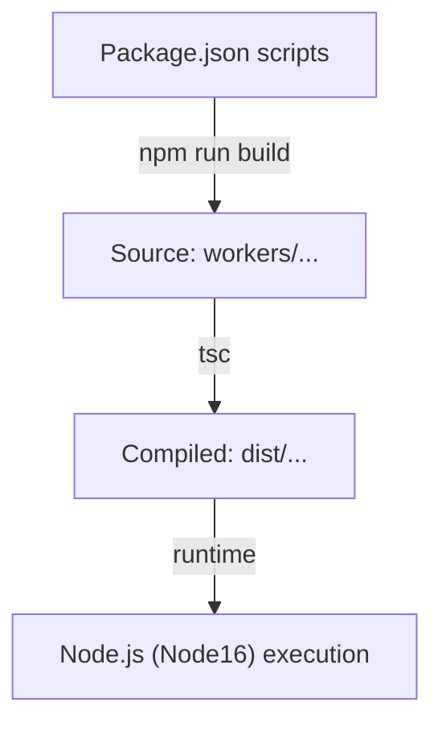

# Other — tsconfig.json

# Other — `tsconfig.json`

## Overview
`tsconfig.json` defines the TypeScript compiler configuration for the **Other** package. It is the single source of truth for how the TypeScript compiler (`tsc`) processes the project's source files, generates declaration files, and emits JavaScript output. The configuration is scoped to the `workers` directory and produces compiled artifacts in the `dist` folder.

## Compiler Options

| Option | Value | Description |
|--------|-------|-------------|
| `target` | `ES2022` | Emit JavaScript that conforms to the ECMAScript 2022 specification. |
| `module` | `Node16` | Use the Node.js 16 module system (ESM with support for `import.meta`). |
| `moduleResolution` | `Node16` | Resolve modules using Node.js 16 resolution rules (including conditional exports). |
| `strict` | `true` | Enable all strict type‑checking options (`noImplicitAny`, `strictNullChecks`, etc.). |
| `esModuleInterop` | `true` | Allow default imports from CommonJS modules (`import foo from "foo"`). |
| `skipLibCheck` | `true` | Skip type checking of declaration files (`*.d.ts`) in `node_modules` to speed up builds. |
| `forceConsistentCasingInFileNames` | `true` | Enforce case‑consistent imports on case‑sensitive file systems. |
| `resolveJsonModule` | `true` | Permit importing `.json` files as typed modules. |
| `declaration` | `true` | Emit `.d.ts` files alongside compiled JavaScript. |
| `declarationMap` | `true` | Generate source maps for declaration files (`.d.ts.map`). |
| `sourceMap` | `true` | Generate source maps for compiled JavaScript (`.js.map`). |
| `outDir` | `./dist` | Destination directory for all compiled output. |
| `rootDir` | `.` | Base directory for relative path calculations; the project root. |
| `composite` | `true` | Enable incremental builds and project references (required for `tsc --build`). |

## File Inclusion / Exclusion

- **Included**: `workers/**/*` – All TypeScript/TSX/JSON files under the `workers` folder are compiled.
- **Excluded**: `node_modules`, `dist` – External dependencies and previously compiled output are ignored.

## Build Process

1. **Invocation**  
   The build is typically run via an npm script, e.g.:

   ```bash
   npm run build   # internally executes: tsc -b
   ```

   The `-b` flag tells TypeScript to treat this `tsconfig.json` as a *composite* project and to respect incremental build metadata (`.tsbuildinfo`).

2. **Compilation Flow**  
   - The compiler reads `tsconfig.json` and resolves all files matching `workers/**/*`.  
   - Each source file is type‑checked under the strict settings.  
   - JavaScript output is emitted to `dist/`, preserving the original directory structure (e.g., `workers/foo/bar.ts` → `dist/foo/bar.js`).  
   - Declaration files (`.d.ts`) and their source maps are emitted alongside the JavaScript files.

3. **Incremental Builds**  
   Because `composite` is `true`, TypeScript writes a `.tsbuildinfo` file in the project root. Subsequent builds only recompile files that have changed, dramatically reducing compile time for large codebases.

## Interaction with the Rest of the Codebase



- **Source (`workers/`)** – Contains the actual worker implementations, utility modules, and any JSON assets imported as modules.
- **Compiled (`dist/`)** – Consumed by the runtime environment (Node.js 16) when the package is executed or published.
- **Package scripts** – The `package.json` of the repository typically references this `tsconfig.json` via `tsc -b` or `tsc` commands, ensuring that the build pipeline respects the same configuration.

## Extending or Modifying the Configuration

When adjusting the TypeScript setup, keep the following guidelines in mind:

1. **Scope** – The `include` pattern is deliberately limited to `workers/**/*`. Adding new source directories requires updating both `include` and any related import paths.
2. **Compatibility** – Changing `module` or `moduleResolution` may affect how the compiled code interacts with Node.js or bundlers. Verify compatibility with the target runtime before altering these values.
3. **Performance** – `skipLibCheck` and `composite` are set for faster builds. Removing `skipLibCheck` will increase type‑checking time but may catch mismatched library typings.
4. **Declaration Generation** – The `declaration` and `declarationMap` options are essential for downstream TypeScript consumers. Disabling them will break type information for packages that depend on this module.

## Common Pitfalls

- **Missing `outDir`** – If `outDir` is removed or changed, compiled files may be emitted alongside source files, polluting the repository and causing accidental commits of build artifacts.
- **Incorrect `rootDir`** – Setting `rootDir` to a subdirectory (e.g., `workers`) will cause the emitted path structure to lose the top‑level folder, potentially breaking import paths.
- **Neglecting `composite`** – Without `composite`, incremental builds are disabled, leading to full recompilation on every `npm run build`.

## Versioning & Compatibility

- **Target ECMAScript** – `ES2022` aligns with the minimum Node.js version that supports top‑level `await` and class fields. If the runtime environment is downgraded, adjust `target` accordingly.
- **Node Module System** – `Node16` requires Node.js 16+; older Node versions will need `CommonJS` (`module: "CommonJS"`).

## Summary

`tsconfig.json` is the central configuration that drives TypeScript compilation for the **Other** package. It enforces strict type safety, produces both JavaScript and declaration files, and outputs them to a clean `dist` directory ready for consumption by Node.js 16. Maintaining the integrity of this file ensures reliable builds, fast incremental compilation, and seamless integration with the rest of the repository.