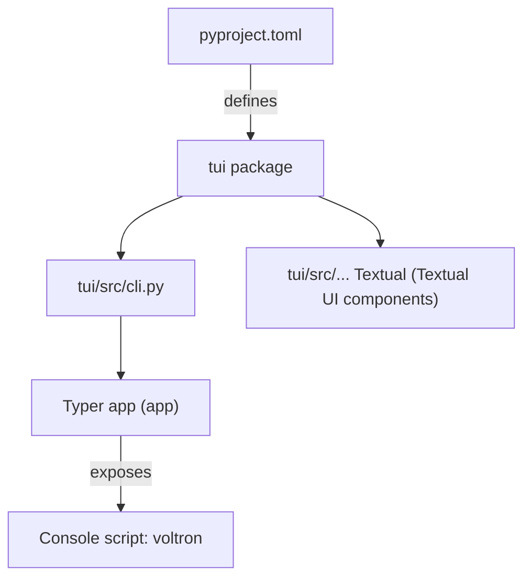

# Other — tui

# voltron-tui (Other — tui)

## Overview
`voltron-tui` provides a Textual‑based terminal user interface (TUI) and a command‑line interface (CLI) for managing SugarVault instances. The package is built with Python 3.11+ and is intended to be installed as a console script named **`voltron`**.

## Package Layout
```
voltron-tui/
├─ pyproject.toml          # Build metadata, dependencies, and entry point
└─ tui/
   ├─ src/
   │  ├─ __init__.py
   │  ├─ cli.py            # Typer application exposing the `voltron` command
   │  └─ ...               # Additional TUI components (Textual widgets, screens)
   └─ ...                  # Optional resources (templates, assets)
```

*The `tui` directory is the top‑level package that is included in the wheel via the `[tool.pdm.build] packages = ["tui"]` setting.*

## Build & Installation

### Using PDM
```bash
# Install the package in a virtual environment
pdm install
# Or install as an editable package for development
pdm install -G dev -e .
```

### Distribution
The project uses **pdm-backend** to build a wheel:

```bash
pdm build
# Resulting .whl can be uploaded to PyPI or installed locally:
pip install dist/voltron_tui-0.1.0-py3-none-any.whl
```

## CLI Entry Point
The `voltron` console script is defined in `pyproject.toml`:

```toml
[project.scripts]
voltron = "tui.src.cli:app"
```

- **`tui.src.cli`** – module containing the Typer application.
- **`app`** – a `typer.Typer` instance that registers sub‑commands for interacting with SugarVault (e.g., `voltron login`, `voltron list`, `voltron sync`).

Running `voltron --help` displays the automatically generated help text from Typer.

## Core Dependencies
| Dependency | Minimum Version | Purpose |
|------------|----------------|---------|
| `textual`  | ≥ 0.80         | Provides the TUI framework (widgets, layout, event loop). |
| `typer`    | ≥ 0.12         | Simplifies CLI creation and argument parsing. |
| `cryptography` | ≥ 42.0   | Handles secure storage of credentials and encryption of vault data. |
| `rich`     | ≥ 13.0         | Supplies rich text rendering for both CLI output and Textual components. |

All dependencies are declared in the `[project]` section of `pyproject.toml`.

## Development & Testing
### Development Extras
```toml
[dependency-groups]
dev = [
    "pytest>=8.0",
    "pytest-asyncio>=0.23",
]
```
- `pytest` – test runner.
- `pytest-asyncio` – support for async test cases (required by Textual/Typer async commands).

### Running Tests
```bash
pdm run pytest
```
Tests are located under the `tests/` directory and are automatically discovered by pytest via the `pythonpath = ["."]` configuration.

## Contribution Guidelines
1. **Fork & Clone** – Create a fork of the repository and clone it locally.
2. **Create a Virtual Environment** – Use `pdm install -G dev` to set up the development environment.
3. **Write Tests** – Add unit tests for any new functionality; ensure coverage of both CLI commands and TUI components.
4. **Lint & Format** – Follow the project's formatting conventions (e.g., `ruff` or `black` if configured).
5. **Submit a PR** – Ensure all tests pass (`pdm run pytest`) before opening a pull request.

## Architecture Diagram

*The diagram shows the flow from packaging metadata to the exposed `voltron` command and the internal UI modules.*

## Runtime Behavior
- **CLI Invocation** – When a user runs `voltron <command>`, Typer parses arguments, dispatches to the appropriate handler in `tui.src.cli`, and may launch a Textual UI session.
- **TUI Session** – Textual creates an async event loop; UI widgets defined under `tui/src/` render the interface, interact with the `cryptography` layer for secure operations, and use `rich` for styled output.

## Extending the Module
- **Add a new command** – Define a function in `tui/src/cli.py` and decorate it with `@app.command()`.
- **Add a new screen** – Subclass `textual.app.App` or `textual.screen.Screen` in `tui/src/` and register it with the main application.
- **Update dependencies** – Modify the `dependencies` list in `pyproject.toml` and run `pdm update`.

--- 

*For detailed API reference, see the docstrings within `tui/src/cli.py` and the Textual widget modules.*