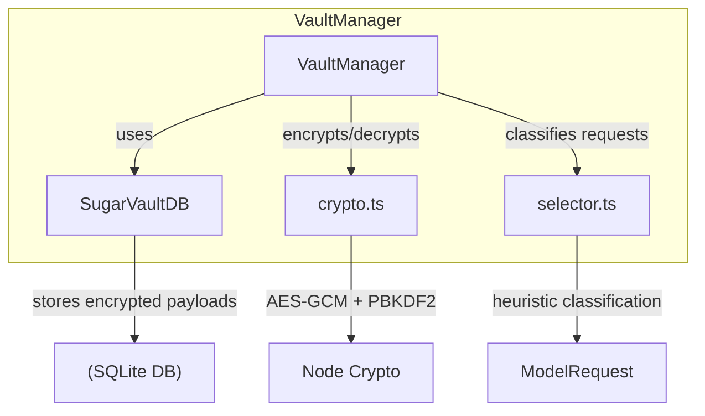
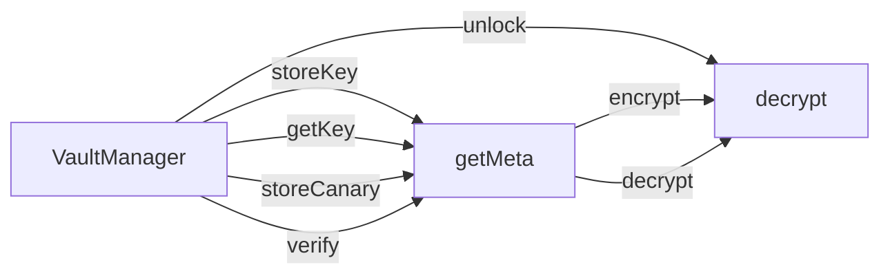

# Other — vault

# @aigency/vault – Secure API‑Key Storage & Retrieval

The **vault** module provides a self‑contained, encrypted key store for API credentials (e.g., OpenAI, Anthropic). It is built on top of SQLite (via `better-sqlite3`) and uses AES‑GCM with a PBKDF2‑derived key to keep secrets safe at rest. The public surface consists of:

* **Crypto utilities** – `deriveKey`, `encrypt`, `decrypt`
* **Database layer** – `SugarVaultDB`
* **Selector** – `HeuristicSelector`, `createSelector`
* **Vault manager** – `VaultManager`

All components are pure TypeScript (ESM) and can be used independently, but the typical workflow goes through `VaultManager`.

---

## 1. Architecture Overview



* `VaultManager` orchestrates unlocking, key derivation, and persistence.
* `SugarVaultDB` abstracts SQLite schema, WAL mode, and meta‑data handling.
* `crypto.ts` provides the low‑level encryption primitives.
* `selector.ts` offers a pluggable request classifier (used by higher‑level workers, not directly by the vault tests).

---

## 2. Crypto Utilities (`src/crypto.ts`)

### 2.1 API

| Export | Signature | Description |
|--------|-----------|-------------|
| `deriveKey(password: string, salt: Buffer): Buffer` | Returns a 32‑byte key derived with PBKDF2 (SHA‑256, 200 000 iterations). Throws if `password` is empty or `salt` is not a 16‑byte `Buffer`. |
| `encrypt(plaintext: string, password: string): EncryptedPayload` | Generates a fresh 16‑byte salt and 12‑byte IV, derives a key via `deriveKey`, encrypts with AES‑GCM, and returns `{ salt, iv, authTag, ciphertext }`. All fields are `Buffer`s. |
| `decrypt(payload: EncryptedPayload, password: string): string` | Re‑derives the key from `payload.salt` and `password`, decrypts the ciphertext, validates the authentication tag, and returns the original plaintext. Throws on malformed payload, empty password, or tag mismatch. |

### 2.2 `EncryptedPayload` type

```ts
type EncryptedPayload = {
  salt: Buffer;        // 16 bytes
  iv: Buffer;          // 12 bytes
  authTag: Buffer;     // 16 bytes (AES‑GCM tag)
  ciphertext: Buffer; // variable length
};
```

### 2.3 Security notes

* **Randomness** – each call to `encrypt` creates a new salt and IV, guaranteeing ciphertext uniqueness even for identical plaintext/password pairs.
* **Tamper detection** – any modification of `salt`, `iv`, `authTag`, or `ciphertext` triggers an authentication‑tag mismatch error.
* **Unicode support** – plaintext is UTF‑8 encoded; Unicode characters survive a full encrypt/decrypt round‑trip.

---

## 3. Database Layer (`src/db.ts`)

`SugarVaultDB` is a thin wrapper around a SQLite file (or `:memory:`) that stores encrypted payloads and auxiliary meta‑data.

### 3.1 Construction

```ts
const db = new SugarVaultDB(pathToFileOrMemory: string);
```

* The constructor creates the required tables (`keys`, `meta`) and enables **WAL** (Write‑Ahead Logging) for better concurrency and crash safety.

### 3.2 Core tables

| Table | Columns |
|-------|---------|
| `keys` | `id` (PK), `providerId`, `encryptedPayload` (BLOB), `virtualColleagueId` (nullable), `isActive` (BOOLEAN), `createdAt` (TIMESTAMP) |
| `meta` | `key` (PK), `value` (TEXT) |

### 3.3 Public methods

| Method | Signature | Behaviour |
|--------|-----------|-----------|
| `storeKey(id: string, providerId: string, payload: Buffer, virtualColleagueId?: string | null): void` | Inserts a new row; `isActive` defaults to `true`. Throws on duplicate `id`. |
| `getKey(providerId: string): KeyEntry \| null` | Returns the **most recent active** key for the given provider, or `null` if none exist. |
| `getAllKeys(): KeyEntry[]` | Returns every row (including deactivated ones) ordered by `createdAt DESC`. |
| `deactivateKey(id: string): void` | Sets `isActive = false` for the matching row; no error if the row does not exist. |
| `setMeta(key: string, value: string): void` | Upserts a meta entry. |
| `getMeta(key: string): string \| null` | Retrieves a meta value or `null`. |
| `getKeyCount(): number` | Counts all rows in `keys` (active + deactivated). |
| `close(): void` | Closes the underlying SQLite connection. |

### 3.4 Types

```ts
type KeyEntry = {
  id: string;
  providerId: string;
  encryptedPayload: Buffer;
  virtualColleagueId: string | null;
  isActive: boolean;
  createdAt: Date;
};
```

### 3.5 WAL mode verification (test)

The test suite creates a file‑based DB, writes a key, and checks that no error is thrown, confirming that the `PRAGMA journal_mode=WAL` statement succeeded.

---

## 4. Selector (`src/selector.ts`)

The selector is a **pluggable heuristic** that classifies a model request as either `"simple"` or `"complex"`.

### 4.1 Types

```ts
type Classification = 'simple' | 'complex';
type ModelRequest = {
  model: string;
  messages: { role: string; content: string }[];
  enforce_json?: boolean;
  max_tokens?: number;
  // other optional fields omitted for brevity
};
interface Selector {
  classify(req: ModelRequest): Classification;
}
```

### 4.2 `HeuristicSelector`

* **Simple** if:
  * `messages.length <= 3`
  * `enforce_json` is falsy
  * `max_tokens` is `undefined` or `<= 4096`
* **Complex** otherwise.

### 4.3 Factory

```ts
export function createSelector(): Selector {
  return new HeuristicSelector();
}
```

The factory returns a `HeuristicSelector` by default, but callers can supply any object that implements the `Selector` interface.

---

## 5. Vault Manager (`src/vault.ts`)

`VaultManager` is the high‑level façade used by workers to store and retrieve API keys securely.

### 5.1 Lifecycle

```ts
const vm = new VaultManager(dbPath);
vm.unlock(masterPassword);   // → { unlocked: true }
vm.lock();                   // wipes the derived master key from memory
```

* **Unlock** derives a master key (via `deriveKey`) using a stored `master_salt` meta value (or generates one on first unlock). It also validates the password by decrypting a *canary* entry (if present). On success, `vm` becomes unlocked.
* **Lock** zeroes the in‑memory master key and marks the manager as locked.

### 5.2 Public API

| Method | Signature | Notes |
|--------|-----------|-------|
| `unlock(password: string): { unlocked: true }` | Throws if `password` is empty or canary verification fails. |
| `lock(): void` | After locking, any call to `storeKey` or `getKey` throws `Vault is locked`. |
| `storeCanary(): void` | Encrypts a known constant (`'canary'`) with the derived master key and stores it in the `meta` table (`'canary'`). Used for subsequent password verification. |
| `storeKey(providerId: string, apiKey: string, virtualColleagueId?: string): { stored: true; id: string }` | Encrypts `apiKey` with the master key, generates a UUID for `id`, and persists via `SugarVaultDB.storeKey`. Throws on empty `providerId` or `apiKey`. |
| `getKey(providerId: string): { key: string; id: string } \| null` | Retrieves the most recent active entry for `providerId`, decrypts the payload, and returns the plaintext key. Returns `null` if no active key exists. |
| `getStatus(): { unlocked: boolean; keyCount: number; providers: string[] }` | Summarizes vault state; `providers` is a deduped list of provider IDs with at least one stored key. |
| `setMeta(key: string, value: string): void` / `getMeta(key: string): string \| null` | Proxy to the underlying DB for arbitrary meta data (e.g., `master_salt`). |

### 5.3 Interaction diagram (simplified)



### 5.4 Error handling

* **Empty password** – `unlock` and `storeKey`/`encrypt` reject with `must not be empty`.
* **Locked access** – `storeKey` and `getKey` throw `Vault is locked` if called after `lock`.
* **Canary mismatch** – `unlock` throws `Unlock failed: wrong master password` when the stored canary cannot be decrypted.

### 5.5 Telemetry (optional)

When a key is rotated (i.e., a new key is stored for a provider that already has an active key), the manager emits a `KEY_ROTATED` telemetry event via the shared `logTelemetry` helper. The event payload contains `{ providerId }`. Failures in telemetry are logged as warnings but do not affect vault operation.

---

## 6. Security & Operational Considerations

| Concern | Mitigation |
|---------|------------|
| **Plaintext leakage** | Keys are always encrypted before persisting. Tests verify that raw DB files never contain the plaintext. |
| **Key derivation salt** | Stored in the `meta` table under `master_salt`. If missing, a new random 16‑byte salt is generated on first unlock. |
| **Canary verification** | Guarantees that a wrong password cannot silently succeed; the canary is encrypted with the master key and checked on each unlock. |
| **WAL mode** | Enabled automatically; improves durability and allows concurrent readers. |
| **Memory hygiene** | `lock()` overwrites the derived master key buffer, reducing the window for accidental exposure. |
| **Tamper detection** | AES‑GCM authentication tag ensures any modification of stored ciphertext is detected on decryption. |

---

## 7. Usage Example

```ts
import { VaultManager } from '@aigency/vault';

// Initialise a vault backed by a file on disk
const vm = new VaultManager('/path/to/vault.db');

// Unlock with a master password (creates the DB if it does not exist)
await vm.unlock('my‑strong‑password');

// Store a new OpenAI key
const stored = vm.storeKey('openai', 'sk-abc123...');
console.log(`Stored key ID: ${stored.id}`);

// Retrieve the latest key for OpenAI
const entry = vm.getKey('openai');
if (entry) {
  console.log(`Decrypted key: ${entry.key}`);
}

// Rotate the key – the second call will trigger telemetry
vm.storeKey('openai', 'sk-new‑key‑456');

// Inspect vault status
console.log(vm.getStatus());

// Securely lock the vault when done
vm.lock();
```

---

## 8. Testing Overview

* **Crypto tests** (`crypto.test.ts`) cover key derivation, encryption/decryption round‑trips, randomness, and tamper detection.
* **DB tests** (`db.test.ts`) verify schema creation, CRUD operations, WAL mode, binary payload integrity, and meta handling.
* **Vault tests** (`index.test.ts`) exercise the full lifecycle: unlock → store → retrieve → lock, canary verification, and ensure plaintext never appears in the raw DB file.
* **Selector tests** (`selector.test.ts`) confirm the heuristic classification logic and the factory behavior.

All tests run with Node’s built‑in test runner (`node:test`) and require no external services.

---

## 9. Extending the Module

* **Custom selector** – implement the `Selector` interface and pass the instance to any higher‑level worker that consumes `createSelector`. The vault itself does not depend on the selector, but the pattern is ready for future request‑routing logic.
* **Alternative storage** – replace `SugarVaultDB` with another persistence layer (e.g., PostgreSQL) by preserving the same method signatures (`storeKey`, `getKey`, etc.).
* **Different KDF** – modify `deriveKey` to use Argon2 or scrypt if stronger memory‑hard derivation is required; ensure the same function is used for both encryption and decryption.

---

## 10. Dependencies

| Dependency | Reason |
|------------|--------|
| `better-sqlite3` | Synchronous, zero‑dependency SQLite driver with full WAL support. |
| `iii-sdk` | Provides the `logTelemetry` helper used for emitting vault events. |
| `tsx` (dev) | Enables running TypeScript files directly in tests (`npm run dev`). |
| `@types/better-sqlite3`, `@types/node` | Type definitions for development. |

---

## 11. License & Repository

The module is private to the monorepo (`private: true` in `package.json`). For internal contributors, see the repository’s `README` for contribution guidelines and the `tsconfig.json` for compiler settings.