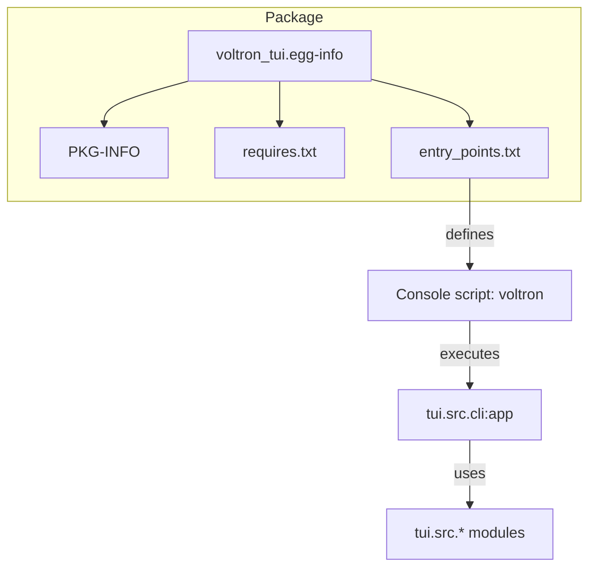

# Other — voltron_tui.egg-info

# voltron_tui.egg-info

## Overview
`voltron_tui.egg-info` is the packaging metadata directory generated by `setuptools` (or `pip`) for the **voltron-tui** distribution. It contains the information required for building, installing, and distributing the package, as well as the entry‑point that exposes the command‑line interface (CLI) to end users.

The directory is not part of the runtime code; it is consulted only during packaging operations (e.g., `pip install .`, `python -m build`, `twine upload`). Developers should treat its contents as the source of truth for versioning, dependencies, and console script registration.

---

## Directory Contents

| File | Description |
|------|-------------|
| `PKG-INFO` | RFC‑822 style metadata (name, version, summary, Python requirement, dependencies). |
| `SOURCES.txt` | List of all source files that were included in the distribution. |
| `dependency_links.txt` | Legacy field for non‑PyPI dependencies (empty for this project). |
| `entry_points.txt` | Definition of console scripts and other entry points. |
| `requires.txt` | Plain‑text list of runtime and optional development dependencies. |
| `top_level.txt` | List of top‑level packages/modules provided by the distribution (empty because the package is a namespace). |

---

## PKG-INFO

```
Metadata-Version: 2.4
Name: voltron-tui
Version: 0.1.0
Summary: Voltron TUI and CLI for SugarVault management
Requires-Python: >=3.11
Requires-Dist: textual>=0.80
Requires-Dist: typer>=0.12
Requires-Dist: cryptography>=42.0
Requires-Dist: rich>=13.0
Provides-Extra: dev
Requires-Dist: pytest>=8.0; extra == "dev"
Requires-Dist: pytest-asyncio>=0.23; extra == "dev"
```

* **Name / Version** – Identifies the distribution on PyPI.  
* **Summary** – Short description shown by `pip show voltron-tui`.  
* **Requires-Python** – Minimum interpreter version; the project requires Python 3.11+.  
* **Requires-Dist** – Runtime dependencies. The TUI relies on `textual`, `typer`, `cryptography`, and `rich`.  
* **Provides-Extra / dev** – Optional development dependencies (`pytest`, `pytest-asyncio`) that can be installed with `pip install voltron-tui[dev]`.

---

## requires.txt

```
textual>=0.80
typer>=0.12
cryptography>=42.0
rich>=13.0

[dev]
pytest>=8.0
pytest-asyncio>=0.23
```

* Mirrors the `Requires-Dist` entries from `PKG-INFO`.  
* The `[dev]` section is used by tools like `pip install .[dev]` to pull in testing utilities.

---

## entry_points.txt

```
[console_scripts]
voltron = tui.src.cli:app
```

* Registers a **console script** named `voltron`.  
* When the package is installed, `pip` creates a wrapper that executes `tui.src.cli:app`.  
* `tui.src.cli` is the module that defines the Typer application (`app = typer.Typer(...)`). This is the entry point for the command‑line interface.

---

## SOURCES.txt

```
pyproject.toml
tests/test_crypto.py
voltron_tui.egg-info/PKG-INFO
voltron_tui.egg-info/SOURCES.txt
voltron_tui.egg-info/dependency_links.txt
voltron_tui.egg-info/entry_points.txt
voltron_tui.egg-info/requires.txt
voltron_tui.egg-info/top_level.txt
```

* Enumerates every file that was packaged.  
* Adding new source files (e.g., new modules under `tui/src/`) requires updating the build configuration (usually `pyproject.toml` or `setup.cfg`) so they appear here on the next build.

---

## top_level.txt

* Empty for this project because the distribution does not expose a top‑level package; the import path is `tui.src.*`.  
* If a top‑level package were added (e.g., `voltron_tui`), its name would be listed here.

---

## Interaction with the Codebase



* The **egg‑info** directory tells the installer how to create the `voltron` command.  
* At runtime, the `voltron` command invokes `tui.src.cli:app`, which bootstraps the Textual UI and Typer CLI defined in the `tui/src/` package.

---

## Maintaining the Metadata

1. **Version bump** – Update the `version` field in `pyproject.toml`. Re‑run the build (`python -m build`) to regenerate `PKG-INFO` and `SOURCES.txt`.  
2. **Adding dependencies** – Add the new requirement to `pyproject.toml` under `[project.dependencies]` (or the legacy `install_requires`). The next build will propagate it to `PKG-INFO` and `requires.txt`.  
3. **Changing the entry point** – Modify the `console_scripts` entry in `pyproject.toml` (or `setup.cfg`). After rebuilding, `entry_points.txt` will reflect the new target.  
4. **Including new source files** – Ensure they are part of the package definition (e.g., `packages = ["tui"]` or `include = ["tui/**/*.py"]`). The build system automatically adds them to `SOURCES.txt`.

---

## Common Tasks

| Task | Command | Effect on egg‑info |
|------|---------|--------------------|
| Build a wheel | `python -m build` | Regenerates all files in `voltron_tui.egg-info`. |
| Install locally (editable) | `pip install -e .` | Uses the metadata to create the `voltron` console script pointing to the source tree. |
| Publish to PyPI | `twine upload dist/*` | Uploads the wheel; the `PKG-INFO` metadata becomes the authoritative source on PyPI. |
| Verify dependencies | `pip check` after install | Reads `requires.txt` to ensure all runtime requirements are satisfied. |

---

## Tips for Contributors

* **Never edit files inside `voltron_tui.egg-info` manually.** They are generated artifacts; manual changes will be overwritten on the next build.  
* **Focus on `pyproject.toml`** for any changes to version, dependencies, or entry points. The build backend (e.g., `setuptools` or `flit`) will propagate those changes into the egg‑info directory.  
* **Run tests** (`pytest`) after modifying dependencies to confirm that the development extras (`[dev]`) are still resolvable.  
* **Check the console script** by running `voltron --help` after installation; it should invoke the Typer app defined in `tui/src/cli.py`.  

---