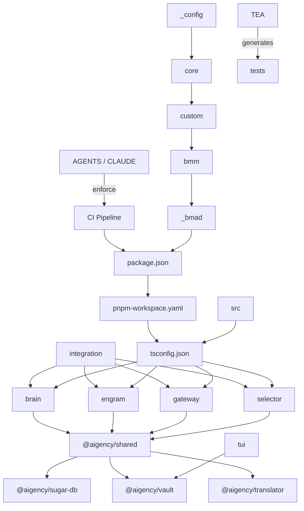

# Other

# Other – Overview

The **Other** collection is the backbone of the Aigency OS monorepo. It groups together:

* **Policy & operational guidance** – [`AGENTS`](AGENTS.md) and [`CLAUDE`](CLAUDE.md) define the mandatory ICM (persistent memory) and GitNexus safety checks that every contributor must obey.  
* **Static configuration artifacts** – [`_config`](_config.md), [`core`](core.md), [`custom`](custom.md), [`bmm`](bmm.md), and [`_bmad`](_bmad.md) provide the declarative BMAD manifest, version‑locked settings, and per‑team overrides that drive the code‑generation pipeline.  
* **Build & package metadata** – [`package.json`](package.json.md), [`pnpm-workspace.yaml`](pnpm-workspace.yaml.md), and [`tsconfig.json`](tsconfig.json.md) describe the workspace layout, compiler options, and npm scripts used by CI/CD.  
* **Shared runtime utilities** – [`@aigency/shared`](shared.md) supplies cluster discovery, LLM‑via‑llama, and selector abstractions; [`@aigency/sugar-db`](sugar-db.md) offers a lightweight SQLite event store; [`@aigency/vault`](vault.md) secures API keys; [`@aigency/translator`](translator.md) resolves model identifiers.  
* **Worker implementations** – [`brain`](brain.md), [`engram`](engram.md), [`gateway`](gateway.md), and [`selector`](selector.md) are concrete workers that consume the shared utilities and participate in the III engine.  
* **Testing & validation** – [`integration`](integration.md) runs end‑to‑end cross‑worker tests; [`TEA`](tea.md) generates deterministic test artifacts; [`skills`](skills.md) and [`skills-lock.json`](skills-lock.json.md) lock external “skill” resources.  
* **Developer tooling** – [`src`](src.md) (Tailwind entry), [`tui`](tui.md) (voltron‑tui CLI for the vault), and assorted docs (`dashboard`, `agile-context`, etc.) round out the developer experience.

## How the pieces fit together

* **Policy → CI** – `AGENTS`/`CLAUDE` are validated by the CI pipeline before any build proceeds.  
* **Configuration → Build** – The BMAD manifest (`_config`, `core`, `custom`, `bmm`, `_bmad`) is read by the build scripts defined in `package.json`/`pnpm-workspace.yaml`.  
* **Build → Runtime** – `tsconfig.json` compiles the TypeScript sources that implement the shared utilities and workers.  
* **Shared utilities → Workers** – All workers import the lightweight APIs from `@aigency/shared`, `@aigency/sugar-db`, `@aigency/vault`, and `@aigency/translator`.  
* **Workers → Integration tests** – `integration` exercises the full request‑flow across workers (TS ↔ Python SDKs) and validates the vault, selector, and gateway behavior.  
* **TEA → Test artifacts** – `TEA` consumes the BMAD configuration to generate deterministic test suites that are later run by CI.  
* **UI → Vault** – `voltron-tui` provides a terminal UI for managing the encrypted secrets stored by `@aigency/vault`.  

## Key workflows spanning sub‑modules

| Workflow | Entry point | Core sub‑modules involved | Outcome |
|----------|-------------|---------------------------|---------|
| **Onboarding / policy compliance** | `AGENTS` / `CLAUDE` | `AGENTS`, `CLAUDE`, CI (`package.json` scripts) | New contributors follow ICM and GitNexus rules; CI fails on violations. |
| **BMAD artifact generation** | `bmm/config.yaml` | `_config`, `core`, `custom`, `bmm`, `_bmad` | Generates project scaffolding, language‑specific adapters, and agent definitions. |
| **Full build** | `npm run build` (defined in `package.json`) | `pnpm-workspace.yaml`, `tsconfig.json`, all TypeScript workers (`brain`, `engram`, `gateway`, `selector`, `translator`) | Compiles TS → JS, bundles shared utilities, produces distributable packages. |
| **Runtime request handling** | Worker entry (e.g., `brain/src/main.py`) | `brain`, `engram`, `gateway`, `selector`, `@aigency/shared`, `@aigency/vault`, `@aigency/translator` | Incoming LLM request is classified, possibly delegated to selector, persisted, and routed via III engine. |
| **Cross‑worker integration testing** | `npm run test:integration` | `integration`, `brain`, `engram`, `gateway`, `selector`, `@aigency/vault` | Verifies that TS and Python SDKs interoperate, that the vault encrypts/decrypts correctly, and that selector fallback logic works. |
| **Test artifact generation** | `npm run generate-tests` (TEA) | `TEA`, BMAD config (`core`, `custom`), `skills-lock.json` | Produces deterministic test suites for CI, ensuring reproducible validation of worker behavior. |
| **Vault management UI** | `voltron` CLI | `tui`, `@aigency/vault` | Allows developers to add, rotate, and inspect encrypted API keys without touching the codebase. |
| **Skill version locking** | `skills-lock.json` read by skill loader | `skills-lock.json`, `skills` docs | Guarantees reproducible skill definitions across builds and deployments. |

## Quick navigation

- **Policies** – [`AGENTS`](AGENTS.md) | [`CLAUDE`](CLAUDE.md)  
- **Configuration** – [`_config`](_config.md) | [`core`](core.md) | [`custom`](custom.md) | [`bmm`](bmm.md) | [`_bmad`](_bmad.md)  
- **Build metadata** – [`package.json`](package.json.md) | [`pnpm-workspace.yaml`](pnpm-workspace.yaml.md) | [`tsconfig.json`](tsconfig.json.md)  
- **Shared utilities** – [`@aigency/shared`](shared.md) | [`@aigency/sugar-db`](sugar-db.md) | [`@aigency/vault`](vault.md) | [`@aigency/translator`](translator.md)  
- **Workers** – [`brain`](brain.md) | [`engram`](engram.md) | [`gateway`](gateway.md) | [`selector`](selector.md)  
- **Testing** – [`integration`](integration.md) | [`TEA`](tea.md) | [`skills`](skills.md) | [`skills-lock.json`](skills-lock.json.md)  
- **Developer tooling** – [`src`](src.md) (Tailwind) | [`tui`](tui.md) (voltron‑tui)  

The **Other** module therefore acts as the glue that binds policy, configuration, build, runtime, and testing concerns into a coherent, self‑documented ecosystem. Each sub‑module can be explored independently for deeper details, while the diagram and workflow table illustrate the high‑level interactions that keep the Aigency OS operating reliably.