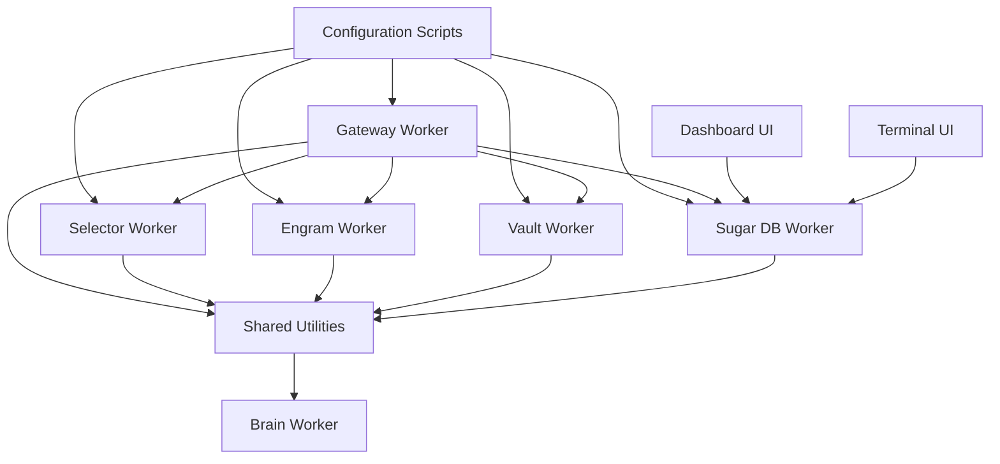

# aigency-router-v2 — Wiki

# aigency-router-v2 – Overview

Welcome to **aigency-router-v2**, the core of *Aigency OS* – an autonomous‑agent swarm orchestration platform built on the III primitives. This repository contains the routing layer that receives OpenAI‑compatible requests, selects the appropriate LLM provider, applies policy checks, and streams results back to callers. It also ships a set of utilities (configuration resolvers, dashboards, and a lightweight SQLite event store) that support development, monitoring, and testing of the whole swarm.

---

## Quick Start

```bash
# Clone the repo
git clone https://github.com/your-org/aigency-router-v2.git
cd aigency-router-v2

# Install Node & Python dependencies
npm ci          # installs TypeScript workers
pip install -r requirements.txt   # only stdlib is required for the config scripts

# Run the full development stack (watch + hot‑reload)
npm run dev:all
```

The `dev:all` script starts:

* the **Gateway Worker** (HTTP entry point on `localhost:8000`)
* the **Selector**, **Engram**, **Vault**, **Sugar DB**, and **Brain** workers
* the **Dashboard UI** (`http://localhost:3000`) and **Terminal UI** (`voltron tui`)

You can also run individual components, e.g.:

```bash
npm run dev:engine   # starts only the worker engine
npm run test         # executes the Jest + PyTest suite
npm run build        # produces production bundles
```

---

## What the System Does

1. **Accepts** OpenAI‑compatible `/v1/chat/completions` HTTP calls.
2. **Resolves** the canonical model name via the **Selector Worker**.
3. **Retrieves** the appropriate API key from the **Vault Worker** (or falls back to a secondary provider).
4. **Checks** rate‑limit cooldowns and policy constraints.
5. **Streams** the LLM response back to the client using Server‑Sent Events (SSE).  
   If the primary provider fails, the **Gateway Worker** automatically fails over to a secondary provider.
6. **Logs** every request/response event to the **Sugar DB Worker**, which can be observed in real time via the **Dashboard UI** or the **Terminal UI**.
7. **Repairs** malformed JSON payloads emitted by LLMs through the **Engram Worker** before they reach downstream consumers.

All workers communicate through the III SDK, sharing common utilities from the **Shared Utilities** package (node discovery, Llama client wrapper, selector factory, etc.).

---

## High‑Level Architecture



*The diagram shows the primary modules and the direction of data flow. The system fits comfortably on a single screen, so a new developer can grasp the overall shape in under ten seconds.*

---

## Core Modules (click to dive deeper)

- **[Configuration Scripts](configuration-scripts.md)** – `resolve_config.py` and `resolve_customization.py` merge layered TOML files into a single JSON document used by all workers.
- **[Gateway Worker](gateway-worker.md)** – HTTP entry point, model resolution, fail‑over logic, and SSE streaming.
- **[Selector Worker](selector-worker.md)** – Classifies model requests (simple vs. complex) and resolves default model paths.
- **[Vault Worker](vault-worker.md)** – Secure storage and retrieval of API keys; integrates with the AES‑256‑GCM encryption layer used by the TUI.
- **[Engram Worker](engram-worker.md)** – Repairs malformed JSON from LLMs and provides a composable processing pipeline.
- **[Sugar DB Worker](sugar-db-worker.md)** – SQLite‑backed event log service; exposes RPCs for logging, querying, and real‑time SSE feeds.
- **[Shared Utilities](shared-utilities.md)** – Core building blocks (`ClusterRegistry`, `LlamaClient`, `SelectorFactory`, etc.) used across all workers.
- **[Brain Worker](brain-worker.md)** – Central coordination service for the swarm (node discovery, health checks, telemetry).
- **[Dashboard UI](dashboard-ui.md)** – Web‑based monitoring console showing telemetry, routing visualisation, quota status, and interactive controls.
- **[Terminal UI (TUI)](terminal-ui.md)** – Textual‑based dashboard and Typer CLI for managing SugarVault keys and observing live events.

---

## End‑to‑End Request Flow (Chat Completion)

```
Client → Gateway Worker (createChatCompletionsHandler)
        → routeLlm
        → streamWithFailover
        → pipeStreamToChannel
        → sendMessage   (streams response)
```

*Key steps*:

1. **`createChatCompletionsHandler`** validates the request and extracts the model name.
2. **`routeLlm`** asks the **Selector Worker** to classify the request and picks the best provider.
3. **`streamWithFailover`** obtains the API key from the **Vault Worker**, checks cooldown via `isInCooldown`, and initiates the provider stream.
4. **`pipeStreamToChannel`** forwards the provider’s SSE payload to the client, handling back‑pressure.
5. **`sendMessage`** logs the event to **Sugar DB** and emits telemetry to the **Dashboard UI**.

If the primary provider errors, `streamWithFailover` automatically retries with a secondary provider (e.g., Groq → Cerebras).

---

## End‑to‑End Model Path Flow (Selector)

```
Client → Selector Worker (createSelectorWorker)
        → createSelectorAsync
        → createSelector
        → isModelAvailable (LlamaClient)
        → getDefaultModelPath
```

The **Selector Worker** resolves the filesystem path of the requested model, falling back to a bundled default if the model is not locally available. This path is then handed to the **Gateway Worker** for provider‑specific routing.

---

## Monitoring & Debugging

- **Dashboard UI** (`http://localhost:3000`) shows live SSE events, routing visualisation (`RadarCanvas`), and quota warnings.
- **Terminal UI** (`voltron tui`) provides a dual‑pane view of the same data, plus a Typer‑based CLI (`voltron keys …`) for managing encrypted API keys.
- All workers emit structured logs to the **Sugar DB Worker**; you can query them with `sugar-db query_events --filter …`.

---

## Contributing

1. Fork the repo and create a feature branch.  
2. Run `npm run test` and `pytest` to ensure the existing test suite passes.  
3. Add or update documentation in the corresponding module markdown file.  
4. Submit a pull request; CI will run the full suite (unit, integration, and end‑to‑end tests).

Happy hacking! 🎉