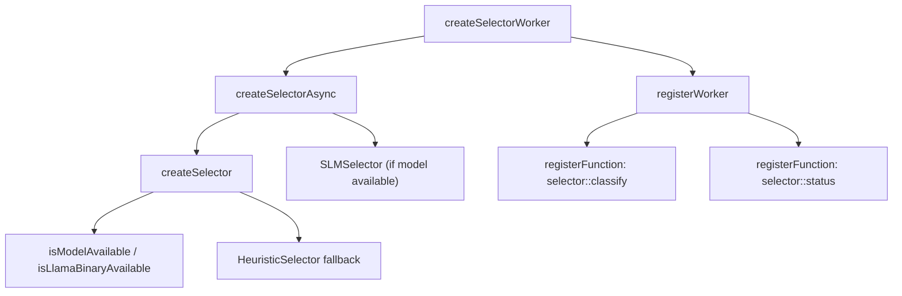

# Selector Worker

# Selector Worker (`workers/selector/src/index.ts`)

## Overview
The **Selector Worker** bridges the TypeScript `Selector` abstraction to the III worker architecture. It exposes two remote‑callable functions:

| Trigger                | Description                                    |
|------------------------|------------------------------------------------|
| `selector::classify`   | Classifies a model request as **simple** or **complex**. |
| `selector::status`     | Health‑check endpoint that reports worker status and SLM availability. |

The worker is instantiated by the Python brain worker via III triggers, allowing the classification logic (either an SLM‑backed selector or a heuristic fallback) to run in a dedicated Node.js process.

---

## Public API

### `createSelectorWorker(url?: string, factoryOptions?: SelectorFactoryOptions): { iii: ISdk; ready: Promise<void> }`

Creates and registers the selector worker.

* **Parameters**
  * `url` – WebSocket address of the III engine. Defaults to `process.env.III_URL` or `ws://127.0.0.1:49134`.
  * `factoryOptions` – Options forwarded to `createSelectorAsync`. See `SelectorFactoryOptions` in `shared/selector-factory.ts`.

* **Returns**
  * `iii` – The III SDK instance used to register functions and trigger telemetry.
  * `ready` – A promise that resolves once the underlying `Selector` instance is initialized (either an `SLMSelector` or a `HeuristicSelector`).

* **Side effects**
  * Registers the two triggers (`selector::classify`, `selector::status`).
  * Starts a background probe that attempts to load a GGUF model via `createSelectorAsync`. If the probe fails, the worker falls back to `HeuristicSelector`.

---

## Initialization Flow



1. **Engine registration** – `registerWorker` creates an III SDK instance bound to the supplied URL and names the worker `"selector"`.
2. **Selector probe** – `createSelectorAsync` attempts to instantiate an `SLMSelector`. Internally it:
   * Checks binary availability (`isLlamaBinaryAvailable`).
   * Resolves the default model path (`getDefaultModelPath`).
   * Calls `isModelAvailable` to verify the GGUF model can be loaded.
3. **Fallback** – If any step throws, the worker dynamically imports `HeuristicSelector` from `vault/src/selector.ts` and uses it instead.
4. **State variables**
   * `selector` – Holds the concrete `Selector` implementation (or `null` on fatal error).
   * `slmAvailable` – Boolean flag indicating whether the SLM‑backed selector is active.
   * `resolvedModel` – The model identifier used for logging/telemetry.

The `ready` promise resolves after the probe completes, guaranteeing that subsequent calls to the registered functions see a fully‑initialized selector.

---

## `selector::classify` Trigger

```ts
iii.registerFunction('selector::classify', async (input: ClassifyInput): Promise<ClassifyResult> => { ... })
```

### Input (`ClassifyInput`)
| Property      | Type                                 | Description |
|---------------|--------------------------------------|-------------|
| `model`       | `string`                             | Model identifier (e.g., `"gpt-4"`). |
| `messages`    | `Array<{ role: string; content: string }>` | Chat history to be classified. |
| `enforce_json?` | `boolean`                           | Optional flag forwarded to the selector. |
| `max_tokens?` | `number`                             | Optional token limit forwarded to the selector. |

### Execution Steps
1. **Await initialization** – `await ready` ensures the selector is ready.
2. **Guard clause** – If `selector` is still `null`, return a default “complex” result with zero confidence.
3. **Build `ModelRequest`** – Merges optional fields only when defined.
4. **Timing** – Captures `start = Date.now()` to compute latency.
5. **Classification**
   * Calls `selector.classify(request)`.
   * Handles both async (`SLMSelector`) and sync (`HeuristicSelector`) implementations by checking `instanceof Promise`.
6. **Telemetry** – Emits an `SLM_CLASSIFY` event via `logTelemetry`. The telemetry payload includes model, latency, classification, and source (`slm` or `heuristic`). Errors from telemetry are silently ignored.
7. **Result construction** – Returns a `ClassifyResult`:
   * `classification` – The value returned by the selector (`'simple' | 'complex'`).
   * `confidence` – Fixed confidence: `0.85` for SLM, `0.6` for heuristic.
   * `source` – `'slm'` if `slmAvailable` else `'heuristic'`.
   * `model` – Echoes the input model.
   * `latencyMs` – Measured duration.

### Error Handling
* Any exception during classification is caught.
* The worker logs a warning with the elapsed time and falls back to a “complex” classification with zero confidence.

---

## `selector::status` Trigger

```ts
iii.registerFunction('selector::status', async (): Promise<StatusResult> => { ... })
```

Returns a static health snapshot:

| Field          | Type    | Value |
|----------------|---------|-------|
| `status`       | `'healthy'` | Fixed string indicating the worker is up. |
| `worker`       | `'selector'` | Identifier of this worker. |
| `slmAvailable` | `boolean` | Mirrors the internal `slmAvailable` flag. |
| `model`        | `string` | The resolved model path (or fallback identifier). |

The function simply awaits `ready` to guarantee the probe has completed before reporting.

---

## Telemetry Integration (`logTelemetry`)

`logTelemetry` is invoked with a custom trigger wrapper that forwards telemetry events back to the III engine:

```ts
await logTelemetry(
  { trigger: (target, fnName, payload) => iii.trigger({ function_id: fnName, payload }) },
  { eventClass: 'SLM_CLASSIFY', sourceWorker: 'selector', payload: { ... } }
)
```

* **Purpose** – Provides observability for classification latency and source.
* **Failure mode** – Errors from telemetry are swallowed (`.catch(() => {})`) to avoid breaking the primary classification flow.

---

## Runtime Lifecycle

| Phase | Action |
|-------|--------|
| **Startup** | `createSelectorWorker` is called (either by the main process or via direct execution). The worker registers with the III engine and begins the selector probe. |
| **Ready** | The `ready` promise resolves. The worker now accepts `selector::classify` and `selector::status` calls. |
| **Classification** | Each request follows the steps described in the *Classify* section, with per‑request latency measured and telemetry emitted. |
| **Shutdown** | When the Node process receives `SIGTERM`, the registered `process.on('SIGTERM')` handler calls `iii.shutdown()` to deregister the worker cleanly. |

---

## Integration Points

| Module | Interaction |
|--------|--------------|
| `iii-sdk` (`registerWorker`, `ISdk`) | Core communication layer; registers triggers and provides `trigger` for telemetry. |
| `shared/selector-factory.ts` (`createSelectorAsync`) | Factory that decides between `SLMSelector` and `HeuristicSelector`. |
| `shared/slm-selector.ts` (`SLMSelector`) | Implements async classification using a local LLM (GGUF). |
| `vault/src/selector.ts` (`HeuristicSelector`, `Selector`, `ModelRequest`, `Classification`) | Defines the selector interface and fallback heuristic implementation. |
| `shared/telemetry.ts` (`logTelemetry`) | Centralized telemetry logger used by many workers. |

---

## Development & Contribution Guidelines

1. **Adding a new classification source**  
   * Implement a class that satisfies the `Selector` interface (`classify(request: ModelRequest): Classification | Promise<Classification>`).  
   * Update `createSelectorAsync` to return the new implementation when appropriate.  
   * Adjust confidence logic in `selector::classify` if a different confidence model is required.

2. **Extending the trigger contract**  
   * Add a new entry to the `registerFunction` call block.  
   * Define a corresponding input/output type (e.g., `interface FooResult { … }`).  
   * Ensure the function awaits `ready` before accessing `selector`.

3. **Testing**  
   * Unit tests should mock `iii-sdk` to verify that triggers are registered with the correct names.  
   * Mock `createSelectorAsync` to force both SLM and heuristic paths, asserting the returned `source` and `confidence` fields.  
   * Use `jest.useFakeTimers()` to control latency measurements when testing error handling.

4. **Logging**  
   * All console output is prefixed with `[selector]`. Preserve this convention for consistency.  
   * Avoid logging sensitive payload data; telemetry already captures the necessary metrics.

5. **Environment variables**  
   * `III_URL` – Override the default WebSocket endpoint.  
   * No other environment variables are consumed directly by this module; model configuration is passed via `factoryOptions`.

---

## Deployment Checklist

- [ ] Verify that the target machine has the required GGUF model files and the `llama-cli` binary in `$PATH` (required for `SLMSelector`).
- [ ] Ensure the III engine is reachable at the URL supplied to `createSelectorWorker`.
- [ ] Confirm that the worker process is started with Node ≥18 (for ES‑module support).
- [ ] Monitor the `selector::status` endpoint after deployment to confirm `slmAvailable` reflects the actual model state.

---