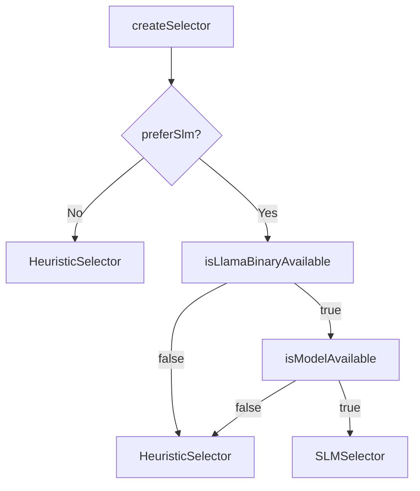
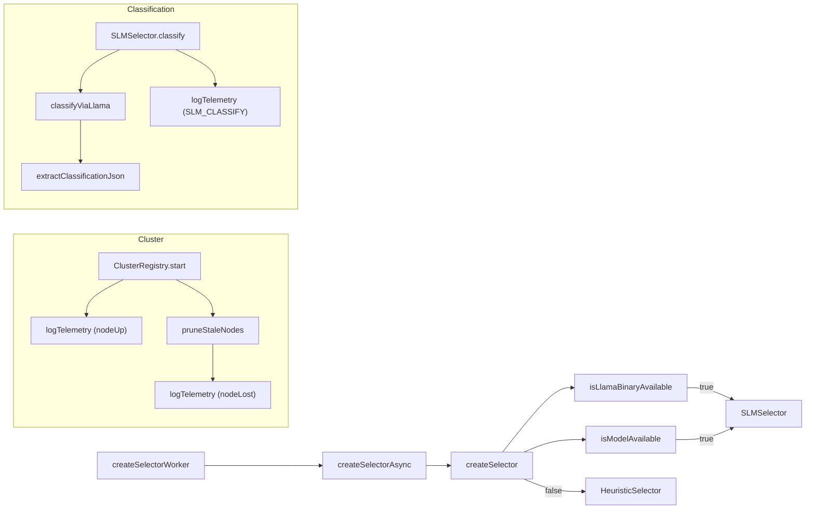

# Shared Utilities

# Shared Utilities

## Overview

The **Shared Utilities** package provides core building blocks used across the workers in the Aigency SLM system:

| Component | Responsibility |
|-----------|----------------|
| `ClusterRegistry` | Zero‑config LAN node discovery via Bonjour/mDNS, health‑checking, and telemetry. |
| `LlamaClient` (functions in `llama-client.ts`) | Wrapper around the `llama-cli` binary for local inference, including binary/model discovery and JSON extraction. |
| `SelectorFactory` | Probes the environment and returns either an `SLMSelector` (LLM‑based) or a `HeuristicSelector` fallback. |
| `SLMSelector` | Implements the `Selector` interface using the local SLM (llama‑cli) to classify requests. |
| `telemetry.ts` | Fire‑and‑forget helper for emitting events to SugarDB. |

These utilities are deliberately lightweight, have no external network dependencies, and are designed for easy unit testing (e.g., injectable Bonjour factory).

---

## 1. ClusterRegistry (`workers/shared/cluster-registry.ts`)

### Purpose
Automatically publishes the current process as a Bonjour service (`_aigency-slm._tcp`) and discovers peer nodes on the same LAN. It maintains a map of live nodes, emits `nodeUp` / `nodeDown` events, and logs telemetry for each discovery/loss.

### Key Types
```ts
export interface ClusterNode {
  id: string;          // `${host}:${port}`
  host: string;
  port: number;
  lastSeen: number;    // ms since epoch
}
export interface ClusterRegistryOptions {
  serviceName?: string;          // default: `_aigency-slm._tcp`
  port?: number;                 // default: 0 (random)
  telemetryDeps?: TelemetryDeps;
  sourceWorker?: string;         // default: 'cluster-registry'
  healthCheckIntervalMs?: number; // default: 30_000
  staleThresholdMs?: number;      // default: 90_000
}
```

### Public API
| Method / Property | Description |
|-------------------|-------------|
| `constructor(options?, bonjourFactory?)` | Creates a registry; `bonjourFactory` can be injected for tests. |
| `async start()` | Starts Bonjour, publishes the local node, begins browsing, and launches the health‑check timer. |
| `async stop()` | Stops browsing, unpublishes the service, destroys Bonjour, clears the timer, and empties the node map. |
| `getNodes(): ClusterNode[]` | Returns a snapshot of currently known nodes. |
| `onNodeUp?: (node) => void` | Optional callback invoked on discovery. |
| `onNodeDown?: (node) => void` | Optional callback invoked when a node is pruned as stale. |
| Events (`nodeUp`, `nodeDown`) | Emitted via `EventEmitter` for the same conditions as the callbacks. |

### Internal Flow
1. **Bonjour creation** – `bonjourFactory.create()` (dynamic import of `bonjour-service` if not injected).  
2. **Publish** – `bonjour.publish({ name, type, port })`.  
3. **Browse** – `bonjour.find({ type }, service => { … })` builds a `ClusterNode` and updates `nodes`.  
4. **Health check** – `setInterval(pruneStaleNodes, healthCheckIntervalMs)` removes nodes whose `lastSeen` exceeds `staleThresholdMs`.  
5. **Telemetry** – On each discovery or loss, `logTelemetry` is called with `CLUSTER_NODE_DISCOVERED` / `CLUSTER_NODE_LOST`.

### Extensibility Tips
* **Testing** – Provide a mock `BonjourFactory` that returns an object with `publish`, `find`, and `destroy` stubs.
* **Custom health logic** – Override `pruneStaleNodes` in a subclass or replace the timer after `start()`.

---

## 2. Llama Client (`workers/shared/llama-client.ts`)

### Purpose
Runs the `llama-cli` binary as a child process, extracts a classification JSON payload from its mixed stdout, and provides helper utilities for binary/model discovery.

### Configuration Interface
```ts
export interface LlamaClientConfig {
  binaryPath?: string;   // default: 'llama-cli'
  timeoutMs?: number;    // default: 2000
  threads?: number;      // default: 4
  temperature?: number;  // default: 0
  maxTokens?: number;    // default: 64
}
```

### Public Functions
| Function | Description |
|----------|-------------|
| `getDefaultModelPath(): string` | Returns `$SLM_MODEL_PATH` or `~/.models/qwen2.5-0.5b-instruct-q4_k_m.gguf`. |
| `isLlamaBinaryAvailable(binaryPath?)` | Checks existence of the binary (absolute path or via `command -v`). |
| `isModelAvailable(modelPath?)` | Checks that the GGUF model file exists. |
| `extractClassificationJson(raw: string): string` | Regex‑based extraction of the first JSON object containing a `"classification"` field. Throws if none found. |
| `classifyViaLlama(modelPath, prompt, config?)` | Spawns `llama-cli`, streams stdout/stderr, enforces a timeout, extracts JSON via `extractClassificationJson`, and resolves with the raw JSON string. Errors are thrown for timeout, spawn failures, non‑zero exit codes, or extraction failures. |

### Execution Details
* **Spawn options** – `stdio: ['ignore', 'pipe', 'pipe']` to avoid leaking stdin.
* **Timeout handling** – `setTimeout` kills the child with `SIGKILL` and rejects.
* **Error propagation** – Errors are wrapped with context (e.g., “binary not found”, “timeout”, “exit code X”).
* **Debug logging** – On failure, the first 500 characters of stdout are printed to `console.debug` for diagnostics.

### Usage Example
```ts
import { classifyViaLlama, getDefaultModelPath } from './llama-client.ts';

const model = getDefaultModelPath();
const prompt = 'Classify this request as simple or complex.';
const classificationJson = await classifyViaLlama(model, prompt, { timeoutMs: 1500 });
```

---

## 3. SelectorFactory (`workers/shared/selector-factory.ts`)

### Purpose
Selects the appropriate request classifier based on runtime availability of the SLM binary and model. Returns a `Selector` implementation that can be used uniformly by the rest of the system.

### Options Interface
```ts
export interface SelectorFactoryOptions {
  preferSlm?: boolean;   // default: true
  modelPath?: string;    // default: getDefaultModelPath()
  binaryPath?: string;   // default: 'llama-cli'
  timeoutMs?: number;    // default: 500
  threads?: number;      // default: 4
}
```

### Public API
| Function | Description |
|----------|-------------|
| `createSelector(options?)` | Synchronous factory. Returns an `SLMSelector` when both binary and model are present; otherwise returns a `HeuristicSelector`. |
| `createSelectorAsync(options?)` | Async wrapper that simply forwards to `createSelector`. Kept for compatibility with callers expecting a promise. |

### Decision Flow


*If `preferSlm` is `false`, the factory bypasses all probes and directly returns a `HeuristicSelector`.*

### Integration Points
* **Worker entry points** – `selector/src/index.ts` calls `createSelectorAsync` during worker initialization.
* **Telemetry** – The factory itself does not emit telemetry, but the returned `SLMSelector` will.

---

## 4. SLMSelector (`workers/shared/slm-selector.ts`)

### Purpose
Implements the `Selector` contract using the local SLM (llama‑cli). It builds a prompt describing request metadata, invokes `classifyViaLlama`, parses the JSON response, and emits telemetry.

### Configuration Interface
```ts
export interface SLMSelectorConfig {
  modelPath?: string;
  timeoutMs?: number;
  binaryPath?: string;
  threads?: number;
  telemetryDeps?: TelemetryDeps;
  sourceWorker?: string;
}
```

### Public API
| Method | Description |
|--------|-------------|
| `constructor(config?)` | Initializes with defaults (`getDefaultModelPath()`, binary `'llama-cli'`, etc.). |
| `isAvailable(): boolean` | Returns `true` iff both binary and model are present. |
| `async classify(request: ModelRequest): Promise<Classification>` | Generates a prompt, calls `classifyViaLlama`, parses the JSON, validates the `classification` field, logs telemetry (`SLM_CLASSIFY`), and returns `'simple'` or `'complex'`. Errors are thrown for timeout, missing binary, malformed JSON, or invalid classification. |

### Prompt Construction
The prompt includes:
* Message count
* Total content length
* Whether `enforce_json` is set
* `max_tokens` value
* Instruction to respond with a JSON object containing `classification` and `reason`.

### Telemetry Payload
```ts
{
  model: 'qwen2.5-0.5b-instruct-q4_k_m',
  latencyMs,
  classification,
  requestMessageCount,
  reason
}
```

### Extending the Selector
* **Alternative models** – Provide a custom `modelPath` or `binaryPath` in the config.
* **Different classification schema** – Adjust the prompt and JSON parsing logic accordingly, but keep the return type `Classification`.

---

## 5. Telemetry (`workers/shared/telemetry.ts`)

### Purpose
Centralizes fire‑and‑forget event emission to SugarDB. All utilities that need to report operational data use `logTelemetry`.

### Types
```ts
export type EventClass = 
  | 'FAST_TRACK_ROUTE' | 'PROVIDER_FAILOVER' | 'QUOTA_WARNING'
  | 'DRIFT_HEALED' | 'KEY_ROTATED' | 'PROVIDER_RESOLVED'
  | 'SLM_CLASSIFY' | 'CLUSTER_NODE_DISCOVERED' | 'CLUSTER_NODE_LOST';

export interface TelemetryEvent {
  eventClass: EventClass;
  sourceWorker: string;
  payload: Record<string, unknown>;
}
export interface TelemetryDeps {
  trigger: (target: string, fnName: string, input: unknown) => Promise<unknown>;
}
```

### Function
```ts
export async function logTelemetry(
  deps: TelemetryDeps,
  event: TelemetryEvent,
): Promise<void>
```
*Wraps `deps.trigger('sugar-db', 'log_event', …)` in a try/catch; on failure it logs a warning but never propagates the error.*

### Usage Pattern
All modules accept an optional `telemetryDeps` (e.g., `ClusterRegistryOptions.telemetryDeps`, `SLMSelectorConfig.telemetryDeps`). When provided, they call `logTelemetry` with a specific `eventClass`.

---

## 6. Interaction Diagram



*The diagram shows the primary flows: selector creation, cluster discovery, and SLM classification.*

---

## 7. Integration Guide

### Adding a New Worker
1. **Import the selector**  
   ```ts
   import { createSelectorAsync } from '../workers/shared/selector-factory';
   const selector = await createSelectorAsync({ /* optional overrides */ });
   ```
2. **Classify a request**  
   ```ts
   const classification = await selector.classify(request);
   // `classification` is 'simple' | 'complex'
   ```
3. **Emit custom telemetry (optional)**  
   ```ts
   import { logTelemetry } from '../workers/shared/telemetry';
   await logTelemetry(telemetryDeps, {
     eventClass: 'FAST_TRACK_ROUTE',
     sourceWorker: 'my-worker',
     payload: { classification, requestId: req.id },
   });
   ```

### Using ClusterRegistry
```ts
import { ClusterRegistry } from '../workers/shared/cluster-registry';
import { logTelemetry } from '../workers/shared/telemetry';

const registry = new ClusterRegistry({
  telemetryDeps: telemetryDeps,
  sourceWorker: 'my-service',
});
await registry.start();

registry.on('nodeUp', node => console.log('Discovered', node));
registry.on('nodeDown', node => console.log('Lost', node));

// Later, when shutting down:
await registry.stop();
```

### Testing Tips
* **ClusterRegistry** – Pass a mock `BonjourFactory` that records `publish`, `find`, and `destroy` calls. Verify that `onNodeUp` / `onNodeDown` callbacks fire as expected.
* **SLMSelector** – Mock `classifyViaLlama` to return a known JSON string; assert that `classify` resolves to the correct `Classification` and that telemetry is called.
* **LlamaClient** – Use a temporary script that mimics `llama-cli` output; test `extractClassificationJson` against noisy stdout.

---

## 8. Common Pitfalls & Mitigations

| Symptom | Likely Cause | Fix |
|---------|--------------|-----|
| `ClusterRegistry` never emits `nodeUp` | Bonjour service not installed or firewall blocks mDNS. | Ensure `bonjour-service` is installed and the network permits multicast DNS. |
| `classifyViaLlama` rejects with “timeout” | `timeoutMs` too low for the model size. | Increase `timeoutMs` in `LlamaClientConfig` or in `SLMSelectorConfig`. |
| `SLMSelector.isAvailable()` returns `false` even though the binary exists | Binary path contains `~` which isn’t expanded. | Use an absolute path or rely on the default PATH resolution. |
| Telemetry warnings flood console | `TelemetryDeps.trigger` points to a non‑responsive SugarDB instance. | Provide a mock implementation in tests or configure a reachable SugarDB endpoint. |

---

## 9. Future Directions

* **Dynamic service discovery** – Replace Bonjour with a pluggable discovery interface to support Kubernetes DNS or Consul.
* **Batch classification** – Extend `SLMSelector` to accept multiple requests and invoke `llama-cli` once, reducing process overhead.
* **Telemetry enrichment** – Add request‑level correlation IDs to all telemetry events for end‑to‑end tracing.

---