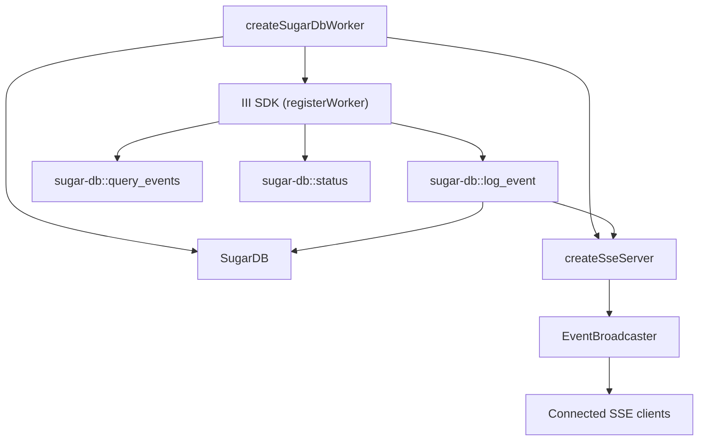

# Sugar DB Worker

# Sugar DB Worker

The **Sugar DB Worker** is a lightweight, SQLite‑backed service that records, queries, and streams event logs generated by other workers in the III ecosystem. It exposes three RPC functions (`log_event`, `query_events`, `status`) via the III SDK and streams every logged event over Server‑Sent Events (SSE) for real‑time consumption.

---

## Table of Contents
1. [Architecture Overview](#architecture-overview)  
2. [Environment Configuration](#environment-configuration)  
3. [Core Components](#core-components)  
   - [SugarDB (`db.ts`)](#sugardb-dbts)  
   - [SSE Server (`sse.ts`)](#sse-server-ssets)  
   - [Worker Bootstrap (`index.ts`)](#worker-bootstrap-indexts)  
4. [Public API](#public-api)  
   - [RPC Functions](#rpc-functions)  
   - [SSE Endpoint](#sse-endpoint)  
5. [Lifecycle & Graceful Shutdown](#lifecycle--graceful-shutdown)  
6. [Extending / Contributing](#extending--contributing)  
7. [Testing & Debugging Tips](#testing--debugging-tips)  

---

## Architecture Overview



*The worker boots a SQLite database, an SSE HTTP server, and registers three RPC functions with the III SDK. `log_event` writes to the DB and immediately pushes the full event to all SSE clients.*

---

## Environment Configuration

| Variable | Default | Description |
|----------|---------|-------------|
| `III_URL` | `ws://127.0.0.1:49134` | URL of the III engine to which the worker registers. |
| `SUGAR_DB_PATH` | `data/sugar.db` | Filesystem path for the SQLite database file. The parent directory is created automatically. |
| `SSE_PORT` | `3115` | TCP port on which the SSE server listens. |

All variables are read at module import time; they can be overridden per‑process launch or via a `.env` loader in the host application.

---

## Core Components

### SugarDB (`db.ts`)

#### Purpose
Encapsulates all SQLite interactions. The schema consists of a single `events` table with indexes on `event_class`, `source_worker`, and `timestamp` (descending) to accelerate the most common queries.

#### Public Types
```ts
export interface LogEventInput {
  event_class: string
  source_worker: string
  payload_snapshot: unknown
}
export interface QueryEventsInput {
  event_class?: string
  source_worker?: string
  limit?: number
}
export interface SugarEvent {
  log_id: number
  timestamp: string
  event_class: string
  source_worker: string
  payload_snapshot: string
}
export interface SugarStatus {
  row_count: number
  last_event_timestamp: string | null
}
```

#### Key Methods
| Method | Signature | Behaviour |
|--------|-----------|-----------|
| `constructor(dbPath: string)` | `new SugarDB(path)` | Creates the DB file (ensuring its directory), sets WAL mode, and creates the schema + indexes. |
| `logEvent(input: LogEventInput)` | `=> {log_id, timestamp}` | Inserts a new row. `payload_snapshot` is stringified unless already a string. Returns the generated `log_id` and the DB‑generated timestamp. |
| `queryEvents(input?: QueryEventsInput)` | `=> SugarEvent[]` | Builds a dynamic `WHERE` clause based on supplied filters, orders by newest first, and respects `limit` (default 100). |
| `status()` | `=> SugarStatus` | Returns total row count and the most recent timestamp (`MAX(timestamp)`). |
| `close()` | `=> void` | Closes the underlying SQLite connection. |

#### Implementation Notes
* **WAL mode** (`journal_mode = WAL`) enables concurrent reads while writes are in progress.  
* **Busy timeout** (`busy_timeout = 5000`) reduces “database is locked” errors under load.  
* All queries are prepared statements; `logEvent` re‑uses a single `INSERT` statement per call, which is cheap because `better-sqlite3` caches prepared statements internally.

---

### SSE Server (`sse.ts`)

#### Purpose
Provides a simple HTTP endpoint (`GET /events`) that streams every logged `SugarEvent` as a JSON payload using the SSE protocol. Also offers a health endpoint (`GET /health`).

#### Exported Types
```ts
export type EventBroadcaster = (event: SugarEvent) => void;
```

#### `createSseServer(port = 3115)`

Returns an object:
```ts
{
  server: Server,          // Node http.Server instance
  broadcast: EventBroadcaster,
  ready: Promise<number>   // Resolves with the actual listening port
}
```

* **`broadcast`** iterates over the `Set<ServerResponse>` of connected clients and writes a `data:` line containing the JSON‑encoded event. Errors on a client cause its removal from the set.  
* **CORS headers** are added to simplify local development.  
* **`/health`** returns `{ status: 'ok', clients: <number> }` for quick liveness checks.

#### Connection Lifecycle
1. Client requests `/events`.  
2. Server responds with `Content-Type: text/event-stream` and writes an initial comment (`:ok`).  
3. The response object is stored in `clients`.  
4. On `req` close, the response is removed from the set.  

---

### Worker Bootstrap (`index.ts`)

#### `createSugarDbWorker(url?, dbPath?, ssePort?)`

*Instantiates*:
* `SugarDB` (persistent storage)
* SSE server via `createSseServer`
* Registers the worker with the III SDK (`registerWorker(url, { workerName: 'sugar-db' })`)

#### RPC Registration
```ts
iii.registerFunction('sugar-db::log_event', async (input: LogEventInput) => { ... })
iii.registerFunction('sugar-db::query_events', async (input: QueryEventsInput = {}) => { ... })
iii.registerFunction('sugar-db::status', async () => { ... })
```
* `log_event` writes to the DB, then immediately calls `broadcast` to push the full event to SSE clients.  
* `query_events` forwards the request to `SugarDB.queryEvents`.  
* `status` forwards to `SugarDB.status`.

#### Graceful Shutdown
```ts
const shutdown = () => {
  db.close()
  _sseServer.close()
}
process.on('SIGTERM', shutdown)
process.on('SIGINT', shutdown)
```
When the process receives a termination signal, the DB connection and HTTP server are closed cleanly.

#### Direct Execution
If the module is executed as a script (`node .../index.js`), it automatically creates the worker, logs a registration message, and wires `SIGTERM` to `iii.shutdown()` before exiting.

---

## Public API

### RPC Functions (exposed via III SDK)

| Function | Input | Output |
|----------|-------|--------|
| `sugar-db::log_event` | `LogEventInput` | `{ log_id: number, timestamp: string }` |
| `sugar-db::query_events` | `QueryEventsInput` (optional) | `SugarEvent[]` |
| `sugar-db::status` | *none* | `SugarStatus` |

All functions are asynchronous (return a `Promise`) because the III SDK expects async handlers, even though the underlying SQLite calls are synchronous.

### SSE Endpoint

* **URL**: `http://127.0.0.1:<SSE_PORT>/events` (default `http://127.0.0.1:3115/events`)  
* **Protocol**: Server‑Sent Events (text/event-stream)  
* **Message format**: Each event is sent as a single `data:` line containing a JSON string that matches the `SugarEvent` interface. Example:

```json
data: {"log_id":42,"timestamp":"2024-10-12T08:15:30.123Z","event_class":"order_created","source_worker":"order-service","payload_snapshot":"{\"orderId\":1234,\"amount\":99.95}"}
```

* **Health check**: `GET /health` → `{ "status": "ok", "clients": <number> }`

---

## Lifecycle & Graceful Shutdown

1. **Startup** – `createSugarDbWorker` is called (either by the host process or via direct run).  
2. **Registration** – The worker registers itself with the III engine and becomes reachable under the `sugar-db::` namespace.  
3. **Operation** –  
   * `log_event` → DB insert → SSE broadcast.  
   * `query_events` → DB read.  
   * `status` → DB aggregate.  
4. **Shutdown** – On `SIGTERM`/`SIGINT`, the `shutdown` handler closes the SQLite connection (`db.close()`) and stops the HTTP server (`_sseServer.close()`). The III SDK’s own shutdown is invoked when the process is run directly.

---

## Extending / Contributing

| Area | What to modify | Guidance |
|------|----------------|----------|
| **Schema** | Add new columns or tables | Update the `CREATE TABLE` statement in `SugarDB` constructor, add corresponding indexes, and adjust `LogEventInput` / `SugarEvent` typings. |
| **Query capabilities** | New filter fields (e.g., time range) | Extend `QueryEventsInput` and augment `queryEvents` to add additional `WHERE` clauses. Remember to add indexes for performance. |
| **SSE payload** | Enrich the broadcasted event | Modify the `broadcast` call in `log_event` to include extra fields; ensure `EventBroadcaster` type stays compatible. |
| **Health monitoring** | Add more metrics | Extend `/health` handler in `sse.ts` to report DB size, last event age, etc. |
| **Testing** | Add unit/integration tests | Use the existing `index.test.ts` as a template; spin up a temporary in‑memory SQLite DB (`:memory:`) and a test SSE server on an unused port. |

All new code should follow the existing TypeScript style, keep side‑effects minimal, and respect the `process.on('SIGTERM')` shutdown contract.

---

## Testing & Debugging Tips

* **Run tests** – `npm test` (or the project's test command) will execute `index.test.ts`, which exercises `log_event`, `query_events`, `status`, and the SSE server.  
* **Inspect DB** – The SQLite file (`data/sugar.db` by default) can be opened with any SQLite client. Verify rows with `SELECT * FROM events ORDER BY log_id;`.  
* **SSE client** – Quick manual test: `curl -N http://127.0.0.1:3115/events` will stream events as they are logged.  
* **Verbose logging** – The module prints two startup messages: one for the worker registration and one for the SSE server. Adjust `console.log` statements if you need more context.  

---