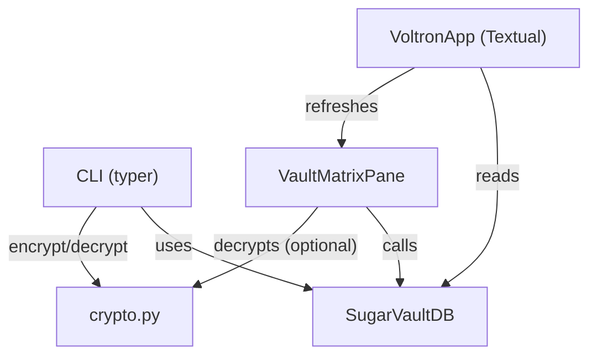

# Terminal UI (TUI)

# Terminal UI (TUI) Module

## Overview
The TUI module provides a Textual‑based dashboard and a Typer‑driven CLI for managing **SugarVault** API keys.  
It offers two entry points:

* **`voltron tui`** – launches an interactive dual‑pane dashboard.
* **`voltron keys …`** – command‑line interface for adding, listing, and removing keys.

Both interfaces share a common SQLite backend (`SugarVaultDB`) and an AES‑256‑GCM encryption layer (`crypto.py`) that is compatible with the TypeScript vault worker.

---

## Architecture Diagram


---

## Key Packages & Files

| Package | Primary Classes / Functions | Role |
|---------|-----------------------------|------|
| `tui.src.app` | `VoltronApp`, `RoutingLogPane`, `VaultMatrixPane` | Textual UI layout, hotkeys, and data refresh |
| `tui.src.cli` | `app` (Typer), `keys_add`, `keys_list`, `keys_remove`, `launch_tui` | CLI command definitions and orchestration |
| `tui.src.db` | `SugarVaultDB`, `VaultEntry` | SQLite wrapper mirroring the TypeScript schema |
| `tui.src.crypto` | `encrypt`, `decrypt`, `derive_key`, `payload_to_bytes`, `bytes_to_payload` | Cross‑language AES‑256‑GCM encryption utilities |
| `tui.src.__init__` | – | Package marker and top‑level docstring |

---

## Detailed Component Guide

### 1. `VoltronApp` (tui/src/app.py)

* **Inheritance**: `textual.app.App`
* **Layout**: Horizontal split – `RoutingLogPane` (70 % width) on the left, `VaultMatrixPane` (30 % width) on the right.
* **Hotkeys**  
  * `F1` – `action_toggle_verbosity` cycles `verbosity_level` (Info → Debug → Trace).  
  * `R` – `action_refresh` triggers `VaultMatrixPane.refresh_keys`.  
  * `ESC` – `action_quit` exits the app.
* **Lifecycle**  
  * `compose()` builds the UI tree (`Header`, `Horizontal`, `Footer`).  
  * `on_mount` of `VaultMatrixPane` automatically calls `refresh_keys`, which queries the DB and populates the `DataTable`.

#### `VaultMatrixPane`

* Subclass of `textual.containers.Vertical`.
* Holds a `DataTable` (`#vault-table`) with columns **ID**, **Provider**, **Colleague**, **Active**, **Created**.
* `refresh_keys()`:
  1. Retrieves the table widget via `self.query_one`.
  2. Instantiates `SugarVaultDB(self.db_path)`.
  3. Calls `db.get_all_keys()`.
  4. For each `VaultEntry`, adds a row with truncated ID, provider, colleague (or “—”), active flag, and creation timestamp.
  5. Closes the DB connection.

#### `RoutingLogPane`

* Simple placeholder `Static` widget showing static text about future OmniGateway routing logs.

### 2. CLI (`tui/src/cli.py`)

* **Typer app** – `app = typer.Typer(...)` with a sub‑app `keys_app`.
* **Common helpers**  
  * `_get_db(db_path)` – ensures the directory exists and returns a `SugarVaultDB`.  
  * `_get_master_password()` – reads `SUGAR_VAULT_PASSWORD` or prompts interactively.

#### Commands

| Command | Signature | Core Logic |
|---------|-----------|------------|
| `keys add` | `keys_add(provider, key, colleague, db_path, password)` | Validates inputs → derives master password → `encrypt(key, master_pw)` → `payload_to_bytes` → `db.store_key` |
| `keys list` | `keys_list(decrypt_keys, password, db_path, json_output)` | Retrieves all entries → optionally decrypts each payload → prints a Rich table or JSON |
| `keys remove` | `keys_remove(id, db_path)` | Looks up entry via `db.get_key_by_id` → `db.deactivate_key(id)` (soft‑delete) |
| `tui` | `launch_tui(db_path)` | Imports `VoltronApp`, constructs with the resolved DB path, and runs the Textual event loop. |

All commands open a DB connection via `_get_db`, perform their operation, and close the connection in a `finally` block.

### 3. Database Layer (`tui/src/db.py`)

* **Schema** – Mirrors the TypeScript worker schema; tables `sugar_vault` and `vault_meta` with appropriate indexes.
* **`SugarVaultDB`** – Wraps a `sqlite3.Connection`.  
  * `store_key`, `get_key`, `get_key_by_id`, `get_all_keys`, `deactivate_key`, `get_meta`, `set_meta`, `get_key_count`.
* **`VaultEntry`** – Dataclass representing a row; fields match the TS interface (`id`, `provider_id`, `encrypted_payload`, `virtual_colleague_id`, `is_active`, `created_at`, `last_used_at`).
* **Row conversion** – Private `_row_to_entry` builds a `VaultEntry` from a DB row tuple.

### 4. Cryptography (`tui/src/crypto.py`)

* **Key Derivation** – `derive_key(master_password, salt)` uses `cryptography.hazmat.primitives.kdf.scrypt.Scrypt` with parameters `N=16384, r=8, p=1` to produce a 32‑byte AES key.
* **Encryption** – `encrypt(plaintext, master_password)`:
  1. Generates random `salt` (16 B) and `iv` (12 B).  
  2. Derives the AES key.  
  3. Calls `AESGCM.encrypt` → returns ciphertext + auth tag.  
  4. Splits into `ciphertext` and `auth_tag`.  
  5. Returns an `EncryptedPayload` dataclass.
* **Decryption** – `decrypt(payload, master_password)` reconstructs the ciphertext+tag, derives the key, and calls `AESGCM.decrypt`. Errors raise a `ValueError` with a clear message.
* **Serialization** –  
  * `payload_to_bytes` → `salt||iv||auth_tag||ciphertext` (used for DB storage).  
  * `bytes_to_payload` → parses the byte blob back into `EncryptedPayload`.  
  * `payload_to_dict` / `dict_to_payload` – JSON‑friendly base64 encoding/decoding.

All crypto functions are deliberately symmetric with the TypeScript implementation (`workers/vault/src/crypto.ts`), enabling cross‑language key exchange.

---

## Interaction Flow

### Adding a Key (CLI → DB → Crypto)

1. `voltron keys add` → `keys_add`.
2. Master password obtained via `_get_master_password`.
3. `encrypt` creates an `EncryptedPayload`.
4. `payload_to_bytes` serializes the payload.
5. `SugarVaultDB.store_key` writes the blob to `sugar_vault`.

### Viewing Keys (CLI or TUI)

* **CLI** – `keys_list` fetches all entries via `db.get_all_keys`. If `--decrypt` is set, each entry’s `encrypted_payload` is deserialized (`bytes_to_payload`) and decrypted (`decrypt`).
* **TUI** – `VaultMatrixPane.refresh_keys` performs the same DB query, but displays only metadata (no plaintext keys). The UI updates automatically on mount and on `R` hotkey.

### Removing a Key

1. `voltron keys remove --id <id>` → `keys_remove`.
2. `db.get_key_by_id` validates existence.
3. `db.deactivate_key` sets `is_active = 0` (soft delete).

### Dashboard Lifecycle

* `VoltronApp` constructs the UI tree.
* `VaultMatrixPane.on_mount` → `refresh_keys`.
* `refresh_keys` → `db.get_all_keys` → `_row_to_entry` → table population.
* User can press `R` to repeat the refresh cycle.

---

## Extending the Module

### Adding New Hotkeys
* Define a new `Binding` in `VoltronApp.BINDINGS`.
* Implement a corresponding `action_<name>` method.
* Optionally add UI widgets in `RoutingLogPane` or a new pane.

### Supporting Additional Vault Metadata
* Extend `VaultEntry` with new fields.
* Update the SQLite schema in `_init_schema` (add columns, indexes).
* Adjust `store_key`, `get_*` methods to include the new columns.
* Update UI/CLI display logic to render the new data.

### Integrating Real Routing Logs
* Replace the placeholder `Static` in `RoutingLogPane` with a streaming widget (e.g., `Log` from Textual).
* Hook into the OmniGateway client and push log lines to the widget.

### Cross‑Language Compatibility
* Ensure any new encryption parameters (e.g., additional AAD) are mirrored in the TypeScript `crypto.ts`.
* Add corresponding unit tests in both language suites.

---

## Testing & Quality Assurance

* **Crypto tests** (`tui/tests/test_crypto.py`) verify:
  * Deterministic key derivation with same salt/password.
  * Randomness of ciphertext for identical plaintext.
  * Round‑trip serialization (`payload_to_bytes` ↔ `bytes_to_payload`, `payload_to_dict` ↔ `dict_to_payload`).
  * Proper error handling for malformed inputs and tampered data.
* **CLI/DB integration** is exercised indirectly via the CLI commands; each command opens and closes the DB cleanly, ensuring no resource leaks.
* **TUI** can be manually exercised; the `on_mount` → `refresh_keys` → `close` flow is covered by the call graph.

Running the test suite:

```bash
pytest tui/tests
```

All tests must pass before merging UI or crypto changes.

---

## Runtime Requirements

* **Python ≥ 3.9**
* **Dependencies** (installed via `pip install -r requirements.txt`):
  * `textual`
  * `typer[all]`
  * `rich`
  * `cryptography`
* **Environment variables** (optional):
  * `SUGAR_VAULT_DB` – custom DB path.
  * `SUGAR_VAULT_PASSWORD` – master password for non‑interactive use.

---

## Example Usage

```bash
# Add a new key (interactive password prompt)
voltron keys add -p openai -k sk-abc123

# List keys (show encrypted payloads only)
voltron keys list

# List keys with decrypted values (requires password)
voltron keys list --decrypt

# Deactivate a key
voltron keys remove --id 3f9e2c1a...

# Launch the dashboard
voltron tui
```

The dashboard will display a static log pane on the left and a live table of vault entries on the right. Press **R** to refresh the table, **F1** to toggle verbosity, and **ESC** to exit.