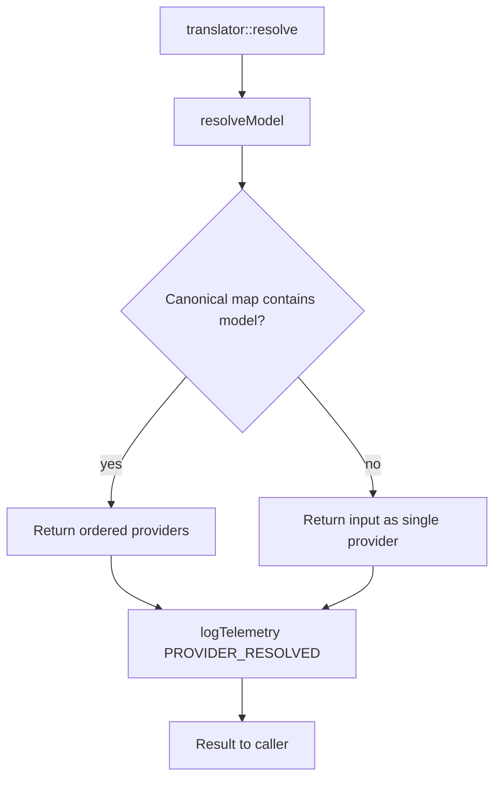

# Translator Worker

## Overview
The **Translator Worker** is a TypeScript III worker that maps canonical model names to concrete provider/model strings. It exposes a small OpenAI-compatible surface (`translate`, `detect`, `resolve`) but its primary production role is `translator::resolve`, which powers the gateway's provider routing and failover logic.

Key responsibilities:
- Resolve abstract names like `llama3` to ordered provider arrays.
- Provide mock `translate` and `detect` endpoints for early milestones.
- Emit `PROVIDER_RESOLVED` telemetry events.
- Expose `translator::status` for health checks.

## Architecture Diagram

## Core Components

### 1. `resolveModel(model: string): ResolveResult`
- **Purpose**: Convert a canonical model name to a prioritized list of provider strings.
- **Logic**
  - Empty/blank input → `{ model, providers: [], resolved: false }`.
  - If the name exists in `CANONICAL_MAP` → `{ model, providers, resolved: true }`.
  - Otherwise → `{ model, providers: [model], resolved: false }`.
- **Failover ordering**: The array order defines provider priority (`0` = primary, `1` = first failover, etc.).

### 2. `CANONICAL_MAP` (`src/canonical-maps.ts`)
Canonical alias → provider/model list:

| Alias | Providers (in priority order) |
|-------|-------------------------------|
| `llama3` | `groq/llama3-8b-8192`, `cerebras/llama3.1-8b`, `together/meta-llama/Meta-Llama-3.1-8B-Instruct-Turbo` |
| `llama3-70b` | `groq/llama-3.3-70b-versatile`, `together/meta-llama/Llama-3.3-70B-Instruct-Turbo` |
| `gpt-oss` | `cerebras/gpt-oss-120b`, `groq/openai/gpt-oss-20b`, `together/openai/gpt-oss-120b` |

### 3. `createTranslatorWorker(url)`
- Registers four III functions:
  - `translator::status` – returns `{ worker, status, uptime }`.
  - `translator::translate` – returns a mock translated string with a placeholder note.
  - `translator::detect` – returns a mock `{ detected: 'en', confidence: 0.95 }`.
  - `translator::resolve` – resolves the model and fires a fire-and-forget `PROVIDER_RESOLVED` telemetry event.
- Connects to `III_URL` or `ws://127.0.0.1:49134` by default.

## Function Reference

| Function | Input | Output |
|----------|-------|--------|
| `translator::status` | `void` | `{ worker, status, uptime }` |
| `translator::translate` | `{ text, from?, to? }` | `{ translated, from, to, worker, note }` |
| `translator::detect` | `{ text }` | `{ detected, confidence, worker }` |
| `translator::resolve` | `{ model }` | `{ model, providers[], resolved }` |

## Telemetry
- Each successful resolution emits `PROVIDER_RESOLVED` with `{ model, resolved, providerCount }`.
- Telemetry is fire-and-forget; resolution never fails because telemetry could not be sent.

## Testing
- `workers/translator/src/index.test.ts` verifies status and resolution behavior.
- Run with `pnpm --filter @aigency/translator test`.

## Integration Points
- **Gateway Worker**: calls `translator::resolve` before retrieving API keys and routing requests.
- **Shared telemetry**: `logTelemetry` helper from `workers/shared/telemetry.ts`.
