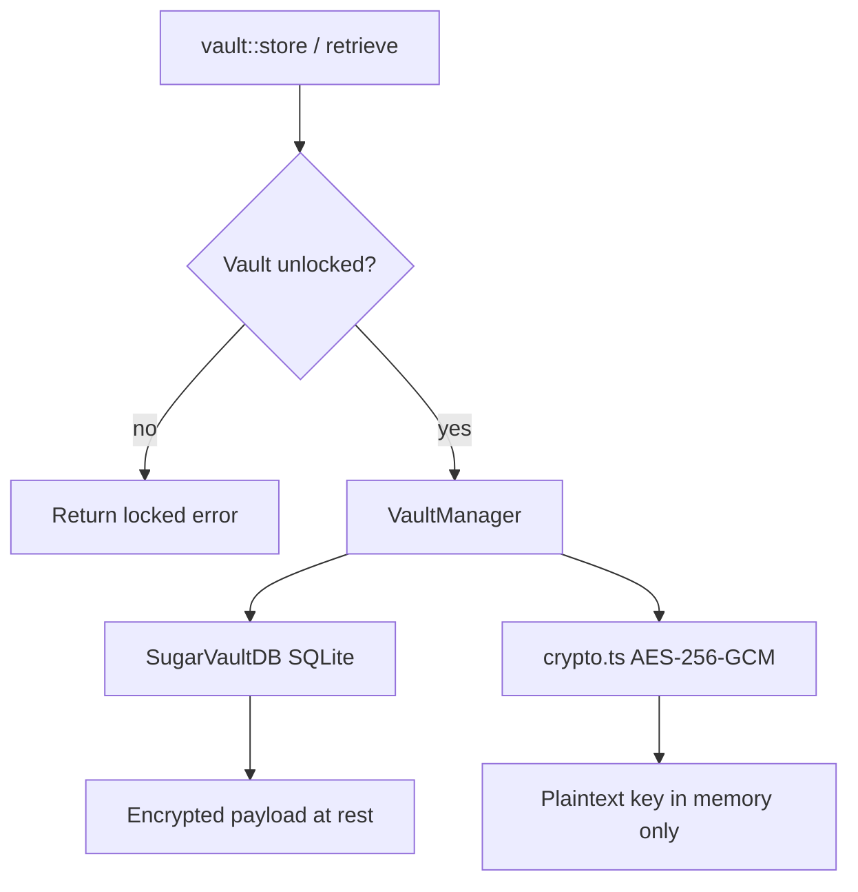

# Vault Worker

## Overview
The **Vault Worker** is the secure credential store for the Aigency router. It encrypts provider API keys at rest using AES-256-GCM and exposes them to authorized workers only after the vault has been unlocked with a master password. The vault is implemented as a TypeScript III worker backed by SQLite (`better-sqlite3`).

Key responsibilities:
- Safely store API keys per provider.
- Decrypt and retrieve keys on demand.
- Lock/unlock vault lifecycle.
- Emit `KEY_ROTATED` telemetry when an existing key is overwritten.

## Architecture Diagram

## Core Components

### 1. `VaultManager` (`src/vault.ts`)
- **Singleton pattern**: One `VaultManager` per worker process; reused across III function calls.
- **Unlock flow**
  1. Open SQLite DB at `VAULT_DB_PATH` (default `data/vault.db`).
  2. Verify master password against stored `password_canary` if one exists.
  3. Mark unlocked and store a fresh canary for new vaults.
- **Key operations**
  - `storeKey(providerId, apiKey, virtualColleagueId?)` → encrypts and inserts a row.
  - `getKey(providerId)` → fetches the newest active row, decrypts, returns `{ key }`.
  - `getStatus()` → unlock state, total key count, distinct providers, last operation.
  - `lock()` → clears password from memory and closes the DB connection.
  - `storeCanary()` → encrypts a known canary value and saves it in `vault_meta`.

### 2. `crypto.ts`
- **AES-256-GCM** authenticated encryption.
- **Key derivation**: `scryptSync` with a random 16-byte salt (`N=16384, r=8, p=1`).
- **Payload layout**: `salt(16) + iv(12) + authTag(16) + ciphertext`.
- Each encryption generates a fresh salt and IV so identical keys produce different ciphertexts.

### 3. `db.ts`
- `SugarVaultDB` wraps `better-sqlite3`.
- **Schema**
  - `sugar_vault` table: id, provider_id, encrypted_payload, virtual_colleague_id, is_active, created_at, last_used_at.
  - `vault_meta` table: key/value pairs for canary and last operation.
- **Indexes**: provider_id, is_active.
- **WAL mode** enabled for concurrent reads.

### 4. `selector.ts`
- Defines the pluggable `Selector` interface and `HeuristicSelector`.
- Simple when ≤3 messages, no JSON enforcement, and `max_tokens ≤ 4096`.
- Otherwise complex.

### 5. `createVaultWorker(url, masterPassword?)`
- Registers III functions:
  - `vault::status`
  - `vault::store`
  - `vault::retrieve`
  - `vault::lock`
- If `masterPassword` is provided, unlocks immediately; otherwise the vault stays locked until unlocked by the caller.
- On direct run, reads `VAULT_MASTER_KEY` or prompts via readline.

## Function Reference

| Function | Input | Output |
|----------|-------|--------|
| `vault::status` | `void` | `{ worker, status, unlocked, keyCount, providers[], lastOperation? }` |
| `vault::store` | `{ providerId, apiKey, virtualColleagueId? }` | `{ stored, id, worker }` or error |
| `vault::retrieve` | `{ providerId }` | `{ key, worker }` or `{ key: null, note }` |
| `vault::lock` | `void` | `{ locked, worker }` |

## Security Notes
- The master password and derived key live only in memory while unlocked.
- `lock()` clears the password reference and closes the database.
- Logs record operation type, provider, success/failure, and key UUID — never the secret value.
- Encrypted payloads include a GCM auth tag so tampering is detected at decryption time.

## Testing
- `workers/vault/src/crypto.test.ts` – AES/GCM + scrypt correctness.
- `workers/vault/src/db.test.ts` – SQLite schema and CRUD.
- `workers/vault/src/index.test.ts` – III function registration and wiring.
- `workers/vault/src/selector.test.ts` – heuristic classification.
- Run with `pnpm --filter @aigency/vault test`.

## Integration Points
- **Gateway Worker**: calls `vault::retrieve` to fetch provider API keys before routing.
- **Shared telemetry**: emits `KEY_ROTATED` on key rotation via `logTelemetry`.
