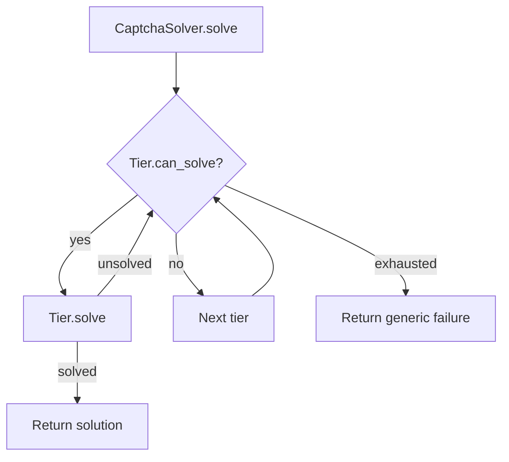

# Captcha Solving

# survey_agent.captcha – CAPTCHA Solving Module

## Overview
The `survey_agent.captcha` package provides a **tiered pipeline** for detecting and solving various CAPTCHA challenges that appear during automated survey interactions.  
It abstracts each solving strategy into a *tier* (`CaptchaTier`) and orchestrates them through `CaptchaSolver`. The design allows easy extension (e.g., adding a new API‑based solver) while keeping the core flow deterministic and testable.

## Core Concepts

| Concept | Definition |
|---------|------------|
| **CaptchaType** | `Enum` describing the supported CAPTCHA families (`ARITHMETIC`, `IMAGE_SLIDER`, `IMAGE_SELECT`, `TEXT_CHALLENGE`, `HCAPTCHA`, `RECAPTCHA`, `UNKNOWN`). |
| **CaptchaChallenge** | Dataclass that carries the detected challenge metadata: `captcha_type`, human‑readable `description`, optional screenshot (`bytes`), and any extra `metadata`. |
| **CaptchaSolution** | Dataclass representing the outcome of a solve attempt: `solved` flag, optional `answer`, the `method` used (`arithmetic`, `llm_vision`, `api`, `manual`), and an `error` message if applicable. |
| **CaptchaTier** | Abstract base class for a solving tier. Concrete implementations must provide `can_solve` and `solve` async methods. |
| **CaptchaSolver** | The orchestrator that iterates over a list of `CaptchaTier` instances, invoking the first tier that reports it can handle the challenge. |

## Data Types

### `CaptchaType`
```python
class CaptchaType(str, Enum):
    ARITHMETIC = "arithmetic"
    IMAGE_SLIDER = "image_slider"
    IMAGE_SELECT = "image_select"
    TEXT_CHALLENGE = "text_challenge"
    HCAPTCHA = "hcaptcha"
    RECAPTCHA = "recaptcha"
    UNKNOWN = "unknown"
```

### `CaptchaChallenge`
```python
@dataclass
class CaptchaChallenge:
    captcha_type: CaptchaType
    description: str
    screenshot_bytes: bytes | None = None
    metadata: dict[str, Any] | None = None
```

### `CaptchaSolution`
```python
@dataclass
class CaptchaSolution:
    solved: bool
    answer: str | None = None
    method: str = ""   # e.g. "arithmetic", "llm_vision", "api", "manual"
    error: str | None = None
```

## Solver Tiers

### 1. `ArithmeticSolver`
* **Purpose** – Handles simple math CAPTCHAs (e.g., “12 + 7 = __”).  
* **`can_solve`** – Returns `True` only when `challenge.captcha_type == CaptchaType.ARITHMETIC`.  
* **`solve`** – Uses a regular expression to extract two operands and an operator, computes the integer result, and returns a `CaptchaSolution` with `method="arithmetic"`.

### 2. `LLMVisionSolver`
* **Purpose** – Delegates image‑based challenges to a Large Language Model with vision capabilities.  
* **Constructor** – Accepts a callable `llm_fn(prompt: str, image_bytes: bytes) -> str`.  
* **`can_solve`** – Supports `ARITHMETIC`, `TEXT_CHALLENGE`, and `IMAGE_SELECT` when an LLM function is supplied.  
* **`solve`** – Builds a concise prompt, calls the LLM, strips whitespace, and returns the answer. Errors from the LLM are captured in `error`.

### 3. `APICaptchaSolver` (optional)
* **Purpose** – Placeholder for third‑party solving services (e.g., 2Captcha, CapSolver).  
* **Activation** – Added to the tier list only when `CaptchaSolver` receives a non‑empty `api_key`.  
* **`can_solve`** – Handles `HCAPTCHA` and `RECAPTCHA`.  
* **`solve`** – Currently returns a not‑implemented `CaptchaSolution`; replace with real API calls when needed.

### 4. `ManualVNCFallback`
* **Purpose** – Guarantees a deterministic fallback path that prompts a human operator via VNC.  
* **`can_solve`** – Always returns `True` (last resort).  
* **`solve`** – Returns `solved=False` with a clear error message; integration with a VNC alert system should be added by the consumer.

## `CaptchaSolver` – Pipeline Orchestrator

```python
class CaptchaSolver:
    def __init__(self, llm_fn: Any = None, api_key: str = ""):
        self._tiers: list[CaptchaTier] = [
            ArithmeticSolver(),
            LLMVisionSolver(llm_fn=llm_fn),
        ]
        if api_key:
            self._tiers.append(APICaptchaSolver(api_key=api_key))
        self._tiers.append(ManualVNCFallback())
```

* **Tier Order** – The list defines the priority: arithmetic → LLM vision → (optional) API → manual fallback.  
* **`tiers` property** – Returns a simplified list of active tier names (e.g., `["arithmetic", "llm_vision", "api", "manual"]`).  
* **`solve(challenge)`** – Iterates over `_tiers`, asks each `can_solve` if it can handle the challenge, then calls `solve`. The first tier that returns `solved=True` short‑circuits the loop. If none succeed, a generic failure `CaptchaSolution` is returned.

### Execution Flow Diagram

*The diagram shows the linear scan of tiers until a solution is found or all tiers are exhausted.*

## Integration Points

| Integration | Where it hooks |
|-------------|----------------|
| **Browser detection** | The surrounding `survey_agent.browser` code should instantiate a `CaptchaChallenge` from page analysis (e.g., by inspecting DOM, taking a screenshot, and classifying the type). |
| **LLM function** | Pass a callable that conforms to `prompt, image_bytes -> str` when constructing `CaptchaSolver`. This could be a wrapper around OpenAI’s Vision API, Anthropic Claude, etc. |
| **External API** | Provide a valid `api_key` to enable `APICaptchaSolver`. Extend the placeholder `solve` method with the provider’s HTTP workflow. |
| **Manual fallback** | Replace the stubbed `ManualVNCFallback.solve` with a real VNC alert mechanism (e.g., push notification + VNC URL). |

## Usage Example

```python
from survey_agent.captcha import CaptchaSolver, CaptchaChallenge, CaptchaType

# 1️⃣  Prepare a challenge (normally produced by the browser module)
challenge = CaptchaChallenge(
    captcha_type=CaptchaType.ARITHMETIC,
    description="What is 8 + 5?",
)

# 2️⃣  Create a solver – no LLM, no API key for this simple case
solver = CaptchaSolver()

# 3️⃣  Solve asynchronously
solution = await solver.solve(challenge)

if solution.solved:
    print(f"Solved via {solution.method}: {solution.answer}")
else:
    print(f"Failed: {solution.error}")
```

### Adding a New Tier
To support a new CAPTCHA family:

1. Subclass `CaptchaTier`.
2. Implement `async def can_solve(self, challenge: CaptchaChallenge) -> bool`.
3. Implement `async def solve(self, challenge: CaptchaChallenge) -> CaptchaSolution`.
4. Insert the new tier into `CaptchaSolver.__init__` at the desired priority position.

## Testing Guidelines

* **Unit tests** – Mock `CaptchaChallenge` objects for each `CaptchaType` and assert that:
  * `ArithmeticSolver` correctly parses and computes expressions.
  * `LLMVisionSolver` calls the injected `llm_fn` with the expected prompt and returns the stripped answer.
  * `APICaptchaSolver` respects `api_key` presence and returns the placeholder error (or a real API response when implemented).
  * `ManualVNCFallback` always reports `solved=False` with the correct method name.
* **Pipeline test** – Create a `CaptchaSolver` with a deterministic set of tiers (e.g., only arithmetic and manual) and verify that the first capable tier wins.
* **Error handling** – Simulate exceptions in the LLM function and ensure they surface as `CaptchaSolution.error`.

## Extensibility Checklist

- [ ] **New CAPTCHA type** – Add a member to `CaptchaType` and update any tier’s `can_solve` logic if needed.  
- [ ] **LLM integration** – Provide a wrapper that matches the `llm_fn` signature; consider async support if the underlying API is async.  
- [ ] **API solver** – Implement HTTP request/response handling, respect rate limits, and map provider‑specific error codes to `CaptchaSolution.error`.  
- [ ] **Manual fallback** – Hook into the application’s user‑notification system (e.g., Slack, email) and VNC session manager.  

--- 

*End of documentation.*