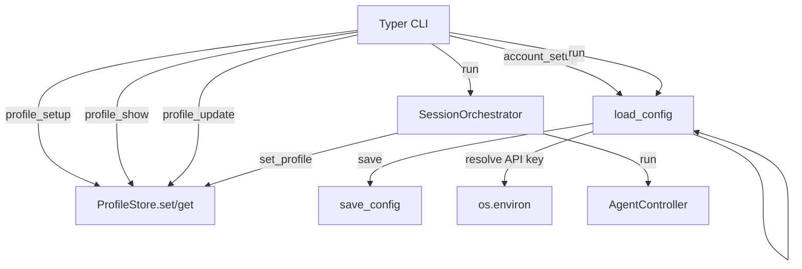

# CLI & Configuration

# Survey Agent – CLI & Configuration Module

## Overview
The **CLI & Configuration** module provides the command‑line interface (`survey_agent.cli`) and the persistent configuration model (`survey_agent.config`).  
It is the entry point for end‑users, exposing sub‑commands for profile management, account/LLM provider setup, survey execution, and provider inspection.  
Configuration is stored in `data/config.yaml` as a Pydantic `AppConfig` model, loaded with `load_config()` and persisted with `save_config()`.

---

## 1. Core Components

| Component | File | Purpose |
|-----------|------|---------|
| `app` (Typer) | `cli.py` | Root Typer application (`survey-agent`). |
| `profile_app` (Typer) | `cli.py` | Sub‑command group for profile operations. |
| `AppConfig` | `config.py` | Pydantic model representing the whole application configuration. |
| `load_config()` / `save_config()` | `config.py` | Load from / write to `data/config.yaml`. |
| `ProfileStore` | `profile/store.py` | JSON‑backed storage for user profile data. |
| `SessionOrchestrator` | `orchestrator.py` | Coordinates browser sessions; invoked by the `run` command. |
| `PROVIDERS` | `llm_provider.py` | Mapping of LLM provider identifiers to metadata (name, env var, default model). |

---

## 2. Command Structure

### 2.1 Root Command (`survey-agent`)
```bash
survey-agent [OPTIONS] COMMAND [ARGS]...
```
* `no_args_is_help=True` – invoking without arguments prints the help screen.

### 2.2 Profile Commands (`survey-agent profile …`)

| Command | Signature | Description |
|---------|-----------|-------------|
| `setup` | `profile_setup()` | Interactive interview that walks the user through each category defined in `profile/categories.py`. Updates are stored via `ProfileStore.set()` with source `"interview"`. |
| `show` | `profile_show()` | Prints a human‑readable summary (`ProfileStore.summary()`) and completion percentage (`ProfileStore.completion_pct()`). |
| `update` | `profile_update(key: str, value: str)` | Directly modifies a single field. Calls `ProfileStore.correct()` → `ProfileStore.set()` → `ProfileStore.get()` to validate and persist the change. |

### 2.3 Account & LLM Provider (`survey-agent account …`)

```python
def account_setup(
    google_email: str | None = typer.Option(...),
    paypal_email: str | None = typer.Option(...),
    provider: str | None = typer.Option(...),
    model: str | None = typer.Option(...),
    api_key: str | None = typer.Option(...),
    base_url: str | None = typer.Option(...),
)
```

* Loads the current configuration with `load_config()`.
* Mutates fields on the `AppConfig` instance (`account.google_email`, `account.paypal_email`, `llm_provider`, `llm_model`, `llm_api_key`, `llm_base_url`).
* Validates `provider` against `PROVIDERS`. Unknown providers abort with `typer.Exit(1)`.
* If **no options are supplied**, prints the current configuration (including whether the provider’s env var is set) and a list of available providers.
* When any option is changed, persists the new configuration via `save_config(config)`.

### 2.4 Run Surveys (`survey-agent run …`)

```python
def run_surveys(
    sites: list[str] = typer.Option([], "--site", "-s"),
    max_surveys: int = typer.Option(5, "--max", "-n"),
    headless: bool = typer.Option(False, "--headless/--no-headless"),
    verbose: bool = typer.Option(False, "--verbose", "-v"),
)
```

* Configures logging (DEBUG if `verbose` else INFO).
* Loads configuration (`load_config()`), resolves the LLM API key:
  * Preference order: `config.llm_api_key` → environment variable defined by the provider (`PROVIDERS[provider]["env_var"]`).
  * If missing, aborts with a helpful error message.
* Sets the resolved env var for downstream LangChain usage.
* Instantiates `SessionOrchestrator(max_sessions=1, config=config, headless=headless)`.
* Calls `orchestrator.set_profile(str(DATA_DIR / "profile.json"))`.
* Determines the site list (`sites` or default `["branded-surveys"]`) and prints a short run summary.
* Executes the orchestrator with `asyncio.run(orchestrator.run(...))` and prints per‑run statistics.

### 2.5 List Providers (`survey-agent providers`)

* Builds a `rich.Table` showing each provider’s key, human‑readable name, default model, required env var, and whether the env var is currently set.
* Uses `PROVIDERS` to populate rows.

---

## 3. Configuration Model (`survey_agent.config`)

### 3.1 Data Layout
```yaml
max_concurrent_sessions: 1
schedule:
  wake_time: "08:00"
  sleep_time: "23:00"
  min_session_minutes: 15
  max_session_minutes: 45
  min_break_minutes: 5
  max_break_minutes: 15
  lunch_start: "12:00"
  lunch_duration_minutes: 30
  heartbeat_interval_seconds: 30
account:
  google_email: ""
  paypal_email: ""
llm_provider: "gemini"
llm_model: ""
llm_api_key: ""
llm_base_url: ""
```

### 3.2 Classes
* **`ScheduleConfig`** – Scheduler‑related timings.
* **`AccountConfig`** – Holds `google_email` and `paypal_email`.
* **`AppConfig`** – Root model; includes defaults and fields for LLM provider configuration.

### 3.3 Persistence Helpers
* `load_config() → AppConfig`  
  * If `config.yaml` exists, parses it with `yaml.safe_load` and constructs an `AppConfig`.  
  * If missing, creates a default `AppConfig`, writes it via `save_config()`, and returns it.
* `save_config(config: AppConfig) → None`  
  * Serialises `config.model_dump()` to YAML (non‑flow style) and writes to `CONFIG_PATH`.

---

## 4. Interaction with Other Modules

* **Profile Commands** → `ProfileStore` (JSON file under `data/profile.json`).  
  * `profile_setup` reads/writes fields via `store.get()` / `store.set()`.  
  * `profile_update` uses `store.correct()` which internally calls `store.set()` and `store.get()` to validate.
* **Run Command** → `SessionOrchestrator` (orchestrates browser agents).  
  * `orchestrator.set_profile()` points the orchestrator at the profile JSON file.  
  * `orchestrator.run()` spawns the browser controller (`browser/agent_controller.py`) and executes the survey loop.
* **Account Setup** → `PROVIDERS` (metadata for LLM providers).  
  * Validation and status display rely on this mapping.
* **Configuration Loading** is also used by `orchestrator.__init__` (see call graph) to ensure the orchestrator always works with the latest persisted settings.

---

## 5. Execution Flow Diagram



*The diagram shows the high‑level data flow for the most common CLI commands.*

---

## 6. Extending the CLI

### Adding a New Sub‑command
1. Define a function with a clear docstring.
2. Decorate it with `@app.command("newcmd")` (or `@profile_app.command` for profile‑related commands).
3. Use `typer.Option` / `typer.Argument` for parameters.
4. Access the shared `console` for rich output.
5. Persist any configuration changes via `load_config()` → mutate → `save_config()`.

### Adding a New Configuration Field
1. Add a field to `AppConfig` (or a nested model) with a default value.
2. Update `CONFIG_PATH` handling if a custom serialization is required (normally Pydantic + YAML handles it automatically).
3. Expose the field through a CLI option (e.g., in `account_setup`) and ensure validation against any provider‑specific constraints.

---

## 7. Logging & Debugging

* Verbose mode (`--verbose` / `-v`) sets `logging.basicConfig(level=logging.DEBUG)`.  
* All internal modules (e.g., `orchestrator`, `browser`) inherit this configuration, making it easy to trace execution with timestamps.

---

## 8. Environment Variable Conventions

| Provider Key | Expected Env Var |
|--------------|------------------|
| `gemini` | `GEMINI_API_KEY` |
| `groq`   | `GROQ_API_KEY` |
| `mistral`| `MISTRAL_API_KEY` |
| `openai-compatible` | Provider‑specific (defined in `PROVIDERS[provider]["env_var"]`) |
| `cerebras`| `CEREBRAS_API_KEY` |

The CLI automatically injects the resolved API key into `os.environ` before invoking the orchestrator, ensuring downstream libraries (e.g., LangChain) can locate it.

---

## 9. Error Handling

* Missing API key → prints a red error and exits with `typer.Exit(1)`.
* Unknown LLM provider → prints a red error, lists available providers, and exits.
* Invalid number input during profile setup → prints a red warning and repeats the prompt.
* All other exceptions bubble up to Typer’s default handler, which prints a traceback when `--verbose` is used.

---

## 10. Testing Tips

* **CLI Invocation** – Use `typer.testing.CliRunner` to invoke commands programmatically.
* **Config Isolation** – Override `DATA_DIR` (e.g., via `os.environ["SURVEY_AGENT_DATA_DIR"]`) in tests to point to a temporary directory.
* **Profile Store** – Mock `ProfileStore` or use a temporary JSON file to avoid polluting the real profile.
* **Environment Variables** – Set/clear provider env vars in the test process to verify key resolution logic.

---