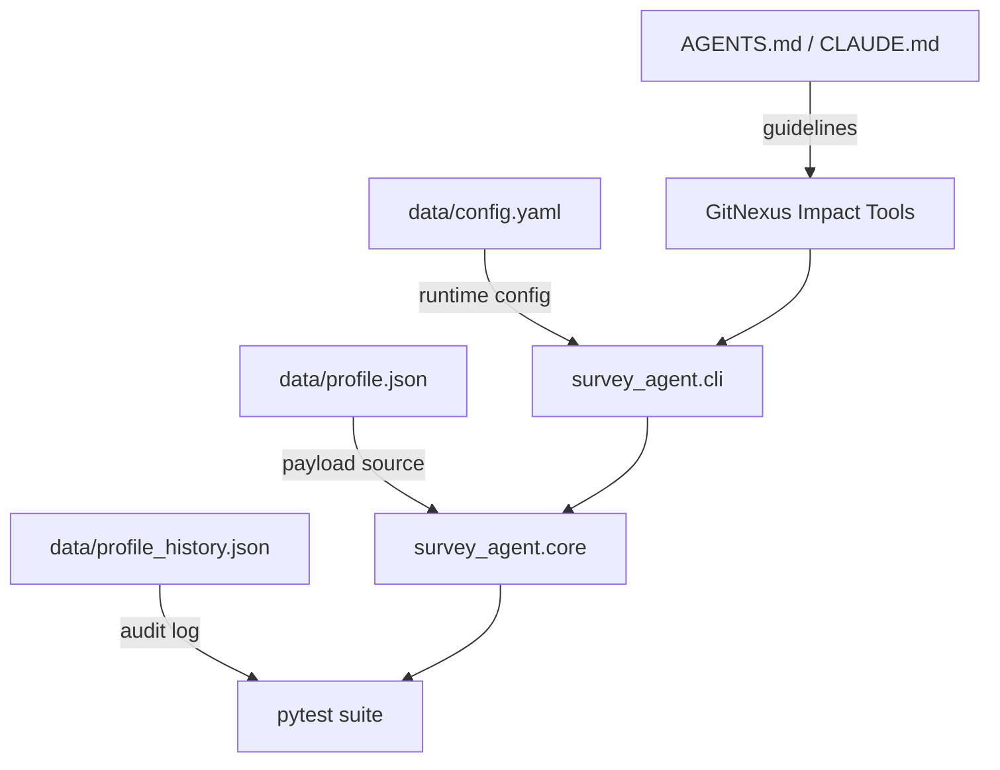

# Other

# Other Module

## Overview
The **Other** module groups auxiliary resources that support the core `survey-agent` application. It does not contain executable code but provides:

* Human‑readable guidance (`AGENTS.md`, `CLAUDE.md`)
* Runtime configuration (`data/config.yaml`)
* Sample user data (`data/profile.json`, `data/profile_history.json`)

These assets are consumed by the CLI, the impact‑analysis tooling, and the test suite to ensure consistent behavior across environments.

## Directory Layout
```
other/
├─ AGENTS.md                # High‑level policy and usage guidelines
├─ CLAUDE.md                # Duplicate of AGENTS.md (kept for tooling compatibility)
├─ data/
│  ├─ config.yaml          # Runtime configuration schema
│  ├─ profile.json         # Example user profile payload
│  └─ profile_history.json # Change‑log for the example profile
```

## Key Files

### `AGENTS.md` & `CLAUDE.md`
Both markdown files contain the same policy text, describing:

* **Always Do** – mandatory pre‑change steps (`impact`, `detect_changes`, `query`, `context`, `explain`).
* **Never Do** – prohibitions (editing without impact analysis, ignoring high‑risk warnings, etc.).
* **Resources** – URIs that point to the GitNexus index (`gitnexus://repo/survey-agent/...`).
* **CLI reference table** – mapping of common tasks to the corresponding Claude skill files.

These documents are parsed by the GitNexus tooling to surface guidance directly in the IDE or CI pipelines.

### `data/config.yaml`
```yaml
anti_detection:
  fingerprint_rotation: true
  human_delays: true
  max_delay_ms: 2500
  min_delay_ms: 500
  proxy_list: []
captcha:
  api_enabled: false
  api_key: ''
  api_provider: ''
  llm_vision_enabled: true
  vnc_fallback: true
  vnc_port: 5900
llm_model: gpt-4o-mini
llm_provider: openai
max_concurrent_sessions: 1
sites: {}
```

#### Purpose
Defines default runtime parameters for the survey automation agent:

| Section | Meaning |
|---------|---------|
| `anti_detection` | Controls stealth features (fingerprint rotation, artificial human delays). |
| `captcha` | Toggles CAPTCHA handling and VNC fallback settings. |
| `llm_model` / `llm_provider` | Selects the LLM backend used for generating survey responses. |
| `max_concurrent_sessions` | Limits parallel browser sessions to avoid detection. |
| `sites` | Placeholder for per‑site overrides (empty by default). |

#### Usage
The configuration is loaded at startup by `survey_agent.config.load()` (implementation resides in the core package). The values are exposed via a Pydantic model, enabling type‑checked access throughout the codebase.

### `data/profile.json`
```json
{
  "demographics": {
    "age": 39,
    "gender": "Male"
  },
  "employment": {
    "status": "Full-time"
  }
}
```
A minimal example of a user profile that the agent can submit to a survey. The structure mirrors the schema expected by the target survey forms and is used by the test suite to verify payload generation.

### `data/profile_history.json`
```json
[
  {
    "timestamp": "2026-06-21T11:45:41.673302+00:00",
    "key": "demographics.age",
    "old_value": null,
    "new_value": 35,
    "source": "test"
  },
  ...
]
```
Chronological change log for the example profile. It demonstrates how the system records edits (e.g., during test runs) and can be leveraged by audit tools to reconstruct the evolution of a profile.

## Interaction with the Core Codebase

| Core Component | Interaction Point |
|----------------|-------------------|
| `survey_agent.cli` | Reads `config.yaml` to configure the Typer CLI (`survey-agent` entry point). |
| `survey_agent.core` | Consumes `profile.json` when constructing survey payloads. |
| GitNexus tooling | Parses `AGENTS.md` / `CLAUDE.md` to enforce the “Always Do / Never Do” policies before any code change. |
| Test suite (`pytest`) | Loads `profile_history.json` to assert that profile mutations are correctly logged. |

The **Other** module therefore acts as a static data hub that the dynamic parts of the application reference at runtime and during development.

## Development Guidelines

1. **Never modify policy text without updating the corresponding skill files** (`.claude/skills/gitnexus/...`).  
2. **When changing configuration defaults**, run the impact analysis command:  
   ```bash
   impact({target: "data/config.yaml", direction: "upstream"})
   ```  
   Verify that no high‑risk callers are affected before committing.
3. **Add new example profiles** only after they have been validated against the survey schema. Update `profile_history.json` to reflect the addition.
4. **Keep the two markdown files in sync**; they are both scanned by GitNexus. A mismatch will cause a warning in CI.

## Mermaid Overview (optional)



*The diagram shows how the static assets feed into the CLI, core logic, and testing pipeline, with GitNexus enforcing policy compliance.*