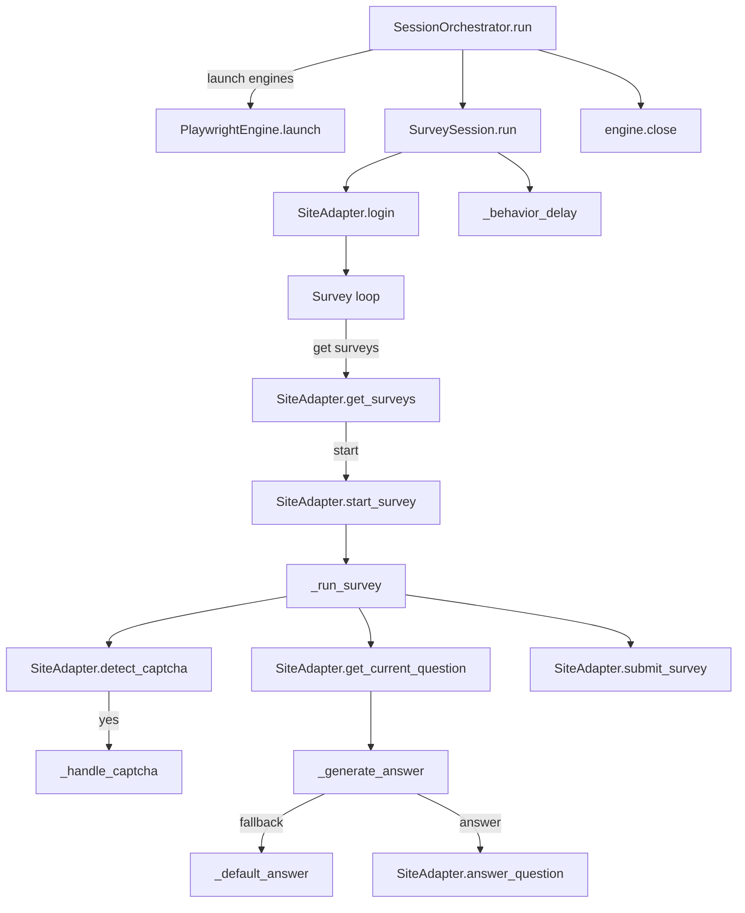

# Survey Orchestration

# Survey Orchestration Module

## Overview
The Survey Orchestration module coordinates the end‑to‑end lifecycle of survey automation. It creates browser contexts, logs into each target site, discovers available surveys, answers questions using profile‑based matching (or fallback strategies), handles CAPTCHAs, and records per‑session statistics. The top‑level entry point is `SessionOrchestrator.run`, which spawns up to **N** concurrent `SurveySession` instances.

## Core Components

| Component | Responsibility | Key Types |
|-----------|----------------|-----------|
| **SurveySession** | Manages a single survey session: login, survey loop, answer generation, CAPTCHA handling, and cleanup. | `SurveySession` |
| **SessionOrchestrator** | Instantiates browser engines, creates `SurveySession` objects, and runs them concurrently. | `SessionOrchestrator` |
| **BrowserEngine** (abstract) | Provides `create_context`, `launch`, and `close` for a concrete engine (e.g., `PlaywrightEngine`). | `BrowserEngine`, `PlaywrightEngine` |
| **SiteAdapter** | Site‑specific implementation that knows how to log in, fetch surveys, navigate questions, and submit answers. | `SiteAdapter` (from `sites.base`) |
| **Answer Generation** | Uses `AttentionCheckHandler`, `FingerprintGenerator`, `OpenEndedGenerator`, and the matcher utilities (`resolve_answer`, `resolve_answer_with_options`). | `AttentionCheckHandler`, `OpenEndedGenerator` |
| **CaptchaSolver** | Detects and solves CAPTCHAs via `CaptchaChallenge`/`CaptchaSolution`. | `CaptchaSolver`, `CaptchaChallenge`, `CaptchaType` |
| **Configuration** | Global settings loaded by `load_config` and injected into sessions. | `AppConfig` |
| **CredentialStore / ProfileStore** | Secure storage for site credentials and user profile data used by the matcher. | `CredentialStore`, `ProfileStore` |

## Execution Flow



*The diagram shows the high‑level orchestration from `SessionOrchestrator.run` down to per‑question handling.*

## Detailed Class Documentation

### `SurveySession`
```python
class SurveySession:
    def __init__(self, site: SiteAdapter, engine: BrowserEngine,
                 config: AppConfig, session_id: int = 0)
    async def run(self, max_surveys: int = 10) -> dict
    async def _run_survey(self, page, survey: Survey) -> bool
    def _generate_answer(self, question: Question) -> Answer | None
    def _default_answer(self, question: Question) -> Answer
    async def _handle_captcha(self, page) -> None
    async def _behavior_delay(self) -> None
```

* **Construction** – Receives a concrete `SiteAdapter`, a `BrowserEngine` instance, the global `AppConfig`, and an optional `session_id` for logging.
* **`run`** – Creates a browser context, logs in, then iterates up to `max_surveys`. For each survey it calls `_run_survey` and records statistics (`surveys_completed`, `questions_answered`, `captchas_solved`). Errors are caught, logged, and returned in the result dict.
* **`_run_survey`** – Drives a single survey:
  1. Calls `site.start_survey`.
  2. Loops over questions (max 100 iterations as a safety guard).
  3. Detects CAPTCHAs via `site.detect_captcha` → `_handle_captcha`.
  4. Retrieves the current question with `site.get_current_question`.
  5. Generates an answer via `_generate_answer`; falls back to `_default_answer` if needed.
  6. Submits the answer with `site.answer_question`.
  7. After the loop, finalises the survey with `site.submit_survey`.
* **`_generate_answer`** – Answer generation order:
  1. **Attention checks** – `AttentionCheckHandler.handle` can produce a deterministic answer.
  2. **Open‑ended** – If the question type is `OPEN_ENDED` and a profile is present, `OpenEndedGenerator.generate` creates a prompt (LLM placeholder).
  3. **Profile‑based matching** – Uses `resolve_answer_with_options` (when options exist) or `resolve_answer` otherwise. Both functions compare the question text to entries in the user profile.
* **`_default_answer`** – Provides a safe fallback based on the question type:
  * `radio`/`select` → first option
  * `checkbox` → list containing first option
  * `scale` → value `3`
  * text‑like fields → `"N/A"`
  * otherwise → empty string
* **`_handle_captcha`** – Takes a screenshot, builds a `CaptchaChallenge`, and asks `CaptchaSolver` to solve it. On success, increments `captchas_solved`. The actual filling of the solution is site‑specific and left as a comment placeholder.
* **`_behavior_delay`** – Introduces a random `asyncio.sleep` (3‑8 s) between surveys to mimic human pacing.

### `SessionOrchestrator`
```python
class SessionOrchestrator:
    def __init__(self, max_sessions: int = 1, config: AppConfig | None = None)
    @property
    def max_sessions(self) -> int
    def set_profile(self, profile_path: str) -> None
    async def run(self, sites: list[str] | None = None,
                  max_surveys: int = 10) -> list[dict]
```

* **Construction** – Loads configuration via `load_config` if none is supplied, determines the effective `max_sessions` (fallback to `config.max_concurrent_sessions`), and creates a `SiteRegistry` and `CredentialStore`. The optional `ProfileStore` is set later via `set_profile`.
* **`set_profile`** – Instantiates a `ProfileStore` from a filesystem path; the store is later passed to each `SiteAdapter`.
* **`run`** – Orchestrates the whole workflow:
  1. If `sites` is `None`, fetches all enabled site slugs from `SiteRegistry.list_sites`.
  2. Creates a list of `PlaywrightEngine` objects, limited by `min(len(sites), max_sessions)`.
  3. Launches each engine (`engine.launch(headless=True)`).
  4. For each site slug (up to `max_sessions`):
     * Validates existence via `registry.has_adapter`.
     * Retrieves a concrete `SiteAdapter` with `registry.get_adapter`, injecting the `CredentialStore` and optional `ProfileStore`.
     * Instantiates a `SurveySession` and adds its `run` coroutine to a task list.
  5. Executes all session tasks concurrently with `asyncio.gather(..., return_exceptions=True)`.
  6. Normalises results: successful dicts are returned unchanged; exceptions are wrapped as `{"error": str(exc)}`.
  7. Finally, closes every engine (`engine.close`).

## Interaction with the Rest of the Codebase

| Module | Interaction |
|--------|--------------|
| `survey_agent/browser/*` | Provides the concrete `BrowserEngine` (`PlaywrightEngine`) used for page creation and navigation. |
| `survey_agent/sites/*` | Each site implements `SiteAdapter` (login, survey discovery, question navigation, answer submission). |
| `survey_agent/answering/*` | `classify` and `QuestionType` are used to interpret question types; `matcher.resolve_answer*` perform profile‑based look‑ups; `OpenEndedGenerator` creates prompts for free‑text questions. |
| `survey_agent/captcha/*` | `CaptchaSolver` solves challenges detected by `SiteAdapter.detect_captcha`. |
| `survey_agent/config.py` | Global configuration (`AppConfig`) supplies defaults such as `max_concurrent_sessions`. |
| `survey_agent/credentials.py` | `CredentialStore` supplies per‑site login credentials to adapters. |
| `survey_agent/profile/store.py` | Holds the user profile used by the matcher; accessed indirectly via `SiteAdapter` when constructing `SurveySession`. |
| `survey_agent/withdrawal.py` | Not directly used by the orchestration module, but can be invoked by a site‑specific `SiteAdapter` after a survey completes to withdraw earned balances. |

## Concurrency Model
* **Engine per session** – Each `SurveySession` receives its own `BrowserEngine` instance, ensuring isolated browser contexts.
* **AsyncIO** – All I/O (page navigation, screenshot, CAPTCHA solving) is performed with `await`. The orchestrator uses `asyncio.gather` to run sessions in parallel.
* **Back‑pressure** – The orchestrator caps the number of concurrent sessions to `max_sessions`. If more site slugs are supplied, excess sites are ignored until a slot frees up (future enhancement could queue them).

## Configuration
* `AppConfig.max_concurrent_sessions` – Default concurrency limit.
* `SurveySession` respects the `max_surveys` argument passed from the orchestrator.
* Logging is performed via the module‑level logger (`logger = logging.getLogger(__name__)`). Adjust log level in the application to see detailed per‑session messages.

## Extending the Orchestrator

1. **Add a new site** – Implement a `SiteAdapter` subclass, register it in `SiteRegistry`, and ensure credentials/profile data are available.
2. **Custom answer logic** – Subclass `SurveySession` and override `_generate_answer` or `_default_answer`. Register the subclass in a factory if you need per‑site variations.
3. **Alternative browser engine** – Provide a new `BrowserEngine` implementation (e.g., Selenium) and modify `SessionOrchestrator.run` to instantiate it based on a config flag.
4. **CAPTCHA strategies** – Extend `CaptchaSolver` with additional challenge types; ensure `CaptchaChallenge.captcha_type` is set appropriately.

## Error Handling & Logging
* All unexpected exceptions inside `SurveySession.run` are caught, logged (`logger.error`), and returned as `{"error": str(e), "stats": ...}`.
* Individual site adapters should raise descriptive exceptions for login failures, missing elements, etc.; the orchestrator will surface them in the result list.
* The orchestrator logs warnings for unknown site slugs and ensures engine cleanup in a `finally` block.

## Example Usage

```python
import asyncio
from survey_agent.orchestrator import SessionOrchestrator

async def main():
    orchestrator = SessionOrchestrator(max_sessions=3)
    orchestrator.set_profile("/path/to/profile.json")
    results = await orchestrator.run(sites=["site_a", "site_b"], max_surveys=5)
    for i, res in enumerate(results):
        print(f"Session {i} result:", res)

if __name__ == "__main__":
    asyncio.run(main())
```

*The example demonstrates creating an orchestrator, loading a profile, and running up to three concurrent sessions on the specified sites.*