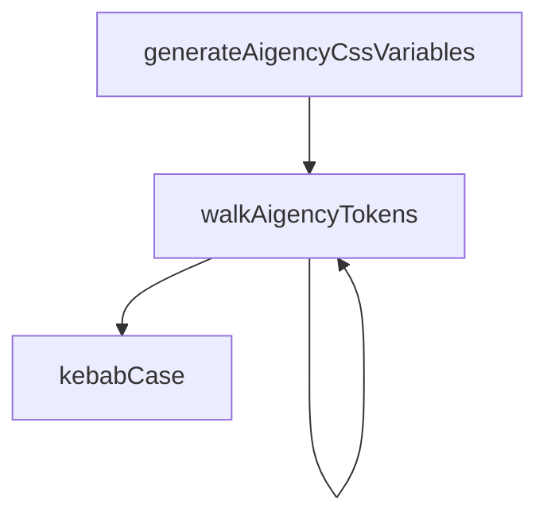

# Design Tokens

# Design Tokens Module (`packages/design-tokens/src/index.ts`)

## Overview
The **Design Tokens** module centralises visual design specifications for both the SynapTree and Aigency product lines. Tokens are stored in JSON files that follow the W3C Design Tokens Community Group (DTCG) format. The module exposes:

* Raw token objects (`aigencyTokens`, `tokens`) for direct consumption.
* Type‑safe accessor functions for common design properties (agent colour, node shape, opacity based on age).
* Utilities to generate CSS custom properties from the Aigency token hierarchy.
* A generic value lookup helper (`aigencyValue`) for arbitrary token paths.

All exports are pure JavaScript/TypeScript; there are no side‑effects at import time.

---

## Exported Token Objects

| Export | Description |
|--------|-------------|
| `aigencyTokens` | The full Aigency token set loaded from `aigency-design-tokens.json`. |
| `tokens` | The SynapTree token set loaded from `synapttree-design-tokens.json`. |
| `default` | Alias for `tokens` (default export). |

These objects conform to the DTCG schema (`{ $value: …, $type?: …, ... }`). They are intended for read‑only use; mutating them will break the type‑safe helpers.

---

## Type‑Safe Accessors (SynapTree)

### `agentColor(callsign: string): string`
Returns the colour value for a given agent callsign.

* **Input** – `callsign`: any string (e.g., `"Alpha_One"`). The function normalises the string to lower‑case and removes underscores before looking up the token.
* **Lookup** – `tokens.atoms.color.agent[<normalisedKey>].$value`
* **Fallback** – `"#FFFFFF"` if the key is missing.

```ts
const color = agentColor("Alpha_One"); // → "#1E90FF"
```

### `nodeShape(nodeType: string): string`
Returns the geometry identifier for a node type.

* **Input** – `nodeType`: any string (e.g., `"router"`).
* **Lookup** – `tokens.atoms.shape[<lowercaseKey>].$value`
* **Fallback** – `"SphereGeometry"`.

```ts
const shape = nodeShape("router"); // → "BoxGeometry"
```

### `opacityForAge(ageHours: number): number`
Maps an entity’s age (in hours) to an opacity token.

| Age range (hours) | Token path |
|-------------------|------------|
| `< 24`            | `tokens.atoms.opacity.fresh.$value` |
| `24‑71`           | `tokens.atoms.opacity["semi-fresh"].$value` |
| `72‑167`          | `tokens.atoms.opacity.aging.$value` |
| `168‑719`         | `tokens.atoms.opacity.stale.$value` |
| `720‑2159`        | `tokens.atoms.opacity.archived.$value` |
| `≥ 2160`          | `tokens.atoms.opacity.deprecated.$value` |

The function returns the numeric `$value` from the appropriate token, defaulting to the *deprecated* token for out‑of‑range values.

```ts
const opacity = opacityForAge(48); // → 0.8 (example)
```

---

## Aigency Helpers

### `kebabCase(str: string): string`
Converts a camel‑cased identifier to kebab‑case (e.g., `"primaryColor"` → `"primary-color"`). Used internally when building CSS variable names.

### `walkAigencyTokens(prefix: string, node: unknown, out: Record<string, string>): void`
Recursively traverses the Aigency token tree, flattening leaf `$value` entries into CSS custom property names.

* **Parameters**
  * `prefix` – Current CSS variable prefix (e.g., `"--aig-color-primary"`).
  * `node` – Current subtree of the token JSON.
  * `out` – Accumulator map where `key → value` pairs are stored.

* **Behaviour**
  * Stops recursion on non‑object nodes.
  * When a leaf with a scalar `$value` is found, stores `out[prefix] = value`.
  * For each child key that does **not** start with `$`, builds a new prefix using `kebabCase` and recurses.

### `generateAigencyCssVariables(): string`
Creates a CSS `:root` block containing all Aigency design tokens as custom properties.

1. Initialise an empty map (`vars`).
2. Call `walkAigencyTokens("", aigencyTokens.atoms, vars)`.
3. Convert the map to a list of `key: value;` lines.
4. Return a string:

```css
:root {
  --aig-color-primary: #0055AA;
  --aig-spacing-large: 24px;
  /* … */
}
```

**Execution flow** (as per call graph):
```
generateAigencyCssVariables → walkAigencyTokens → walkAigencyTokens (recursive) → kebabCase
```

### `aigencyValue(path: string): string | undefined`
Retrieves a token value by dot‑separated path (e.g., `"color.primary"`).

* Splits `path` into parts, walks `aigencyTokens.atoms` accordingly, and returns the leaf `$value` as a string if found.
* Returns `undefined` when the path does not resolve to a `$value`.

```ts
const primary = aigencyValue("color.primary"); // → "#0055AA"
```

---

## Integration Points

* **SynapTree UI components** – Use `agentColor`, `nodeShape`, and `opacityForAge` to style 3‑D nodes and agents consistently with the token set.
* **Aigency web applications** – Call `generateAigencyCssVariables()` at build time (or inject the result into a `<style>` tag) to expose design tokens as CSS variables for theming.
* **Design token consumers** – Import `aigencyTokens` or `tokens` directly when a component needs the raw token structure (e.g., for a design‑system documentation site).

---

## Example Usage

```ts
import designTokens, {
  agentColor,
  nodeShape,
  opacityForAge,
  generateAigencyCssVariables,
  aigencyValue,
} from "@aigency/design-tokens";

// 1. Apply CSS variables globally (e.g., in a React app entry point)
const style = document.createElement("style");
style.textContent = generateAigencyCssVariables();
document.head.appendChild(style);

// 2. Use accessor helpers in a Three.js scene
function createAgentMesh(callsign: string) {
  const material = new THREE.MeshStandardMaterial({
    color: agentColor(callsign),
    opacity: opacityForAge(36), // 36 h old agent
    transparent: true,
  });
  const geometry = new THREE[nodeShape("agent")](); // resolves to BoxGeometry, etc.
  return new THREE.Mesh(geometry, material);
}

// 3. Retrieve a token value for a custom calculation
const spacing = aigencyValue("spacing.large"); // "24px"
```

---

## Internal Architecture (Mermaid)



*The diagram shows the top‑level flow: `generateAigencyCssVariables` initiates a recursive walk of the token tree, which repeatedly calls `walkAigencyTokens`. The walk uses `kebabCase` to build CSS variable names.*

---

## Extending the Module

1. **Add new token categories** – Extend the JSON files (`*.json`) with additional `$value` leaves. No code changes are required; the recursive walker will automatically surface them as CSS variables.
2. **Expose a new accessor** – Follow the pattern of `agentColor`:
   * Normalise the input key.
   * Cast the token path to `keyof typeof tokens.<category>`.
   * Return the `$value` with a sensible fallback.
3. **Custom CSS variable prefix** – Modify `walkAigencyTokens` to accept a custom root prefix (e.g., `"--my-prefix"`). Ensure the new prefix is propagated through the recursive calls.

---

## Testing & Validation

* **Unit tests** should cover:
  * Normalisation logic in `agentColor` and `nodeShape`.
  * Boundary conditions in `opacityForAge`.
  * Correct flattening of nested token structures in `generateAigencyCssVariables`.
  * Path resolution in `aigencyValue` (including undefined cases).

* **Runtime validation** – The generated CSS string can be parsed with a CSS parser to ensure all variable names are syntactically valid.

---

## Dependencies

* **Node.js** – Uses native ES‑module JSON import (`assert { type: "json" }`).
* **No external libraries** – All helpers are pure TypeScript/JavaScript.

---