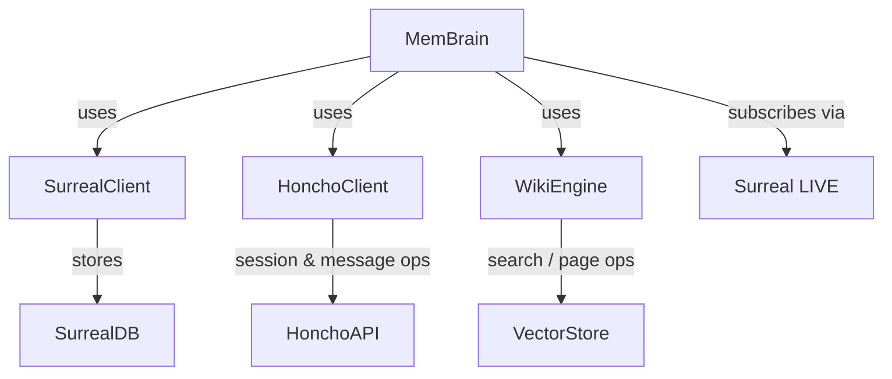

# MemBrain

# MemBrain Module Documentation

## Overview
`MemBrain` is the unified memory interface for Aigency agents. It abstracts three underlying services:

| Service | Purpose | Client |
|---------|---------|--------|
| **SurrealDB** | Graph‑based persistent store for directives, patterns, agent memories, peers, and timeline events. | `SurrealClient` (static) |
| **Honcho** | Peer identity & session management (start sessions, add messages, cross‑session reasoning). | `HonchoClient` |
| **WikiEngine** | Knowledge base with vector search, page crystallization, linting, and statistics. | `WikiEngine` |

The module implements the **Aigency Core Mem_Brain v1** contract, GBrain patterns, and OB1‑style governance.

---

## Configuration

```ts
export interface MemBrainConfig {
  surreal: {
    url: string;
    namespace: string;
    database: string;
    username: string;
    password: string;
  };
  honcho: {
    apiKey: string;
    workspaceId: string;
    baseUrl?: string;
  };
  wiki?: Partial<WikiEngineConfig>;
}
```

* `surreal` – connection parameters for SurrealDB.
* `honcho` – credentials for the Honcho service.
* `wiki` – optional overrides for `WikiEngine` (e.g., embedding dimension, decay rate).

---

## Class: `MemBrain`

```ts
export class MemBrain {
  private honcho: HonchoClient;
  public wiki: WikiEngine;

  constructor(config: MemBrainConfig);
  async connect(): Promise<void>;
  // …methods listed below…
}
```

### Construction & Connection
1. **Constructor** – Instantiates `HonchoClient` and `WikiEngine` with the supplied config.
2. **connect()** – Calls `SurrealClient.connect` to establish the DB connection. Must be awaited before any DB operation.

---

## Core Functional Areas

### 1. Directive Operations
Directives represent high‑level tasks for agents.

| Method | Signature | Description |
|--------|-----------|-------------|
| `getActiveDirectives` | `(): Promise<DirectiveRecord[]>` | Returns all directives with `status = 'active'`, ordered by priority. |
| `createDirective` | `(data: Omit<DirectiveRecord, "id" | "created_at">): Promise<DirectiveRecord>` | Inserts a new directive, timestamps `created_at`, and logs a `directive_created` event. |
| `completeDirective` | `(id: string, agent: AgentCallsign): Promise<void>` | Marks a directive as `completed`, sets `completed_at`, and logs `directive_completed`. |
| `supersedeDirective` | `(oldId: string, newId: string, reason: string, agent: AgentCallsign): Promise<void>` | Sets the old directive to `superseded`, creates a `supersedes` edge, and logs the supersession. |

**Internal flow:** All three mutating methods invoke `logEvent` to record the action in the timeline.

---

### 2. Pattern Operations
Patterns capture recurring embeddings (e.g., sensor signatures).

| Method | Signature | Description |
|--------|-----------|-------------|
| `searchPatterns` | `(embedding: number[], limit?: number): Promise<PatternRecord[]>` | Cosine similarity search (`> 0.75`) ordered by score. |
| `recordPattern` | `(data: Omit<PatternRecord, ...>): Promise<PatternRecord>` | Creates a new pattern with `occurrence_count = 1` and timestamps. |
| `incrementPatternOccurrence` | `(id: string): Promise<void>` | Atomically increments `occurrence_count` and updates `last_seen`. |

---

### 3. Peer Operations (Honcho Sync Layer)
Peers are external agents or services identified by a handle.

| Method | Signature | Description |
|--------|-----------|-------------|
| `getPeer` | `(handle: string): Promise<PeerRecord \| null>` | Retrieves a peer record by handle. |
| `upsertPeer` | `(data: Omit<PeerRecord, ...>): Promise<PeerRecord>` | Inserts a new peer or merges updates (interaction count, timestamps). Calls `getPeer` internally. |

---

### 4. Agent Memory Governance (OB1‑style)

| Method | Signature | Description |
|--------|-----------|-------------|
| `createAgentMemory` | `(data: Omit<AgentMemoryRecord, ...>): Promise<AgentMemoryRecord>` | Persists a memory entry, timestamps, and logs `memory_created`. |
| `searchAgentMemory` | `(agent: AgentCallsign, embedding: number[], limit?: number): Promise<(AgentMemoryRecord & { similarity: number })[]>` | Vector search limited to the given agent, active lifecycle, and `can_use_as_evidence = true`. Also creates a `agent_memory_recall_trace` record. |
| `relateMemories` | `(fromId: string, toId: string, relationType: AgentMemoryRelationRecord["relation_type"], context?: string): Promise<AgentMemoryRelationRecord>` | Creates a directed edge (`agent_memory_relation`). |
| `reviewMemory` | `(id: string, reviewStatus: AgentMemoryRecord["review_status"], canUseAsInstruction: boolean): Promise<void>` | Updates review status, instruction flag, and `updated_at`. |

---

### 5. Timeline & Events
All significant actions are stored in the `timeline` table.

| Method | Signature | Description |
|--------|-----------|-------------|
| `logEvent` | `(eventType: TimelineRecord["event_type"], agent: AgentCallsign, summary: string, metadata?: Record<string, unknown>): Promise<void>` | Generic event logger used throughout the module. |
| `getTimelineForAgent` | `(agent: AgentCallsign, limit?: number): Promise<TimelineRecord[]>` | Retrieves recent events for a specific agent, ordered newest first. |

---

### 6. LIVE Subscriptions
Real‑time feeds for UI or other services.

| Method | Signature | Description |
|--------|-----------|-------------|
| `subscribeToDirectives` | `(cb: (action, directive) => void) => Unsubscribe` | Subscribes to CREATE/UPDATE/DELETE on `directive` where `status = 'active'`. |
| `subscribeToTimeline` | `(cb: (action, event) => void) => Unsubscribe` | Subscribes to all timeline changes. |
| `subscribeToAgentStatus` | `(cb: (action, agent) => void) => Unsubscribe` | Subscribes to generic `agent` table changes. |

All three delegate to `LIVE.subscribe` from `@aigency/surreal`.

---

### 7. Honcho Session Management
Facilitates cross‑session reasoning and message handling.

| Method | Signature | Description |
|--------|-----------|-------------|
| `startAgentSession` | `(callsign: AgentCallsign, metadata?: Record<string, unknown>) => Promise<Session>` | Calls `HonchoClient.startSession`, logs `session_start`. |
| `addAgentMessage` | `(callsign: AgentCallsign, sessionId: string, content: string, isUser?: boolean) => Promise<Message>` | Delegates to `HonchoClient.addMessage`. |
| `oracleDream` | `(query: string) => Promise<string>` | Calls `HonchoClient.dream` with the special `"ORACLE"` agent for async cross‑session reasoning. |

---

### 8. Wiki Integration
Provides knowledge‑base search, page creation, linting, and statistics.

| Method | Signature | Description |
|--------|-----------|-------------|
| `searchWiki` | `(queryText: string, queryEmbedding: number[], limit?: number) => Promise<WikiPageRecord[]>` | Calls `WikiEngine.search` and returns the underlying pages. |
| `crystallizeSession` | `(slug: string, digest: {question:string; findings:string; filesInvolved:string[]; lessons:string[]}) => Promise<WikiPageRecord \| null>` | Persists a session summary as a wiki page via `WikiEngine.crystallize`. |
| `lintWiki` | `() => Promise<void>` | Runs `WikiEngine.lint` (checks link integrity, dead pages, etc.). |
| `getWikiStats` | `() => Promise<WikiStats>` | Returns statistics from `WikiEngine.stats`. |

**External flow example:** `searchWiki` → `WikiEngine.search` → `WikiEngine.applyBacklinkBoost` → `WikiEngine.getLinks` → `WikiEngine.getPage`.

---

## Interaction Diagram



*The diagram shows the three primary external services (`SurrealClient`, `HonchoClient`, `WikiEngine`) and the live subscription mechanism.*

---

## Typical Usage Pattern

```ts
import { MemBrain } from "./mem-brain";

const config = {
  surreal: { url: "...", namespace: "aig", database: "mem", username: "root", password: "pwd" },
  honcho: { apiKey: "hk_...", workspaceId: "ws_123" },
  wiki: { confidenceDecayRate: 0.05 },
};

const brain = new MemBrain(config);
await brain.connect();

// Create a directive
await brain.createDirective({
  title: "Investigate anomaly",
  owner: "agent-007",
  status: "active",
  priority: 1,
  description: "Check sensor logs for spikes."
});

// Search knowledge base
const pages = await brain.searchWiki("quantum tunneling", embeddingVector);
console.log(pages.map(p => p.title));

// Start a session and add a message
const session = await brain.startAgentSession("agent-007");
await brain.addAgentMessage("agent-007", session.id, "Initial report", true);
```

---

## Extending the Module

* **Adding a new entity type** – Define the Surreal table schema, add a method that follows the existing pattern (create → logEvent → return typed record).
* **Custom live feeds** – Use `LIVE.subscribe<T>("table_name", callback, optionalFilter)`; follow the signature of existing subscription methods.
* **New Wiki capabilities** – Extend `WikiEngine` (e.g., add a `summarize` method) and expose a thin wrapper in `MemBrain` that forwards arguments and returns the appropriate record type.

---

## Error Handling & Concurrency

* All DB calls are awaited; SurrealDB returns promises that resolve when the operation completes.
* `logEvent` is fire‑and‑forget; failures will propagate as rejected promises, so callers should `await` if ordering matters.
* `HonchoClient` methods may throw network errors; callers should wrap them in try/catch or use higher‑level retry logic.

---

## Testing Hooks

* The constructor accepts a partial `wiki` config, allowing injection of a mock `WikiEngine` for unit tests.
* `SurrealClient` is static; tests can replace `SurrealClient.db` with a mock that implements `query`, `create`, `merge`, etc.
* `HonchoClient` can be stubbed by providing a custom client that matches the interface used in the class.

---

## Related Modules

| Module | Interaction |
|--------|-------------|
| `src/mcp-server.ts` | Dispatches incoming requests to `MemBrain` methods (e.g., `searchAgentMemory`, `oracleDream`). |
| `src/automation-jobs.ts` | Periodic jobs that call `logEvent`, `searchPatterns`, etc. |
| `src/wiki-engine.ts` | Implements the knowledge‑base logic; referenced by all wiki‑related methods. |
| `src/live.ts` (Surreal) | Provides the `LIVE.subscribe` API used for real‑time feeds. |
| `honcho/src/client.ts` | Underlying HTTP client for session and message operations. |

---