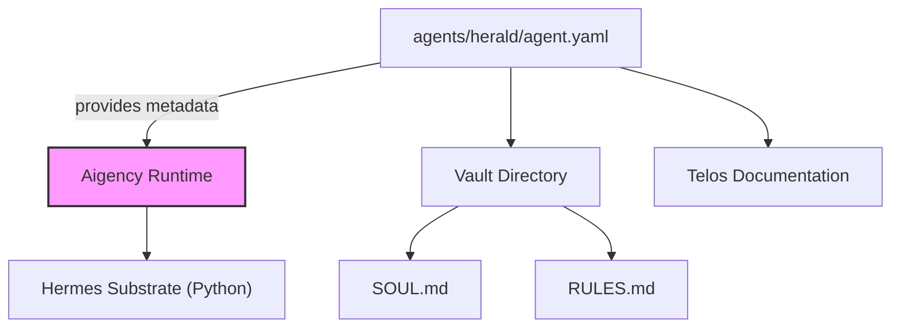

# Other — agents-herald

# agents‑herald Module

## Overview
The **agents‑herald** package defines the *HERALD* agent – a communications specialist named **Dax Okafor**.
It is a declarative description of the agent’s identity, role, visual branding, and the underlying substrate that powers its behavior. The module does not contain executable code; instead, it supplies metadata consumed by the Aigency framework to instantiate and manage the agent.

## Core Files

| File | Purpose |
|------|---------|
| `agents/herald/agent.yaml` | YAML manifest describing the agent’s attributes, substrate, and links to supporting documentation. |
| `agents/herald/package.json` | NPM package descriptor (used for dependency management and publishing). |

### `agent.yaml` – Manifest Details

```yaml
callsign: HERALD
name: "Dax Okafor"
role: "Communications"
color: "#FFFFFF"
substrate: "Hermes"
substrate_lang: "Python"
substrate_why: "Only claw-family substrate with a built-in learning loop (Nous Research) — comms improves with every dispatch"
substrate_repo: "https://github.com/NousResearch/Hermes"
vault: "../../aigency-vault/agents/herald"
soul: "../../aigency-vault/agents/herald/SOUL.md"
rules: "../../aigency-vault/agents/herald/RULES.md"
telos: "../../apps/telos/agents/herald.md"
```

| Key | Meaning |
|-----|---------|
| **callsign** | Short identifier used by the framework to reference the agent. |
| **name** | Human‑readable name displayed in UI and logs. |
| **role** | Functional domain; here, “Communications”. |
| **color** | Hex color for UI theming (white). |
| **substrate** | Execution engine – the *Hermes* Python library that provides a learning loop. |
| **substrate_lang** | Language of the substrate implementation (`Python`). |
| **substrate_why** | Rationale for choosing Hermes: it is the only “claw‑family” substrate with a built‑in learning loop, enabling the agent to improve with each dispatch. |
| **substrate_repo** | Source repository for the Hermes substrate. |
| **vault** | Relative path to the agent’s vault directory containing assets, prompts, and auxiliary files. |
| **soul** | Path to the `SOUL.md` file that captures the agent’s core philosophy and high‑level behavior description. |
| **rules** | Path to the `RULES.md` file that enumerates operational constraints and guardrails. |
| **telos** | Path to the Telos documentation (`herald.md`) that outlines the agent’s mission objectives within the larger application. |

### `package.json` – NPM Descriptor

```json
{
  "name": "@aigency/agent-herald",
  "version": "0.1.0",
  "private": true,
  "description": "Dax Okafor — Communications"
}
```

* The package is **private**, meaning it is intended for internal use within the Aigency monorepo.
* Versioning follows semantic versioning; bump the patch number for non‑breaking updates to the manifest.

## Integration Points

The agent manifest is consumed by the **Aigency runtime** during startup:

1. **Discovery** – The runtime scans the `agents/` directory for `agent.yaml` files.
2. **Registration** – The `callsign` (`HERALD`) becomes a key in the global agent registry.
3. **Substrate Loading** – The runtime clones or pulls the `substrate_repo` (`Hermes`) and loads the Python environment specified by `substrate_lang`.
4. **Vault Attachment** – Files under the `vault` path are mounted as read‑only resources for the agent (e.g., prompts, templates).
5. **Policy Enforcement** – The `rules` and `soul` markdown files are parsed to generate runtime guardrails (e.g., content filters, ethical constraints).

No direct code imports or function calls exist within this module; all interactions are mediated by the framework’s loader.

## Extending the Agent

When adding new capabilities or updating the agent’s description:

1. **Update `agent.yaml`** – Add or modify fields such as `role`, `color`, or additional metadata (e.g., `tags`). Keep the YAML schema consistent with other agents.
2. **Version bump** – Increment the `version` field in `package.json` according to semantic‑versioning rules.
3. **Add assets** – Place new prompt files, data samples, or configuration snippets under the `vault` directory. Reference them from `SOUL.md` or `RULES.md` as needed.
4. **Document changes** – Amend `SOUL.md`, `RULES.md`, and `telos` documentation to reflect new behavior or constraints.

## Deployment Considerations

* **Private Package** – Since the package is marked `private`, it is not published to a public NPM registry. Deployment scripts should reference it via a relative path or a monorepo workspace.
* **Substrate Dependency** – The Hermes repository must be accessible (public GitHub) and compatible with the host Python runtime. Ensure the appropriate Python version and dependencies are installed in the deployment environment.
* **Vault Path Resolution** – The relative `vault` path assumes the module resides under `agents/herald`. Changing the directory structure requires updating all relative references (`vault`, `soul`, `rules`, `telos`).

## Architecture Diagram



*The diagram shows how the manifest feeds the runtime, which in turn loads the Hermes substrate and attaches the vault resources.*

## Summary

The **agents‑herald** module is a metadata‑only package that defines the communications agent *Dax Okafor*. It supplies all necessary identifiers, visual branding, substrate information, and links to supporting documentation. The Aigency framework reads this manifest to register the agent, load its Python‑based Hermes substrate, and enforce the policies described in the vault files. No executable code resides in the module itself, making it straightforward to maintain and extend through YAML and markdown updates.