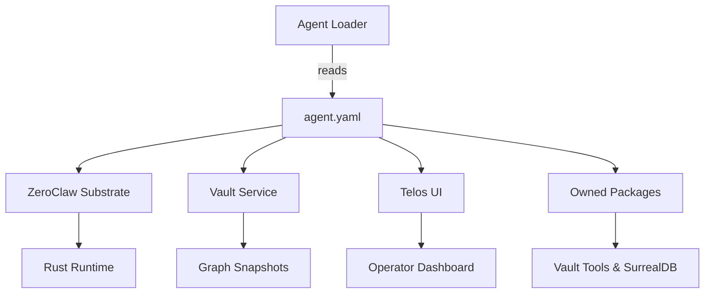

# Other — agents-librarian

# agents‑librarian Module Documentation

## Overview
The **agents‑librarian** module defines the *Ren Nakamura* agent, a Knowledge Graph Curator within the Aigency ecosystem. It supplies declarative metadata used by the runtime to instantiate the agent, locate its resources, and expose its capabilities to other components (e.g., the `telos` application).

## Core Metadata (`agents/librarian/agent.yaml`)

| Field | Value | Description |
|-------|-------|-------------|
| `callsign` | `LIBRARIAN` | Short identifier used in logs and inter‑agent messaging. |
| `name` | `Ren Nakamura` | Human‑readable name of the agent. |
| `role` | `Knowledge Graph Curator` | Primary responsibility; curates and maintains the knowledge graph. |
| `color` | `#FF6D00` | UI accent color for dashboards and visualizations. |
| `substrate` | `ZeroClaw` | Underlying execution platform. |
| `substrate_lang` | `Rust` | Language of the substrate implementation. |
| `substrate_why` | `Zero-overhead trait-driven components + VCS-native architecture — fractures cleanly for Crystal Graft snapshots` | Rationale for choosing ZeroClaw; highlights performance and version‑control friendliness. |
| `substrate_repo` | <https://github.com/zeroclaw/zeroclaw> | Source repository for the substrate. |
| `vault` | `../../aigency-vault/agents/librarian` | Relative path to the agent’s vault containing persistent data, configuration, and assets. |
| `soul` | `../../aigency-vault/agents/librarian/SOUL.md` | Path to the *SOUL* document that captures the agent’s philosophy, constraints, and ethical guidelines. |
| `rules` | `../../aigency-vault/agents/librarian/RULES.md` | Path to the *RULES* document that enumerates operational policies and validation rules. |
| `owns` | `["packages/vault-tools", "packages/surreal"]` | List of internal packages that the agent owns and can import directly. |
| `telos` | `../../apps/telos/agents/librarian.md` | Link to the agent’s entry in the `telos` application documentation. |

## Package Definition (`agents/librarian/package.json`)

```json
{
  "name": "@aigency/agent-librarian",
  "version": "0.1.0",
  "private": true,
  "description": "Ren Nakamura — Knowledge Graph Curator"
}
```

* The package is **private**; it is not published to npm registries.
* Versioning follows semantic versioning, currently at `0.1.0`.
* The description mirrors the agent’s role for quick identification in tooling.

## Owned Packages

The agent declares ownership of two internal packages:

| Package | Purpose |
|---------|---------|
| `packages/vault-tools` | Utilities for interacting with the vault (e.g., encryption, versioning, snapshot handling). |
| `packages/surreal` | Integration layer for the SurrealDB graph database used by the Knowledge Graph. |

These packages are bundled with the agent and can be imported using standard Node.js resolution (`require('@aigency/agent-librarian/packages/vault-tools')`, etc.).

## Resource Layout

```
agents/
└─ librarian/
   ├─ agent.yaml          ← Core metadata
   ├─ package.json        ← NPM package definition
   ├─ vault/              ← Persistent data (managed by the vault system)
   │   ├─ SOUL.md         ← Ethical and philosophical guide
   │   └─ RULES.md        ← Operational policies
   └─ telos/
       └─ librarian.md    ← Documentation for the Telos UI
```

## Integration Points

| Target | Connection | Notes |
|--------|------------|-------|
| **Vault System** | `vault` path points to a directory managed by the Aigency vault service. | The vault provides version‑controlled storage for the agent’s knowledge graph snapshots. |
| **Telos UI** | `telos` markdown file is consumed by the `telos` application to render an agent‑specific view. | Allows operators to inspect the librarian’s state, run diagnostics, and trigger graph updates. |
| **Substrate** | `substrate` and `substrate_repo` inform the runtime which execution engine to spin up. | The ZeroClaw Rust substrate is compiled separately; the agent’s YAML is the only glue needed for discovery. |
| **Owned Packages** | Imported by the agent’s runtime code (not present in this repo). | Guarantees that the agent has direct access to `vault-tools` and `surreal` without external dependency resolution. |

## Runtime Instantiation Flow (Conceptual)



*The diagram illustrates how the loader consumes `agent.yaml`, which in turn wires the agent to its substrate, vault, UI, and owned packages.*

## Development Guidelines

1. **Metadata Updates**
   - Modify `agent.yaml` for any change to the agent’s identity, role, or owned packages.
   - Keep `SOUL.md` and `RULES.md` in sync with policy changes; they are referenced by compliance tooling.

2. **Adding New Owned Packages**
   - Add the package directory under `agents/librarian/packages/`.
   - Update the `owns` array in `agent.yaml` with the relative path.
   - Increment the module version in `package.json` following semantic versioning.

3. **Testing**
   - Since the module contains no executable code, tests focus on schema validation of `agent.yaml`.
   - Use a JSON/YAML schema validator to ensure required fields are present and correctly typed.

4. **Building the Substrate**
   - The ZeroClaw repository is external; clone it, build the Rust crate, and ensure the resulting binary is reachable via the runtime’s plugin loader.
   - No build steps are required within this module itself.

5. **Version Control**
   - The module is part of the monorepo; commit changes alongside updates to the vault or telos documentation to maintain atomicity.

## Release Process

| Step | Action |
|------|--------|
| 1 | Update `agent.yaml` and `package.json` as needed. |
| 2 | Run schema validation (`npm run lint:yaml` if a lint script exists). |
| 3 | Commit changes with a clear message (e.g., `feat(librarian): add vault‑tools ownership`). |
| 4 | Tag a new version (`git tag v0.2.0 && git push --tags`). |
| 5 | Deploy the updated vault and telos assets via the CI pipeline. |

## FAQ

**Q: Why is the package marked `private`?**
A: The agent is intended to run only within the Aigency ecosystem; publishing it publicly would expose internal implementation details and could cause version conflicts.

**Q: Where is the actual Rust code for the agent?**
A: It lives in the ZeroClaw repository (`substrate_repo`). The YAML file only declares which substrate to load.

**Q: How do I view the agent’s current knowledge graph?**
A: Access the vault through the `telos` UI (`telos/agents/librarian.md`) or query SurrealDB directly using the `surreal` package.

---