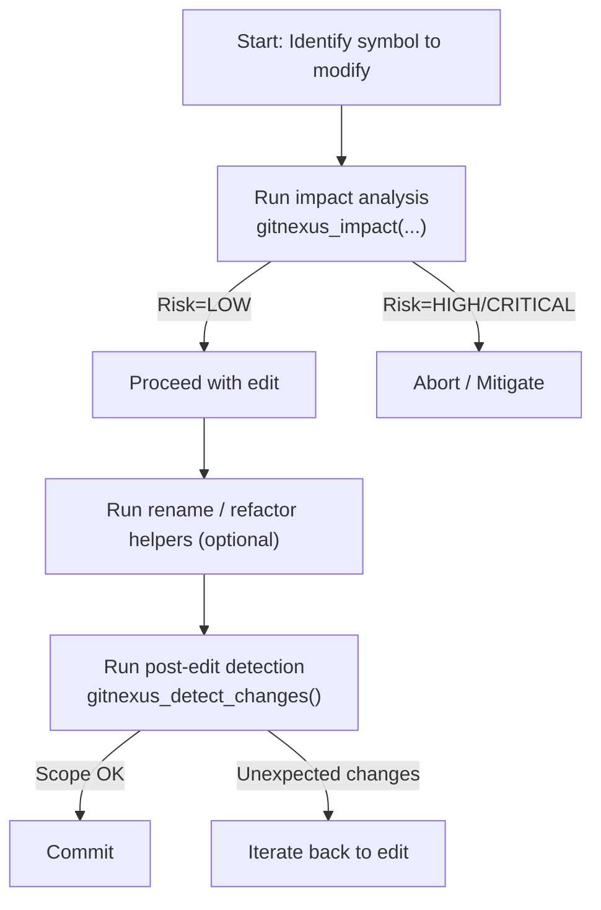

# Other — AGENTS.md

# Other — AGENTS.md

## Overview
`AGENTS.md` is the canonical “operational handbook” for the **GitNexus** code‑intelligence platform within the *aigency‑monorepo*.
It does not contain executable code, but it defines the **process** developers must follow when they:

* query the code graph,
* assess impact before editing,
* perform safe refactors, and
* verify changes before committing.

All tooling referenced in this file is part of the GitNexus CLI / SDK and is expected to be available in the repository’s development environment.

---

## Core Principles

| Principle | Enforcement |
|-----------|--------------|
| **Run impact analysis before any edit** | `gitnexus_impact({target: "symbolName", direction: "upstream"})` |
| **Validate change scope before commit** | `gitnexus_detect_changes()` |
| **Never ignore HIGH / CRITICAL risk** | The impact call returns a `risk` field; abort or mitigate if `risk >= "HIGH"` |
| **Prefer graph‑aware operations over text‑search** | Use `gitnexus_rename`, `gitnexus_query`, `gitnexus_context`, `gitnexus_cypher` |

---

## Typical Development Workflow



*Only the *LOW* path is allowed to continue without additional mitigation.*

---

## Tool Quick Reference

| Tool | Purpose | Example Invocation |
|------|---------|--------------------|
| `gitnexus_query` | Find code by concept (full‑text + graph) | `gitnexus_query({query: "auth validation"})` |
| `gitnexus_context` | 360° view of a symbol (callers, callees, processes) | `gitnexus_context({name: "validateUser"})` |
| `gitnexus_impact` | Compute blast radius (upstream/downstream) | `gitnexus_impact({target: "X", direction: "upstream"})` |
| `gitnexus_detect_changes` | Verify that only expected symbols / files changed | `gitnexus_detect_changes({scope: "staged"})` |
| `gitnexus_rename` | Safe multi‑file rename (graph‑aware) | `gitnexus_rename({symbol_name: "old", new_name: "new", dry_run: true})` |
| `gitnexus_cypher` | Run custom Cypher queries against the graph | `gitnexus_cypher({query: "MATCH (n) WHERE n.name='Foo' RETURN n"})` |

All commands return a JSON payload with `status`, `risk`, `affectedSymbols`, and `affectedProcesses`. Scripts should inspect these fields before proceeding.

---

## Impact Analysis Details

### Call Pattern
```js
gitnexus_impact({
  target: "symbolName",   // function, class, or method identifier
  direction: "upstream"  // "upstream" = callers, "downstream" = callees
})
```

* **`risk`** – one of `LOW`, `MEDIUM`, `HIGH`, `CRITICAL`.
* **`blastRadius`** – array of direct callers (`depth = 1`), indirect callers (`depth = 2`), etc.
* **`processes`** – execution flows that include the target.

### Risk‑Based Actions
| Risk | Action |
|------|--------|
| `LOW` | Proceed, but still run `gitnexus_detect_changes` after edit. |
| `MEDIUM` | Review affected callers; add unit / integration tests for them. |
| `HIGH` / `CRITICAL` | Abort edit until mitigation (e.g., add abstraction layer, deprecate, or coordinate with owners). |

---

## Refactoring Workflow

1. **Rename**
   ```js
   gitnexus_rename({
     symbol_name: "oldName",
     new_name: "newName",
     dry_run: true   // preview only
   })
   ```
   *Review the preview (graph edits are auto‑applied; text edits require manual confirmation). Then re‑run with `dry_run: false`.*

2. **Extract / Split**
   ```js
   // Discover all inbound/outbound references
   const ctx = gitnexus_context({name: "targetFunction"});
   // Compute upstream impact to see who will be affected
   const impact = gitnexus_impact({target: "targetFunction", direction: "upstream"});
   ```
   *Move the code only after confirming that all external callers are either unchanged or will be updated.*

3. **Post‑refactor validation**
   ```js
   gitnexus_detect_changes({scope: "all"});
   ```
   *The command must report only the files you intended to modify.*

---

## Debugging Workflow

| Step | Command | Goal |
|------|---------|------|
| 1 | `gitnexus_query({query: "<error or symptom>"})` | Locate execution flows that touch the failing area. |
| 2 | `gitnexus_context({name: "<suspect function>"})` | Enumerate callers, callees, and participating processes. |
| 3 | `READ gitnexus://repo/aigency-monorepo/process/{processName}` | Walk the full execution trace step‑by‑step. |
| 4 (regression) | `gitnexus_detect_changes({scope: "compare", base_ref: "main"})` | Verify that the current branch only changed intended symbols. |

---

## Index Maintenance

The GitNexus index becomes stale after any commit. Keep it fresh with:

```bash
npx gitnexus analyze            # basic re‑index
npx gitnexus analyze --embeddings   # preserve existing embeddings
```

*Check `.gitnexus/meta.json` → `stats.embeddings` to confirm whether embeddings exist before running a non‑embedding analysis.*

A **PostToolUse** hook (provided for Claude Code users) automatically triggers the appropriate `analyze` command after `git commit` and `git merge`.

---

## Integration Points

| Component | Interaction |
|-----------|-------------|
| **CLI** (`gitnexus` binary) | All commands above are thin wrappers around the underlying graph database. |
| **SDK** (`gitnexus_*` functions) | Used by scripts, CI pipelines, and IDE extensions to enforce policies programmatically. |
| **Repository URLs** (`gitnexus://repo/...`) | Virtual file system exposing graph resources; readable via `READ` in the CLI or any HTTP‑compatible client. |
| **Claude Skills** (`.claude/skills/gitnexus/...`) | Pre‑written skill files that map the same workflows to natural‑language prompts for AI‑assisted developers. |

---

## Self‑Check Checklist (run before pushing)

1. **Impact** – `gitnexus_impact` executed for **every** modified symbol.
2. **Risk** – No `HIGH` or `CRITICAL` warnings ignored.
3. **Scope** – `gitnexus_detect_changes()` confirms only expected files changed.
4. **Depth = 1** – All direct dependents (`d=1`) have been updated or verified.

If any item fails, halt the PR and address the gap before proceeding.

---

## Frequently Asked Questions

| Question | Answer |
|----------|--------|
| *What if `gitnexus_impact` returns `risk: "HIGH"` but I must ship the change?* | Open a mitigation ticket, add explicit deprecation warnings, and coordinate with owners of the affected callers. Document the decision in the PR. |
| *Can I bypass `gitnexus_rename` and use a regular search‑replace?* | **Never**. `gitnexus_rename` updates the call graph; plain text replace will leave stale references and break the index. |
| *Do I need to run `gitnexus_detect_changes` after a pure documentation edit?* | No, but running it does no harm and guarantees the index stays in sync. |
| *How do I query for “all processes that touch the Auth module”?* | `gitnexus_cypher({query: "MATCH (p:Process)-[:USES]->(m:Module {name:'Auth'}) RETURN p"})` |

---