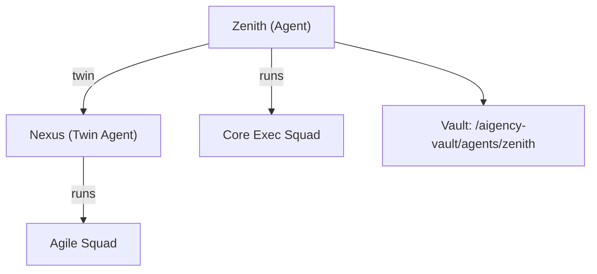

# Other — agents-zenith

# @aigency/agent-zenith – “Newton Hughes” (Chief of Staff & Orchestrator)

## Overview
`@aigency/agent-zenith` is a **data‑only** module that defines the *Zenith* agent – the Chief of Staff & Orchestrator for the Aigency ecosystem. The module supplies a YAML descriptor (`agent.yaml`) and a minimal `package.json` used by the monorepo tooling (e.g., Yarn workspaces, Lerna) to treat the agent as a first‑class package. No executable code lives in this package; instead, other runtime components import the YAML to instantiate the agent’s configuration.

## Core Files

| Path | Description |
|------|-------------|
| `agents/zenith/agent.yaml` | Human‑readable definition of the Zenith agent (callsign, role, visual styling, linked resources, and twin relationship). |
| `agents/zenith/package.json` | NPM package metadata required for workspace resolution and version tracking. |

### `agent.yaml` – Key Fields

| Field | Meaning | Example |
|-------|---------|---------|
| `callsign` | Short identifier used in logs and UI. | `ZENITH` |
| `name` | Full name of the agent. | `Newton Hughes` |
| `role` | Business function of the agent. | `Chief of Staff & Orchestrator` |
| `color` | Hex colour for UI theming. | `#00E5CC` |
| `substrate` | Underlying platform or framework. | `OpenClaw` |
| `vault` | Relative path to the agent’s vault (contains extended documentation, assets, etc.). | `../../aigency-vault/agents/zenith` |
| `soul` | Path to the agent’s “SOUL” markdown – the narrative description of its purpose and personality. | `../../aigency-vault/agents/zenith/SOUL.md` |
| `rules` | Path to the rule set governing the agent’s behaviour. | `../../aigency-vault/agents/zenith/RULES.md` |
| `twin` | Identifier of the paired agent. | `NEXUS` |
| `twin_note` | Human‑readable note describing the twin relationship. | `Identical twins. ZENITH runs the Core Exec Squad. NEXUS runs the Agile Squad.` |
| `telos` | Link to the external “telos” documentation (often a higher‑level design spec). | `../../apps/telos/agents/zenith.md` |

## Package Metadata (`package.json`)

```json
{
  "name": "@aigency/agent-zenith",
  "version": "0.1.0",
  "private": true,
  "description": "Newton Hughes — Chief of Staff & Orchestrator"
}
```

* **`private: true`** – The package is not intended for publishing to a public registry; it exists solely within the monorepo.
* **Versioning** – Incremented manually when the YAML descriptor or associated vault content changes. This version is used by tooling that tracks agent revisions (e.g., CI pipelines, change‑log generators).

## How It Is Consumed

1. **Workspace Resolution**
   The monorepo’s package manager (Yarn or npm workspaces) resolves `@aigency/agent-zenith` as a local package. This enables imports such as:

   ```ts
   import zenithDescriptor from '@aigency/agent-zenith/agent.yaml';
   ```

2. **Agent Factory**
   A central *AgentFactory* (outside this module) reads the YAML, validates required fields, and creates a runtime `Agent` instance. The factory typically performs:

   * YAML parsing → JavaScript object.
   * Path resolution for `vault`, `soul`, `rules`, and `telos` (converted to absolute paths based on repo root).
   * Registration of the twin relationship (`ZENITH` ↔ `NEXUS`) in the global agent registry.

3. **UI Rendering**
   UI components (e.g., dashboards, chat widgets) consume the `color` and `callsign` fields to style the agent’s avatar and to display its name/role.

4. **Rule Engine**
   The `rules` markdown is parsed by the rule engine to enforce behavior constraints. The engine expects a specific markdown schema (see `RULES.md` for details).

## Relationship Diagram



*The diagram illustrates the twin relationship and the squads each agent leads. The vault holds the extended documentation referenced by the YAML.*

## Extending / Maintaining the Module

| Action | Steps |
|--------|-------|
| **Add a new rule** | Edit `RULES.md` in the vault. Increment the package version if the rule set change is semantically significant. |
| **Update visual branding** | Change the `color` field in `agent.yaml`. UI components will pick up the new colour on the next reload. |
| **Rename the agent** | Update `name` and optionally `callsign`. Ensure any external references (e.g., logs, monitoring dashboards) are also updated. |
| **Introduce a new twin** | Add a new field `twin: <NEW_TWIN>` and update `twin_note` accordingly. The twin agent must have its own package with a matching descriptor. |
| **Version bump** | Run `npm version <type>` (e.g., `npm version patch`) from the module root. The monorepo’s CI will propagate the new version tag. |

## Integration Points

| Component | Interaction |
|-----------|-------------|
| **AgentFactory** (central) | Loads `agent.yaml`, resolves paths, registers the agent. |
| **RuleEngine** | Consumes `RULES.md` referenced by `rules`. |
| **UI Dashboard** | Reads `callsign`, `name`, `role`, and `color` for display. |
| **Vault** (`../../aigency-vault/agents/zenith`) | Stores long‑form documentation (`SOUL.md`, `RULES.md`, assets). |
| **Twin Agent (NEXUS)** | Coordinated via the global registry; both agents share the same `twin` identifier. |

## Testing & Validation

* **YAML Schema Validation** – The repository includes a lint step (`npm run lint:yaml`) that checks for required fields and correct data types.
* **Path Existence** – CI jobs verify that `vault`, `soul`, `rules`, and `telos` resolve to existing files. Missing files cause the build to fail.
* **Twin Consistency** – A custom script (`scripts/check-twins.js`) ensures that each twin pair references each other correctly.

## Frequently Asked Questions

**Q: Why is the package marked `private`?**
A: The agent definition is internal to the organization and should not be published to a public npm registry. Marking it private prevents accidental publishing.

**Q: Can I add executable code to this module?**
A: While technically possible, the design intent is to keep agents declarative. Executable logic belongs in the core runtime (e.g., the AgentFactory or dedicated service modules).

**Q: Where should I place new assets (icons, diagrams) for Zenith?**
A: Add them to the agent’s vault directory (`../../aigency-vault/agents/zenith`). Reference them from `SOUL.md` or other markdown files as needed.

---

*End of documentation for `@aigency/agent-zenith`.*