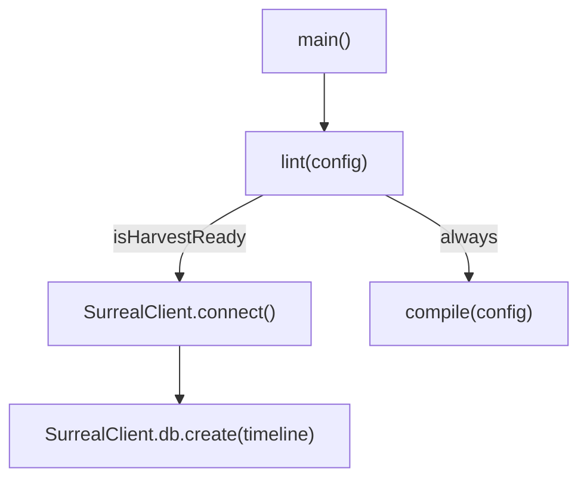

# Other — apps-librarian

# @aigency/librarian – Knowledge Graph Curator

## Overview
`@aigency/librarian` is a tiny scheduled service that inspects the **Aigency Vault**, runs a lint pass, and, when the vault meets “harvest‑ready” criteria, records a timeline event in **SurrealDB** before triggering a compilation step. The module is intended to be executed on a cron schedule (or via GitHub Actions) to keep the knowledge graph up‑to‑date.

## Repository Layout
```
apps/
└─ librarian/
   ├─ src/
   │  └─ index.ts          # entry point, orchestrates lint → DB → compile
   ├─ package.json         # npm metadata & scripts
   └─ tsconfig.json        # TypeScript configuration (extends @aigency/tsconfig)
```

## Scripts (npm)
| Script | Description |
|--------|-------------|
| `build` | Bundles `src/index.ts` with **tsup** (ESM output + d.ts) |
| `clean` | Removes the `dist` folder |
| `compile` | Runs `src/compile-run.ts` (used by CI) |
| `dev` | Starts the service with **tsx** watch mode |
| `lint` | Executes **Biome** linting on the source |
| `typecheck` | Runs `tsc --noEmit` for static type checking |
| `start` | Executes the compiled entry point (`dist/index.js`) |

## Runtime Configuration (environment variables)

| Variable | Default | Description |
|----------|---------|-------------|
| `VAULT_ROOT` | `process.cwd() + "/../../aigency-vault"` | Root directory of the vault to be inspected |
| `SURREAL_URL` | `ws://localhost:8000/rpc` | WebSocket endpoint for SurrealDB |
| `SURREAL_USER` | `root` | DB username |
| `SURREAL_PASS` | `root` | DB password |
| `NODE_ENV` | — | Not used directly but influences typical Node behavior |

All variables are read at runtime in `src/index.ts`. Missing values fall back to the defaults shown above.

## Core Execution Flow
1. **Load configuration** – `loadConfig(vaultRoot)` from `@aigency/vault-tools`.
2. **Lint the vault** – `lint(config)` returns a `result` object containing:
   - `isHarvestReady` (boolean)
   - `healthScore`, `wikiDensity`, `vaultAgeDays` (metrics used for DB payload)
3. **Conditional DB write** – If `result.isHarvestReady`:
   - Connect to SurrealDB via `SurrealClient.connect`.
   - Insert a `timeline` record with the lint metrics.
4. **Compile** – Regardless of harvest readiness, invoke `compile(config)` to generate the knowledge graph artifacts.

### Mermaid diagram


## Key Functions & Imports

| Import | Source | Role |
|--------|--------|------|
| `join` | `node:path` | Resolve `VAULT_ROOT` relative to the current working directory |
| `SurrealClient` | `@aigency/surreal` | DB client wrapper – provides `connect` and `db.create` |
| `compile` | `@aigency/vault-tools` | Runs the LLM‑driven compilation pipeline (see `compile.ts`) |
| `lint` | `@aigency/vault-tools` | Executes the vault linting logic (see `lint.ts`) |
| `loadConfig` | `@aigency/vault-tools` | Reads the vault configuration files and returns a typed config object |

### `main()`
```ts
async function main() {
  const vaultRoot = process.env.VAULT_ROOT ?? join(process.cwd(), "../../aigency-vault");
  const config = loadConfig(vaultRoot);
  const result = lint(config);

  if (result.isHarvestReady) {
    await SurrealClient.connect({
      url: process.env.SURREAL_URL ?? "ws://localhost:8000/rpc",
      namespace: "aigency",
      database: "mem_brain",
      username: process.env.SURREAL_USER ?? "root",
      password: process.env.SURREAL_PASS ?? "root",
    });
    await SurrealClient.db.create("timeline", {
      event_type: "lint_run",
      agent: "LIBRARIAN",
      summary: "Harvest moon conditions met",
      metadata: {
        health_score: result.healthScore,
        wiki_density: result.wikiDensity,
        vault_age_days: result.vaultAgeDays,
      },
      created_at: new Date().toISOString(),
    });
  }
  await compile(config);
}
```
*The function is invoked at the bottom of the file and any uncaught error is logged via `console.error`.*

## Integration Points

### Vault Tools (`@aigency/vault-tools`)
- **`lint`** – Performs a file‑system scan, counts markdown files, and evaluates health metrics. The call graph shows `lint` internally invoking `countMarkdownFiles`.
- **`compile`** – Drives the LLM compilation pipeline; internally calls `callLLM` to generate the knowledge graph.

### SurrealDB (`@aigency/surreal`)
- The module uses the singleton `SurrealClient` to open a WebSocket connection and write a single `timeline` record. No further queries are performed here; downstream services (e.g., an Oracle) subscribe to the `timeline` table via live queries.

## Extending / Contributing

1. **Add new lint metrics**
   - Extend the result type in `vault-tools/src/lint.ts`.
   - Update the DB payload in `src/index.ts` to include the new fields.

2. **Change harvest criteria**
   - Modify the `isHarvestReady` logic inside `vault-tools/src/lint.ts`.
   - Ensure any new conditions are reflected in the documentation and tests.

3. **Replace the DB backend**
   - Abstract the SurrealDB calls behind an interface (e.g., `TimelineSink`).
   - Implement a new sink (e.g., PostgreSQL) and inject it via dependency injection.

4. **Testing**
   - The module currently has no unit tests. Add Jest or Vitest suites that mock `SurrealClient` and the `vault-tools` functions.
   - Verify that `main()` correctly skips DB writes when `isHarvestReady` is false.

## Deployment Checklist
- [ ] Ensure `VAULT_ROOT` points to the correct vault location in the CI environment.
- [ ] Verify SurrealDB is reachable at `SURREAL_URL` with the provided credentials.
- [ ] Confirm the `lint` step passes the health thresholds expected by downstream consumers.
- [ ] Schedule the built artifact (`dist/index.js`) via a cron job or GitHub Actions workflow.

---

*End of documentation.*