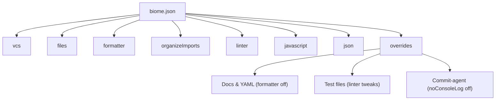

# Other — biome.json

# Other — `biome.json`

## Overview
`biome.json` is the central configuration file for **Biome**, the unified JavaScript/TypeScript formatter, linter, and import organizer used throughout the repository. It follows the Biome schema version **1.9.4** and is consumed by the Biome CLI (`biome`) during `format`, `lint`, and `check` commands. The file lives at the repository root, enabling a single source of truth for code quality rules, formatting preferences, and VCS integration.

## Schema Declaration
```json
{
  "$schema": "https://biomejs.dev/schemas/1.9.4/schema.json"
}
```
The `$schema` field points to the official JSON‑Schema for Biome 1.9.4, allowing IDEs and editors to provide validation, autocomplete, and documentation for the configuration.

## Core Sections

| Section | Purpose | Key Fields |
|---------|---------|------------|
| `vcs` | Controls version‑control integration. | `enabled`, `clientKind`, `useIgnoreFile` |
| `files` | Determines which files Biome should consider or ignore. | `ignoreUnknown`, `ignore` |
| `formatter` | Global formatting options (indentation, line width, etc.). | `enabled`, `indentStyle`, `indentWidth`, `lineWidth`, `attributePosition` |
| `organizeImports` | Enables automatic import sorting. | `enabled` |
| `linter` | Global linting toggle and rule set. | `enabled`, `rules` |
| `javascript` | Language‑specific formatter tweaks for JavaScript/JSX. | `formatter` |
| `json` | Language‑specific formatter tweaks for JSON files. | `formatter` |
| `overrides` | Per‑pattern customizations that supersede the global settings. | `include`, `formatter`, `linter` |

### VCS Integration (`vcs`)
- **`enabled: true`** – Biome will read the repository’s VCS state (e.g., changed files) to limit its work to staged/modified files.
- **`clientKind: "git"`** – Explicitly selects Git as the VCS client.
- **`useIgnoreFile: true`** – Instructs Biome to respect the repository’s `.gitignore` (or other VCS ignore files) when discovering files.

### File Selection (`files`)
- **`ignoreUnknown: false`** – Files with unknown extensions are still processed (useful for non‑standard extensions).
- **`ignore`** – Glob patterns that are excluded from all Biome operations. The list covers typical build artefacts (`node_modules`, `dist`, `out`, `build`, `coverage`), generated TypeScript files (`*.gen.ts`, `*.d.ts`), and lock files (`pnpm-lock.yaml`).

### Formatter (`formatter`)
- **`enabled: true`** – Turns on Biome’s formatter for all supported file types.
- **`indentStyle: "space"`**, **`indentWidth: 2`** – Enforces two‑space indentation.
- **`lineWidth: 100`** – Wraps lines at 100 characters.
- **`attributePosition: "auto"`** – Lets Biome decide the optimal placement of JSX/HTML attributes.

### Organize Imports (`organizeImports`)
- **`enabled: true`** – Automatically sorts and groups imports according to Biome’s default strategy (e.g., third‑party before local, alphabetic ordering).

### Linter (`linter`)
- **`enabled: true`** – Activates Biome’s linting engine.
- **`rules`** – A nested object that merges Biome’s built‑in rule sets with project‑specific severity overrides:
  - **`recommended: true`** – Starts from Biome’s recommended rule baseline.
  - **`correctness`** – Critical bugs:
    - `noUnusedVariables: "error"`
    - `noUnusedImports: "error"`
  - **`suspicious`** – Potentially unintended patterns:
    - `noConsoleLog: "warn"`
  - **`style`** – Enforces consistent code style:
    - `useBlockStatements: "error"`
    - `useShorthandArrayType: "error"`

### Language‑Specific Formatter Settings
- **JavaScript / JSX (`javascript.formatter`)**
  - `quoteStyle: "double"` – Enforces double quotes.
  - `jsxQuoteStyle: "double"` – Same rule for JSX attributes.
  - `semicolons: "always"` – Requires trailing semicolons.
  - `trailingCommas: "es5"` – Adds commas in multi‑line arrays/objects per ES5 rules.
- **JSON (`json.formatter`)**
  - `trailingCommas: "none"` – Disallows trailing commas in JSON files (strict JSON compliance).

## Overrides
Overrides allow fine‑grained rule adjustments based on file glob patterns. They are applied **after** the global configuration, overriding any conflicting settings.

### 1. Documentation & YAML Files
```json
{
  "include": ["*.md", "*.yaml", "*.yml"],
  "formatter": { "enabled": false }
}
```
- Disables formatting for Markdown and YAML files, preventing Biome from re‑formatting documentation or configuration files where whitespace may be significant.

### 2. Test Files
```json
{
  "include": ["**/*.test.ts", "**/*.test.tsx", "**/*.spec.ts", "**/*.spec.tsx"],
  "linter": {
    "rules": {
      "suspicious": { "noExplicitAny": "off" },
      "correctness": { "noUnusedVariables": "off" },
      "performance": { "noDelete": "off" }
    }
  }
}
```
- Loosens strictness for test suites:
  - Allows `any` types (`noExplicitAny` off) to simplify test scaffolding.
  - Ignores unused variable warnings (`noUnusedVariables` off) because test files often contain placeholders.
  - Disables the `noDelete` performance rule, which is irrelevant in isolated test contexts.

### 3. Commit‑Agent Package
```json
{
  "include": ["packages/commit-agent/src/**/*.ts"],
  "linter": {
    "rules": {
      "suspicious": { "noConsoleLog": "off" }
    }
  }
}
```
- Permits `console.log` statements within the `commit-agent` source, acknowledging that the package intentionally logs diagnostic information.

## Interaction with the Rest of the Codebase
- **Biometric CLI**: When developers run `biome format`, `biome lint`, or `biome check`, the CLI reads `biome.json` to resolve which files to process, which rules to enforce, and how to format output.
- **IDE Integration**: Editors that support Biome (e.g., VS Code with the Biome extension) automatically load this configuration, providing on‑save formatting and inline lint diagnostics consistent with the repository’s standards.
- **CI Pipelines**: CI jobs typically invoke `biome check --apply` (or similar) to ensure that all committed code adheres to the configuration. The `vcs.enabled` flag ensures the CI step only evaluates changed files, reducing runtime.

## Extending or Modifying the Configuration

1. **Add a New Rule**
   ```json
   "linter": {
     "rules": {
       "style": {
         "useConsistentSpacing": "error"
       }
     }
   }
   ```
   Place the rule under the appropriate category (`correctness`, `suspicious`, `style`, `performance`, etc.) and set the desired severity (`off`, `warn`, `error`).

2. **Create a New Override**
   ```json
   {
     "include": ["scripts/**/*.js"],
     "formatter": { "lineWidth": 120 },
     "linter": { "rules": { "style": { "useBlockStatements": "off" } } }
   }
   ```
   This example relaxes line length for scripts and disables block‑statement enforcement.

3. **Adjust VCS Behaviour**
   - To ignore the `.gitignore` file, set `"useIgnoreFile": false`.
   - To switch to another VCS client (e.g., `hg`), change `"clientKind": "hg"`.

## Example Mermaid Diagram (Configuration Hierarchy)



The diagram illustrates the top‑level sections and how the three overrides branch off from the main configuration.

## Contribution Guidelines
- **Keep the schema up‑to‑date**: If Biome upgrades to a newer schema version, update the `$schema` URL and verify compatibility with existing rules.
- **Document new overrides**: When adding a new pattern, include a comment (or a README entry) explaining the rationale to avoid accidental rule regressions.
- **Run the full Biome suite**: After any change, execute `biome check --apply` locally and ensure CI passes before merging.
- **Prefer global changes over overrides**: Only use overrides when a rule truly needs to be scoped; otherwise, adjust the global configuration to maintain consistency.