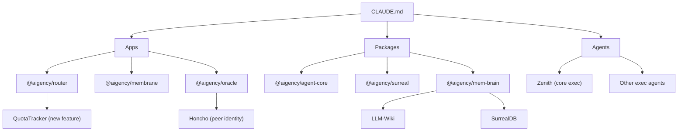

# Other — CLAUDE.md

# CLAUDE.md — Repository Working Memory

## 1. Purpose

`CLAUDE.md` is the **single source of truth** for the `aigency-monorepo` codebase.
It captures:

* High‑level architecture (apps, packages, agents)
* Critical naming conventions and the `AGENT_REGISTRY` contract
* Standard development commands and scripts
* Technical decisions that guide implementation choices
* The local **LLM‑Wiki** knowledge store location and ingestion workflow
* The **SLM** (local small language model) used for auto‑generating conventional commit messages
* Immediate next‑work priorities for each sub‑project
* Integration guidelines for the **GitNexus** code‑intelligence tooling

Developers must read this file **before** making any change to the repository. It ensures consistency across the monorepo, prevents accidental divergence of naming rules, and guarantees that tooling (e.g., `prepare-commit-msg` hook, GitNexus impact analysis) behaves as expected.

---

## 2. Workspace Overview

```
aigency-monorepo/
├─ apps/
│  ├─ router/      @aigency/router      – LLM router (quota‑aware, OpenAI‑compatible)
│  ├─ membrane/    @aigency/membrane    – 3D UI (Three.js + React + SurrealDB)
│  ├─ oracle/      @aigency/oracle      – SurrealDB bootstrap + Honcho session layer
│  ├─ librarian/   @aigency/librarian   – Vault curator (lint, compile, flush)
│  └─ contracts/   @aigency/contracts   – Solidity contracts (HarvestMoon.sol, ERC‑721/20)
├─ packages/
│  ├─ tsconfig/         @aigency/tsconfig
│  ├─ agent-core/       @aigency/agent-core   – `AGENT_REGISTRY`, `AgentCallsign` enum
│  ├─ surreal/          @aigency/surreal      – SurrealDB client, live queries, record types
│  ├─ honcho/           @aigency/honcho       – Peer/identity client (deprecated 0.2.0)
│  ├─ vault-tools/      @aigency/vault-tools  – `lint.ts`, `compile.ts`, `flush.ts`
│  ├─ design-tokens/    @aigency/design-tokens
│  └─ mem-brain/        @aigency/mem-brain    – Unified memory layer (SurrealDB + Honcho + LLM‑Wiki)
└─ agents/
   ├─ zenith/ … other callsigns …
   │   └─ agent.yaml   – identity, color, substrate, vault pointer
```

> **Note:** The persistent markdown knowledge store (`aigency-vault`) lives outside this repo at `../aigency-vault`. The `mem-brain` package syncs a subset of that store locally.

---

## 3. Core Concepts

| Concept | Location | Description |
|---------|----------|-------------|
| **Exec Squad Orchestrators** | `agents/zenith/` (core) & external NEXUS | `ZENITH` (Newton Hughes) is the core exec squad orchestrator; `NEXUS` (Marcus Hale) lives in a separate repo. Never conflate the two. |
| **Agent Registry** | `packages/agent-core/src/index.ts` | Exports `AGENT_REGISTRY` – a map of all 10 exec agents plus **THE ARCHITECT**. Used by router, oracle, and any component that needs agent identity. |
| **LLM‑Wiki** | `packages/mem-brain/llm-wiki/` | Persistent knowledge base (human docs, agent schema, org charts). Files dropped into `llm-wiki/raw/` are ingested by the LLM. |
| **SLM for Commits** | `scripts/automation/setup-slm.sh` | Auto‑installs the best local small language model (MLX → llama.cpp → llamafile → heuristic) and wires it into the `prepare-commit-msg` Git hook. |
| **GitNexus** | `gitnexus_*` commands (see section 7) | Provides impact analysis, safe rename, and change‑detection before any edit. All modifications must be preceded by the appropriate GitNexus call. |

---

## 4. Development Workflow

### 4.1 Common Commands

| Command | Scope | Effect |
|---------|-------|--------|
| `pnpm install` | workspace | Installs all dependencies (pnpm workspaces). |
| `pnpm dev` | workspace | Starts **all** apps in dev mode via Turborepo. |
| `pnpm build` | workspace | Builds every package and app. |
| `pnpm test` | workspace | Runs the full test suite. |
| `pnpm router` | workspace | Starts only the router (`apps/router`, port 8402). |
| `pnpm oracle` | workspace | Starts only the ORACLE service. |
| `pnpm membrane` | workspace | Starts only the Membrane UI. |
| `pnpm --filter @aigency/<pkg> dev` | per‑package | Runs dev server for a single package. |
| `pnpm --filter @aigency/librarian lint` | per‑package | Lints the LIBRARIAN code. |
| `pnpm --filter @aigency/oracle seed` | per‑package | Seeds SurrealDB with initial agent records. |
| `pnpm format` | workspace | Formats all code with **Biome**. |
| `pnpm lint:fix` | workspace | Lints and auto‑fixes with Biome. |
| `pnpm autofix` | workspace | Runs all auto‑fixers (Biome, import‑sort, etc.). |
| `pnpm review` / `pnpm review:agent` | workspace | Runs CodeRabbit AI review (plain vs. agent‑optimized). |
| `pnpm commit` | workspace | Interactive commit using **cz‑git** (hooks invoke the SLM). |

### 4.2 SLM Setup & Backend Selection

```bash
# Auto‑detect and install the best backend for the host platform
./scripts/automation/setup-slm.sh

# Force a specific backend (e.g., on macOS M1)
./scripts/automation/setup-slm.sh --backend mlx

# Force reinstall (useful after a failed install)
./scripts/automation/setup-slm.sh --force
```

Backend priority (auto‑detected):

1. **MLX** – macOS arm64, native Metal (fastest).
2. **llama.cpp** – cross‑platform, pip wheel, AVX2/METAL optimizations.
3. **llamafile** – single‑binary fallback, no Python.
4. **Heuristic** – pattern‑based diff stats (always works).

Metadata about the selected backend lives in `scripts/automation/.slm/backend.json`. The default model is **Qwen3.5‑0.8B** (~450 MB).

---

## 5. Technical Decisions (Snapshot)

| Decision | Choice | Rationale |
|----------|--------|-----------|
| Database | **SurrealDB 3.0** | Multi‑model (graph + vector + document) + live queries. |
| Peer Identity | **Honcho ^0.2.0** | Session‑wide reasoning, “dreaming” inference. |
| LLM Inference | **MLX (M1 Pro) + Llama.cpp (Intel ×3 on Tailnet)** | Local‑first, zero external API costs. |
| Commit‑Message AI | Same stack as LLM inference (auto‑install) | Consistent tooling, no manual setup. |
| LLM Router | **apps/router** (migrated from aigency‑router v1) | OpenAI‑compatible proxy, quota‑aware. |
| Blockchain | **Base L2 (chain 8453)** | Low gas, EVM‑compatible, Coinbase alignment. |
| Contracts | **Foundry** (forge + cast + anvil) | Fast local dev, easy deployment to Base & Sepolia. |
| Frontend | **React + Three.js + @react‑three/fiber** | 3D SynapTree graph visualisation. |
| Package Manager | **pnpm workspaces** | Disk‑efficient, strict version resolution. |
| Build System | **Turborepo** | Caching, pipeline orchestration. |

---

## 6. LLM‑Wiki Knowledge Base

*Location*: `packages/mem-brain/llm-wiki/`

| Item | Path | Role |
|------|------|------|
| Human docs | `.../llm-wiki/README.md` | General repository documentation. |
| Agent schema | `.../llm-wiki/AGENTS.md` | Formal description of each agent (callsign, color, vault pointer). |
| Raw ingestion | `.../llm-wiki/raw/` | Drop any markdown, PDF, or CSV here; the LLM will process it on demand. |
| Query interface | `mem-brain` runtime API | Use `MemBrain.queryWiki(prompt)` to ask the LLM questions against the wiki. |

**Workflow**:

1. Add source files to `raw/`.
2. Run `pnpm --filter @aigency/mem-brain ingest-wiki` (script defined in `mem-brain/package.json`).
3. The LLM parses, indexes, and stores embeddings in SurrealDB.
4. Query via the `MemBrain` service from any app (router, oracle, etc.).

---

## 7. Immediate Next Work (Priority Order)

| # | Target | Goal | Relevant Scripts / Commands |
|---|--------|------|------------------------------|
| 1 | `apps/router` | - Audit existing source (from v1). <br> - Wire `QuotaTracker` into routing decisions. <br> - Fix broken base URL (`z.ai`). <br> - Add local SLM endpoints (MLX M1 Pro 8080, Intel Tailnet nodes). <br> - Replace raw `fetch()` with **Portkey** gateway. <br> - Add Claude/Anthropic provider. <br> - Make routing context agent‑aware (`@aigency/agent-core`). | `pnpm --filter @aigency/router test` |
| 2 | `apps/oracle` | Bootstrap SurrealDB + Honcho workspace. | `surreal start --user root --pass root` <br> `pnpm --filter @aigency/oracle seed` |
| 3 | `apps/contracts` | Complete `AigencyGraft.sol` (ERC‑721) and `AigencyGraftAccess.sol` (ERC‑20). | `forge install OpenZeppelin/openzeppelin-contracts` |
| 4 | `apps/membrane` | Render initial SynapTree scene (CIPHER owns implementation). | Design tokens at `packages/design-tokens/src/synapttree-design-tokens.json` <br> Spec at `../aigency-vault/agents/iris/wiki/membraned-interface-spec.md` |

> **Before starting any of the above**, run the appropriate GitNexus impact analysis (see section 8) to understand downstream dependencies.

---

## 8. GitNexus Integration (Safety Net)

All modifications must be guarded by GitNexus commands:

1. **Impact analysis** – Identify blast radius before editing:
   ```bash
   gitnexus_impact({target: "src/agent-core/registry.ts", direction: "upstream"})
   ```
   *Review the returned depth‑1 (WILL BREAK) callers and address them.*

2. **Pre‑commit verification** – Ensure only expected symbols changed:
   ```bash
   gitnexus_detect_changes({scope: "staged"})
   ```

3. **Safe rename / extract** – Use the built‑in rename helper:
   ```bash
   gitnexus_rename({symbol_name: "QuotaTracker", new_name: "RequestQuotaTracker", dry_run: true})
   ```

4. **Debugging** – Locate execution flows related to a symptom:
   ```bash
   gitnexus_query({query: "router quota error"})
   gitnexus_context({name: "QuotaTracker"})
   ```

5. **Refactoring checklist** – After any refactor:
   - Run `gitnexus_impact` on all moved symbols.
   - Run `gitnexus_detect_changes({scope: "all"})`.
   - Verify no HIGH/CRITICAL risk warnings were ignored.

**Risk Levels** (as defined in `CLAUDE.md`):

| Depth | Meaning | Action |
|------|----------|--------|
| d=1 | **WILL BREAK** – direct callers/importers | Must update all dependents. |
| d=2 | **LIKELY AFFECTED** – indirect deps | Add tests, verify behaviour. |
| d=3 | **MAY NEED TESTING** – transitive | Test if on a critical path. |

---

## 9. Updating CLAUDE.md

1. **Add new knowledge** – When a new package, app, or agent is introduced, extend the relevant section (e.g., add a row to the *Technical Decisions* table or a new entry in *Immediate Next Work*).
2. **Sync with GitNexus** – After committing changes, run:
   ```bash
   npx gitnexus analyze --embeddings
   ```
   This refreshes the index and preserves any embeddings that `CLAUDE.md` contributes to the LLM‑Wiki.
3. **Version bump** – Update the “Last updated” timestamp at the bottom of the file.
4. **Review** – Run `pnpm review` to let CodeRabbit AI suggest wording improvements.

---

## 10. FAQ & Tips

| Question | Answer |
|----------|--------|
| *Where do I find the list of all agents?* | `packages/agent-core/src/index.ts` exports `AGENT_REGISTRY`. The YAML files under `agents/<callsign>/agent.yaml` point to the vault docs. |
| *How do I change the default SLM model?* | Edit `scripts/automation/.slm/backend.json` → `model` field, then re‑run `setup-slm.sh --force`. |
| *Is Honcho still maintained?* | `honcho-ai@0.2.0` is deprecated. Verify the upstream repo (`https://github.com/plastic-labs/honcho`) before extending its API. |
| *Can I run the router without the rest of the monorepo?* | Yes. Use `pnpm --filter @aigency/router dev`. Ensure the local SLM is installed if you want the `/slm` endpoint. |
| *What if I need to add a new tech decision?* | Add a row to the **Tech Decisions** table and reference the concrete package (e.g., `@aigency/new‑pkg`). Update any affected scripts or docs accordingly. |

---

## 11. Diagram – High‑Level Relationship



*The diagram shows how `CLAUDE.md` sits at the centre, documenting the relationships between the monorepo’s apps, packages, and agents.*

---