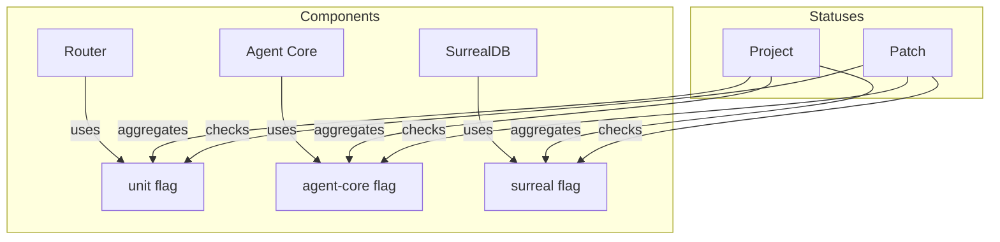

# Other — codecov.yml

# Other — `codecov.yml`

## Overview
`codecov.yml` is the central Codecov configuration for the **Aigency** monorepo. It defines how test coverage data is collected, processed, and reported for every package, and it enforces coverage thresholds both at the project level and per‑component level. The file is consumed by the Codecov uploader (typically run in CI pipelines) and by the Codecov UI to generate coverage reports, flaky‑test analytics, and PR comments.

---

## Table of Contents
1. [Global Settings](#global-settings)
2. [Coverage Targets](#coverage-targets)
   - 2.1 [Project‑level (`project`)](#project-level)
   - 2.2 [Patch‑level (`patch`)](#patch-level)
   - 2.3 [Change‑level (`changes`)](#change-level)
3. [Component Management](#component-management)
4. [Flags & Carry‑forward](#flags)
5. [Ignore Patterns](#ignore-patterns)
6. [Comment Configuration](#comment-configuration)
7. [Test Analytics & Flaky Detection](#test-analytics)
8. [Integration Points](#integration-points)
9. [Maintenance Tips](#maintenance-tips)

---

## Global Settings <a name="global-settings"></a>

| Key | Value | Description |
|-----|-------|-------------|
| `codecov.require_ci_to_pass` | `true` | Coverage upload will be rejected if the CI job fails. |
| `codecov.notify.wait_for_ci` | `true` | Codecov will wait for the CI job to finish before posting a comment. |
| `coverage.precision` | `2` | Coverage percentages are rounded to two decimal places. |
| `coverage.round` | `down` | Rounding direction (always round down). |
| `coverage.range` | `"50...90"` | Acceptable global coverage range; values outside this range are highlighted in the UI. |

---

## Coverage Targets <a name="coverage-targets"></a>

### Project‑level (`project`) <a name="project-level"></a>
Defines baseline coverage expectations for the whole repository and for each monorepo component.

* **Default**
  * `target: 70%` – overall coverage must be at least 70 %.
  * `threshold: 5%` – a drop of up to 5 % is tolerated before the build fails.
  * `if_ci_failed: error` – CI will be marked as failed if the target is not met.
  * `flags: [unit]` – the default status aggregates the `unit` flag (see Flags section).

* **Component‑specific entries** (e.g., `router`, `agent-core`, `surreal`, …)
  * Each component has its own `target`, `threshold`, and associated `flags`.
  * Example: `router` requires **55 %** coverage, `agent-core` requires **80 %**, etc.

These entries are used by Codecov to compute per‑component coverage badges and to enforce the thresholds defined per package.

### Patch‑level (`patch`) <a name="patch-level"></a>
Applies to the diff introduced by a pull request.

* `target: 50%` – the changed lines must be covered at least 50 %.
* `threshold: 5%` – a 5 % drop is tolerated.
* `if_ci_failed: error` – PR checks will fail if the patch target is not met.

### Change‑level (`changes`) <a name="change-level"></a>
Tracks coverage over the entire diff (not just the changed lines).

* `target: 50%` – overall diff coverage must be ≥ 50 %.
* `if_ci_failed: error` – CI fails if the diff coverage falls below the target.

---

## Component Management <a name="component-management"></a>

The `component_management` block maps source directories to logical components, enabling fine‑grained coverage reporting.

```yaml
component_management:
  default_rules:
    statuses:
      - type: project
        target: auto
        branches: [main]
      - type: patch
        target: 50%
  individual_components:
    - component_id: router
      name: Router
      paths:
        - apps/router/src/**
    - component_id: agent-core
      name: Agent Core
      paths:
        - packages/agent-core/src/**
    # … other components omitted for brevity …
```

* **`default_rules`** – applies to any component that does not have an explicit entry.
* **`individual_components`** – explicit mapping of component IDs to source globs.
* The `paths` glob is used by Codecov to compute coverage for that component only.

### Mermaid Overview (Component ↔ Flag ↔ Status)



*The diagram shows that each component contributes its flagged coverage to both the project‑level and patch‑level status checks.*

---

## Flags & Carry‑forward <a name="flags"></a>

Flags group source files for selective reporting and enable *carry‑forward* of coverage from previous runs.

```yaml
flags:
  unit:
    paths:
      - apps/router/src/**
      - packages/*/src/**
    carryforward: true
  router:
    paths:
      - apps/router/src/**
    carryforward: true
  # … other flags omitted …
```

* **`unit`** – a global flag covering all source files; used by the default project status.
* **Component‑specific flags** (e.g., `router`, `agent-core`) – map directly to the component IDs defined in `component_management`.
* **`carryforward: true`** – retains coverage data from previous CI runs when a new run does not produce any data for the flagged paths (useful for incremental CI pipelines).

---

## Ignore Patterns <a name="ignore-patterns"></a>

Files and directories that should never be considered for coverage:

```yaml
ignore:
  - "**/node_modules/**"
  - "**/dist/**"
  - "**/*.test.ts"
  - "**/*.spec.ts"
  - "**/*.d.ts"
  - "apps/docs/**"
  - "apps/contracts/**"
  - "apps/membrane/**"
  - "apps/telos/**"
  - "**/llm-wiki/**"
  - "scripts/**"
  - ".github/**"
  - "packages/tsconfig/**"
  - "packages/design-tokens/**"
```

Typical exclusions include generated artifacts, type definition files, test files, and documentation sources.

---

## Comment Configuration <a name="comment-configuration"></a>

Controls how Codecov comments appear on pull requests:

| Setting | Value | Effect |
|---------|-------|--------|
| `layout` | `"header, diff, flags, components, files, tests"` | Order of sections in the PR comment. |
| `behavior` | `default` | Standard comment behavior (post once per PR). |
| `require_changes` | `false` | Comment is posted even if coverage did not change. |
| `require_base` | `true` | Base commit must be available (required for diff calculations). |
| `require_head` | `true` | Head commit must be available. |
| `hide_project_coverage` | `false` | Project‑level coverage is shown in the comment. |

---

## Test Analytics & Flaky Detection <a name="test-analytics"></a>

```yaml
codecov:
  test_analytics:
    enabled: true
    flaky_detection:
      enabled: true
      threshold: 0.05
```

* **Test Analytics** – uploads raw test results (via `codecov/test-results-action`) to enable Codecov’s test‑analytics dashboard.
* **Flaky Detection** – marks a test as flaky if its failure rate exceeds **5 %** over the short‑term (7 days) or long‑term (30 days) windows. This data is surfaced in the Codecov UI and can be used to triage unstable tests.

---

## Integration Points <a name="integration-points"></a>

| CI Tool | How it uses `codecov.yml` |
|---------|---------------------------|
| **GitHub Actions** | `codecov/codecov-action@v4` reads the file automatically; the action uploads `coverage.xml` (or equivalent) and, if `test_analytics.enabled` is true, also uploads `test-results.json`. |
| **GitLab CI** | The `codecov/codecov-action` can be used similarly; the same `codecov.yml` is respected. |
| **Local Development** | Running `npx codecov` locally will respect the same configuration, useful for debugging thresholds before committing. |

The file does **not** contain any executable code; it is purely declarative. No internal or external function calls are made from this module.

---

## Maintenance Tips <a name="maintenance-tips"></a>

1. **Add New Packages**
   * Add a new entry under `component_management.individual_components` with a unique `component_id`, a human‑readable `name`, and the appropriate `paths` glob.
   * Add a matching flag under `flags` (or reuse the `unit` flag if appropriate).
   * Define a coverage target under `coverage.status.project.<component_id>`.

2. **Adjust Thresholds**
   * Increase `target` values gradually to avoid breaking CI.
   * Use `threshold` to allow a buffer for temporary regressions.

3. **Update Ignored Paths**
   * When new build artefacts or generated directories appear, add them to the `ignore` list to keep coverage numbers meaningful.

4. **Validate Changes**
   * Run `codecov yaml validate` (provided by the Codecov CLI) to catch syntax errors before committing.
   * Use a feature branch PR to verify that the comment layout and thresholds behave as expected.

5. **Monitor Flaky Tests**
   * Periodically review the Flaky Test Dashboard in Codecov.
   * If a test consistently exceeds the 5 % threshold, consider stabilizing or disabling it.

---

## Summary

`codecov.yml` is the authoritative source for coverage policy across the Aigency monorepo. It:

* Enforces **project‑level**, **patch‑level**, and **change‑level** coverage targets.
* Maps source directories to logical **components** for per‑package reporting.
* Defines **flags** with carry‑forward semantics to support incremental CI.
* Excludes non‑relevant files via the `ignore` list.
* Configures PR comment layout and behaviour.
* Enables **test analytics** and **flaky‑test detection**.

Properly maintaining this file ensures that coverage metrics remain reliable, that CI failures surface early, and that developers receive actionable feedback on pull requests.