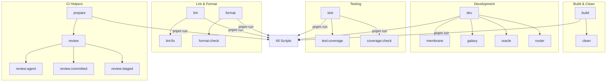

# Other — package.json

# Other — `package.json`

## Overview
`package.json` is the root manifest for the **Aigency** monorepo. It defines the project metadata, the set of npm scripts used throughout development, the development‑time dependencies, and the runtime environment constraints. The file is the entry point for tooling such as **Turbo**, **Biome**, **Commitizen**, and **lefthook**, which together orchestrate building, testing, linting, formatting, and CI‑related automation across all packages in the repository.

## Key Sections

| Section | Purpose |
|---------|---------|
| `name` / `version` | Identifies the repository (`aigency`) and its current version (`0.1.0`). |
| `private` | Prevents accidental publishing to the npm registry. |
| `description` | Human‑readable summary of the project. |
| `scripts` | Centralized command aliases that invoke Turbo pipelines, shell helpers, or other automation scripts. |
| `config` | Custom configuration for tools that read `package.json` (e.g., Commitizen). |
| `devDependencies` | Packages required only for development, CI, and tooling. |
| `packageManager` | Pinpoints the exact PNPM version used (`pnpm@10.33.2`). |
| `engines` | Enforces minimum Node.js and PNPM versions. |

## Scripts

The `scripts` block is the primary interface for developers. Each entry maps a short command name to a shell command that can be run via `pnpm run <script>` (or simply `pnpm <script>` thanks to PNPM’s script shortcut).

### 1. Build & Clean
| Script | Command | Description |
|--------|---------|-------------|
| `build` | `turbo run build` | Executes the `build` pipeline in every package that defines a `build` script. |
| `clean` | `turbo run clean && rimraf node_modules` | Runs each package’s `clean` script, then removes the top‑level `node_modules` directory. |
| `typecheck` | `turbo run typecheck` | Runs TypeScript type checking across the monorepo. |

### 2. Development & Hot‑Reload
| Script | Command | Description |
|--------|---------|-------------|
| `dev` | `turbo run dev` | Starts the development pipelines for all packages (e.g., watch mode, dev servers). |
| `membrane` | `turbo run dev --filter=@aigency/membrane` | Spins up only the **membrane** package in dev mode. |
| `galaxy` | `turbo run dev --filter=@aigency/galaxy` | Spins up only the **galaxy** package. |
| `oracle` | `turbo run dev --filter=@aigency/oracle` | Spins up only the **oracle** package. |
| `router` | `turbo run dev --filter=@aigency/router` | Spins up only the **router** package. |

### 3. Testing & Coverage
| Script | Command | Description |
|--------|---------|-------------|
| `test` | `turbo run test` | Executes the `test` script in each package (usually Jest or Vitest). |
| `test:coverage` | `turbo run test:coverage` | Runs tests with coverage collection enabled. |
| `coverage:check` | `./scripts/automation/coverage-check.sh` | Custom CI helper that fails the build if coverage thresholds are not met. |

### 4. Linting & Formatting
| Script | Command | Description |
|--------|---------|-------------|
| `lint` | `turbo run lint` | Runs the linter (Biome) across all packages. |
| `lint:fix` | `turbo run lint -- --write` | Auto‑fixes lintable issues. |
| `format` | `biome format --write .` | Formats the entire codebase in place. |
| `format:check` | `biome format .` | Checks formatting without modifying files. |
| `commit` | `cz` | Launches Commitizen’s interactive commit prompt. |
| `commit:ai` | `./scripts/automation/generate-commit-msg.sh` | Generates a commit message using an LLM. |

### 5. Git Hooks & CI Automation
| Script | Command | Description |
|--------|---------|-------------|
| `prepare` | `lefthook install` | Installs Git hooks defined in `.lefthook` (e.g., pre‑commit lint). |
| `review` | `./scripts/automation/coderabbit-review.sh quick` | Runs a quick AI‑powered code review. |
| `review:agent` / `review:committed` / `review:staged` | Variants of the above script with different scopes. | Provides targeted AI reviews for specific git states. |

### 6. Wiki & Documentation Helpers
| Script | Command | Description |
|--------|---------|-------------|
| `wiki:check` | `./scripts/automation/wiki-check.sh` | Validates the integrity of the LLM‑generated wiki content. |
| `wiki:update` | `./scripts/automation/wiki-check.sh --auto-fix` | Auto‑fixes wiki issues. |
| `wiki:ingest` / `wiki:lint` | `echo …` | Place‑holder commands that remind developers to invoke the LLM for wiki ingestion or linting. |

### 7. Miscellaneous Automation
| Script | Command | Description |
|--------|---------|-------------|
| `autofix` | `./scripts/automation/autofix.sh fix` | Runs a custom autofix pipeline (e.g., lint + format). |
| `autofix:check` | `./scripts/automation/autofix.sh check` | Checks whether the codebase would be clean after autofix. |
| `slice*` | Various `agent-slice-commit.sh` invocations | Helpers for committing slices of agent code, optionally with Graphite integration or push flags. |

## Configuration Objects

### Commitizen
```json
"config": {
  "commitizen": {
    "path": "node_modules/cz-git"
  }
}
```
*Points Commitizen to the `cz-git` adapter, enabling conventional‑commit style prompts.*

### Engines
```json
"engines": {
  "node": ">=20",
  "pnpm": ">=9"
}
```
*Ensures developers use Node 20+ and PNPM 9+; CI pipelines enforce these constraints.*

## Development Workflow

1. **Setup**
   ```bash
   pnpm install          # installs devDependencies
   pnpm prepare          # installs lefthook Git hooks
   ```

2. **Iterative Development**
   - Run `pnpm dev` to start all packages in watch mode, or target a single package with `pnpm membrane`, `pnpm galaxy`, etc.
   - Use `pnpm format` / `pnpm lint` to keep code style consistent.
   - Commit with `pnpm commit` (interactive) or `pnpm commit:ai` (LLM‑generated).

3. **Testing & CI**
   - Local test run: `pnpm test`.
   - Coverage check: `pnpm coverage:check`.
   - CI pipelines typically invoke `pnpm build && pnpm test && pnpm typecheck && pnpm lint`.

4. **Release Preparation** (internal, as the repo is private)
   - Ensure all scripts pass: `pnpm build && pnpm test && pnpm lint && pnpm format:check && pnpm coverage:check`.
   - Bump the version in `package.json` (or via a release tool) and push tags.

## Extending the Manifest

When adding a new package or tool:

1. **Add a script** – follow the naming convention (`<category>:<action>`).
2. **Update Turbo pipelines** – edit `turbo.json` (not shown here) to include the new script in the appropriate pipeline.
3. **Add devDependencies** – run `pnpm add -D <pkg>`; the lockfile will be updated automatically.
4. **Document the change** – add a brief entry to the `README` or the relevant package’s docs, and optionally a new script alias for CI.

## Mermaid Diagram (Script Category Overview)



*The diagram groups scripts by functional domain, showing the primary entry points (`build`, `dev`, `test`, `lint`, `format`, `prepare`).*

## Compatibility & Tooling Versions

| Tool | Version (pinned) |
|------|------------------|
| `@biomejs/biome` | 1.9.4 |
| `@commitlint/cli` | ^19.8.0 |
| `cz-git` | ^1.11.1 |
| `lefthook` | ^1.11.12 |
| `turbo` | ^2.9.7 |
| `typescript` | ^5.7.2 |
| `pnpm` (package manager) | 10.33.2 (minimum 9) |
| `node` (engine) | >=20 |

These versions are deliberately pinned to avoid breaking changes in CI and developer environments.

## Contributing Guidelines

- **Never edit `package.json` manually for dependency versions**; always use `pnpm add` / `pnpm remove` to keep the lockfile in sync.
- **All new scripts must be added to the appropriate Turbo pipeline** (see `turbo.json`).
- **Run `pnpm format` and `pnpm lint` before committing**; the pre‑commit hook (installed by `pnpm prepare`) will enforce this.
- **Commit messages** should follow the conventional‑commit format; use `pnpm commit` for interactive prompts or `pnpm commit:ai` for LLM‑generated messages.
- **CI failures** related to scripts are considered blockers; fix them locally before pushing.

---

*End of documentation for the `Other — package.json` module.*