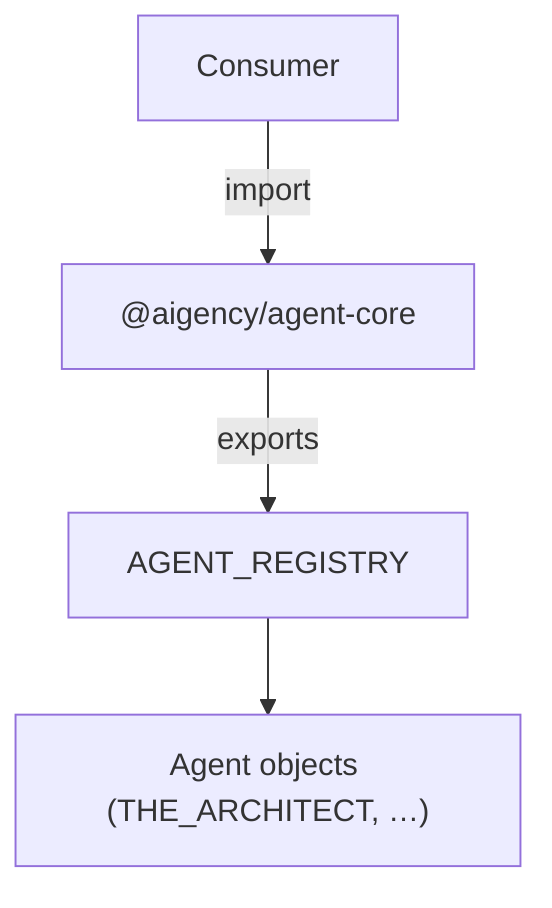

# Other — packages-agent-core

# @aigency/agent-core

## Overview

`@aigency/agent-core` provides the canonical definitions for all Aigency agents. It centralises:

* **Agent metadata** – callsign, display name, role, colour, and substrate.
* **Type definitions** – shared TypeScript interfaces that describe an agent.
* **The `AGENT_REGISTRY` constant** – a runtime‑accessible map of every registered agent.

All other packages import this module to obtain a consistent view of the agents that exist in the system.

---

## Installation

```bash
# As a workspace dependency (recommended)
pnpm add -D @aigency/agent-core
```

The package is **private** and intended for internal use only; it is published only within the monorepo.

---

## Build & Test

| Script | Description |
|--------|-------------|
| `npm run build` | Compiles `src/index.ts` with **tsup**, emitting both ESM (`.mjs`) and CommonJS (`.js`) bundles plus declaration files (`.d.ts`). |
| `npm run dev` | Same as `build` but watches source files for incremental rebuilds. |
| `npm run lint` | Runs **Biome** over the `src` directory. |
| `npm run test` | Executes the Vitest suite (`src/**/*.test.ts`). |
| `npm run test:coverage` | Runs Vitest with V8 coverage collection. |
| `npm run typecheck` | Runs `tsc --noEmit` to verify type correctness. |
| `npm run clean` | Removes the generated `dist` folder. |

### Vitest configuration (`vitest.config.ts`)

* **Globals** – `describe`, `it`, `expect` are injected automatically.
* **Environment** – Node (no browser polyfills).
* **Reporters** – Default console output plus JUnit XML (`./coverage/junit.xml`).
* **Coverage** – V8 provider; reports generated in `./coverage` (text, lcov, json). Test files and generated output are excluded.

---

## Exported API

### `AGENT_REGISTRY`

```ts
export const AGENT_REGISTRY: Record<string, Agent>;
```

* **Key** – The agent’s *callsign* (e.g. `"THE_ARCHITECT"`).
* **Value** – An object conforming to the `Agent` interface (see below).

The registry is populated at module import time and is immutable for the lifetime of the process.

#### Example (from the test suite)

```ts
import { AGENT_REGISTRY } from "@aigency/agent-core";

const architect = AGENT_REGISTRY.THE_ARCHITECT;
console.log(architect.callsign); // "THE_ARCHITECT"
console.log(architect.name);     // "Antonio Reid"
console.log(architect.role);     // "Founder & Chief Architect"
```

The test suite asserts that:

* `AGENT_REGISTRY` is defined and contains at least one entry.
* The `THE_ARCHITECT` entry matches the expected metadata.
* Every agent object defines `callsign`, `name`, `role`, `color` (hex string), and `substrate`.

### `Agent` interface (implicit)

While the source file is not shown, the test expectations imply the following shape:

```ts
export interface Agent {
  /** Unique identifier used throughout the codebase */
  callsign: string;

  /** Human‑readable display name */
  name: string;

  /** Role or title of the agent */
  role: string;

  /** Hex colour used for UI theming (e.g. "#ff6600") */
  color: `#${string}`;

  /** The underlying substrate (e.g. a language model, toolset, or platform) */
  substrate: unknown; // concrete type defined elsewhere in the repo
}
```

Any new agent added to the registry must satisfy this contract.

---

## Adding a New Agent

1. **Create the agent definition** in `src/agents/<name>.ts` (or any location that is imported by `src/index.ts`). The file should export a constant that matches the `Agent` interface.

   ```ts
   // src/agents/the_builder.ts
   import { Agent } from "../types";

   export const THE_BUILDER: Agent = {
     callsign: "THE_BUILDER",
     name: "Samira Patel",
     role: "Lead Engineer",
     color: "#1e90ff",
     substrate: /* reference to a concrete substrate implementation */,
   };
   ```

2. **Register the agent** in `src/index.ts`:

   ```ts
   import { THE_ARCHITECT } from "./agents/the_architect";
   import { THE_BUILDER } from "./agents/the_builder";

   export const AGENT_REGISTRY = {
     THE_ARCHITECT,
     THE_BUILDER,
   } as const;
   ```

3. **Run the test suite** – the existing tests will automatically verify that the new entry conforms to the required shape.

4. **Update documentation** – add a short description of the new agent to the module README (or the generated docs).

---

## TypeScript Configuration (`tsconfig.json`)

* **Extends** – `@aigency/tsconfig/node.json` (provides a baseline Node.js configuration).
* **Root / Output** – Source lives under `src`; compiled artifacts are emitted to `dist`.
* **Include / Exclude** – Only `src` is compiled; `node_modules` and the generated `dist` folder are excluded.

---

## Runtime Behaviour

The module has **no side effects** beyond constructing the `AGENT_REGISTRY` object. It does not perform any I/O, network calls, or dynamic imports. Consequently:

* **Cold start** – Importing `@aigency/agent-core` is cheap; the registry is a plain object.
* **Tree‑shaking** – Consumers that only need a subset of agents can import the specific constants (e.g. `import { THE_ARCHITECT } from "@aigency/agent-core/agents/the_architect"`), allowing bundlers to drop unused entries.

---

## Integration Points

| Consumer | How it uses `AGENT_REGISTRY` |
|----------|------------------------------|
| **Agent orchestrators** | Resolve an agent by callsign to retrieve its substrate and metadata. |
| **UI components** | Pull `color`, `name`, and `role` for display in dashboards. |
| **Logging / Auditing** | Record the `callsign` of the agent that performed an action. |
| **Testing utilities** | Validate that all agents expose the required fields (as demonstrated in `src/index.test.ts`). |

Because the registry is a plain object, any consumer can safely perform a shallow lookup:

```ts
function getAgentColor(callsign: string): string | undefined {
  return AGENT_REGISTRY[callsign]?.color;
}
```

---

## Mermaid Diagram (high‑level)



*The diagram shows that any consumer imports the package, accesses `AGENT_REGISTRY`, and works with the individual agent objects.*

---

## Frequently Asked Questions

**Q: Can I mutate an agent after import?**
**A:** No. The registry is exported as a `const` and should be treated as immutable. Mutating it would break type safety and could cause subtle bugs across the codebase.

**Q: Where are the concrete `substrate` implementations defined?**
**A:** They live in sibling packages (e.g. `@aigency/agent-substrate-*`). The `substrate` field is typed to the appropriate interface exported by those packages.

**Q: How do I enforce colour format?**
**A:** The test suite checks that `color` matches `/^#/`. Adding a custom lint rule or extending the TypeScript type to `\`#${string}\`` can provide compile‑time guarantees.

---

## Release Process (internal)

1. **Run `npm run typecheck`** – ensure no TypeScript errors.
2. **Run `npm run lint`** – enforce code style.
3. **Run `npm run test:coverage`** – verify test coverage thresholds (enforced by `scripts/automation/coverage-check.sh`).
4. **Commit** – the monorepo CI will build the package and publish the compiled artifacts to the shared `dist` folder.

---