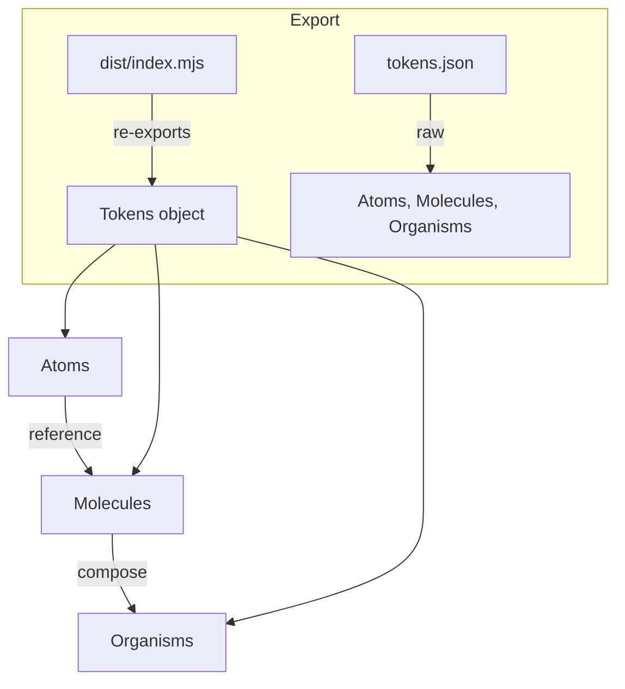

# Other — packages-design-tokens

# @aigency/design-tokens

## Overview
`@aigency/design-tokens` is a pure‑data package that provides a W3C Design Token Community Group (DTCG) compliant token set for the Aigency + SynapTree UI.
The token hierarchy follows **Atomic Design**:

```
atoms → molecules → organisms
```

All values are stored in JSON and compiled to a TypeScript declaration file (`dist/index.d.ts`) so they can be imported with full type safety.

---

## Installation

```bash
# npm
npm i @aigency/design-tokens

# yarn
yarn add @aigency/design-tokens
```

The package is **private** to the monorepo, but the same import paths work in any consuming workspace.

---

## Export map (package.json)

| Export path                | What is exported                              |
|----------------------------|----------------------------------------------|
| `.` (default)              | `dist/index.mjs` (ESM) / `dist/index.js` (CJS) – re‑exports the token objects with TypeScript typings |
| `./tokens.json`            | Raw SynapTree token file (`src/synapttree-design-tokens.json`) |
| `./aigency.json`           | Raw Aigency‑specific token file (`src/aigency-design-tokens.json`) – **not present in the current snapshot** but reserved for future extensions |

> **Note:** The sub‑path exports allow you to load the raw JSON directly when you need a copy‑by‑value or want to process the file with a custom parser.

---

## Build & Type generation

```bash
npm run build   # tsup → dist/index.{js,mjs} + .d.ts
npm run dev     # watch mode for rapid iteration
npm run typecheck
```

`tsup` bundles `src/index.ts` (the entry point) into both ESM and CJS formats and generates a declaration file. The `resolveJsonModule` flag in `tsconfig.json` enables direct import of the JSON token files.

---

## Token hierarchy

### 1. Atoms
Primitive values that **must not** be referenced directly in UI components. They are the source of truth for colors, opacities, shapes, timings, blur, and radius.

```json
{
  "atoms": {
    "color": { /* ... */ },
    "opacity": { /* ... */ },
    "shape": { /* ... */ },
    "timing": { /* ... */ },
    "blur": { /* ... */ },
    "radius": { /* ... */ }
  }
}
```

*All color values are sRGB hex, durations are milliseconds, sizes are pixels, opacities are 0‑1.*

### 2. Molecules
Composed tokens that reference atoms via the `{path}` syntax. This is the only place where atom values are dereferenced.

```json
{
  "molecules": {
    "node": {
      "agent-sphere": {
        "geometry": { "$value": "{atoms.shape.agent}" },
        "bloom-frequency": { "$value": "{atoms.timing.pulse-frequency}" }
      }
    },
    "edge": { /* ... */ },
    "panel": { /* ... */ }
  }
}
```

*Reference syntax*
- `{atoms.shape.agent}` → resolves to the string `"SphereGeometry"`
- `{atoms.timing.pulse-frequency}` → resolves to the number `2000`

### 3. Organisms
High‑level UI constructs that combine molecules (and occasionally atoms) into ready‑to‑use configurations.

```json
{
  "organisms": {
    "synapttree-graph": {
      "renderer": "Three.js WebGL",
      "layout": "d3-force-3d, damping 0.4",
      "background": { "$value": "{atoms.color.base.void}" },
      "target-fps": 60
    },
    "agent-card-panel": {
      "width": { "$value": 320 },
      "glass": { "$value": "{molecules.panel.base}" }
    }
  }
}
```

---

## Importing tokens

### Type‑safe import (recommended)

```ts
import { tokens } from '@aigency/design-tokens';

// Example: use a color atom in a styled component
const primary = tokens.atoms.color.text.primary.$value; // "#E8E8E8"
```

The generated `index.d.ts` declares a `tokens` object that mirrors the JSON structure, so IDEs provide autocomplete and type checking.

### Raw JSON import (when you need the literal file)

```ts
import synapttreeTokens from '@aigency/design-tokens/tokens.json' assert { type: 'json' };
```

or, in a Node environment:

```js
const synapttreeTokens = require('@aigency/design-tokens/tokens.json');
```

---

## Token referencing rules

| Level   | Allowed reference pattern | Example |
|---------|--------------------------|---------|
| **Molecule** | `{atoms.<category>.<key>}` | `{atoms.color.agent.zenith}` |
| **Organism** | `{atoms.<…>}` or `{molecules.<…>}` | `{atoms.timing.normal}` or `{molecules.panel.base}` |
| **Atom** | *Never* reference other tokens | — |

When a token is consumed, the `$value` field is extracted; any additional metadata (`$type`, `$description`) is ignored at runtime.

---

## Extending the token set

1. **Add a new atom** – edit `src/synapttree-design-tokens.json` under `atoms`.
2. **Create a molecule** – reference the new atom using the `{atoms…}` syntax.
3. **Expose a new organism** – combine molecules/atoms as needed.

After changes, run `npm run build` to regenerate the compiled output and typings.

---

## Integration points

- **Component libraries** (e.g., `@aigency/ui`) import `tokens` to style React/Three.js components.
- **Theming system** reads the token JSON at runtime to generate CSS custom properties (`--color-primary: #E8E8E8`).
- **Design tooling** (Storybook, Figma plugins) can load `tokens.json` directly to keep design files in sync with the source of truth.

---

## Example usage in a Three.js scene

```ts
import { tokens } from '@aigency/design-tokens';
import { Mesh, SphereGeometry, MeshStandardMaterial } from 'three';

const geometry = new SphereGeometry(1, 32, 32);
const material = new MeshStandardMaterial({
  color: tokens.atoms.color.agent.zenith.$value, // "#00E5CC"
  opacity: tokens.atoms.opacity.fresh.$value,   // 1.0
  transparent: true,
});

const agentSphere = new Mesh(geometry, material);
scene.add(agentSphere);
```

---

## Mermaid diagram (token hierarchy)



The diagram shows the one‑directional flow: **atoms** are the base, **molecules** dereference atoms, **organisms** compose molecules (and occasionally atoms), and the package entry point re‑exports the fully typed token object.

---

## FAQ

**Q: Can I mutate a token at runtime?**
A: Tokens are plain objects; you *can* mutate them, but doing so breaks the design‑system contract. Prefer creating a derived object instead.

**Q: How do I add a custom token set for a new brand?**
A: Fork the JSON, add a new top‑level key (e.g., `brandX`), and expose it via a new sub‑path export in `package.json`. Update the TypeScript index to merge the new namespace.

**Q: Are there any runtime dependencies?**
A: No. The package only contains JSON and generated TypeScript typings. All consumption is static.

---

## License & Ownership

- **Owner:** IRIS (Vivienne Calloway)
- **Co‑owner:** CIPHER (Roman Voss)
- **Version:** 1.0.0 (created 2026‑04‑11)
- **Standard:** W3C Design Token Community Group (DTCG)

All contributions must respect the atomic‑design paradigm and the token naming conventions defined in the JSON schema.