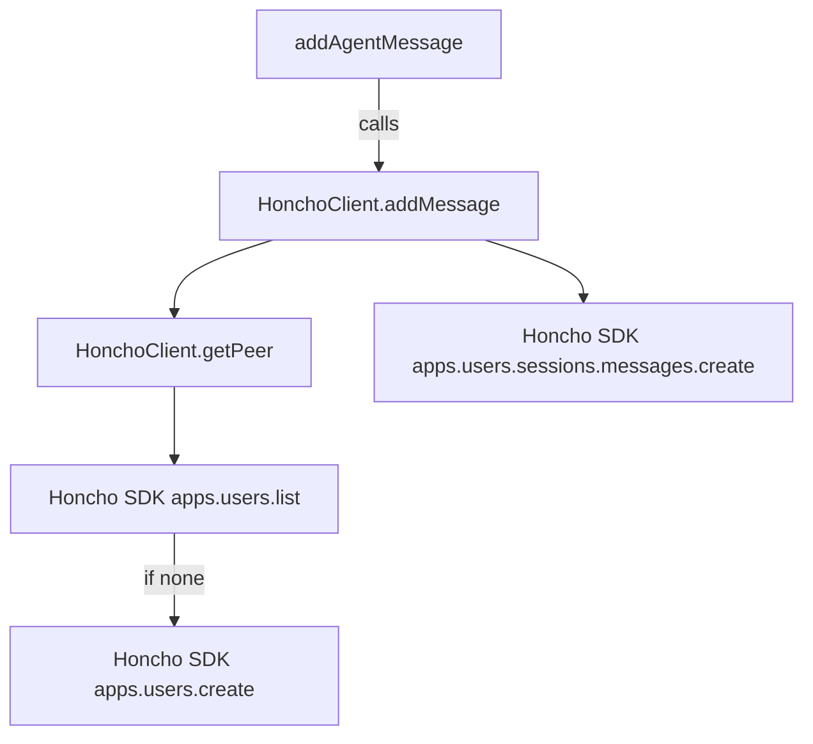
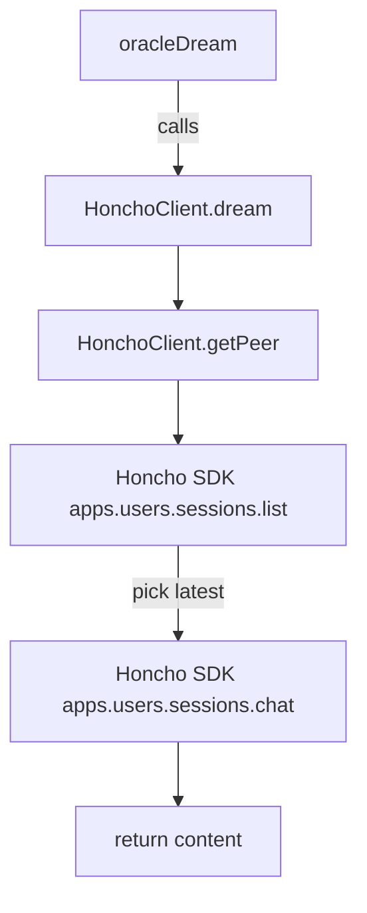

# Other — packages-honcho

# @aigency/honcho – Honcho Peer/Identity Client

## Overview

`@aigency/honcho` provides a thin, type‑safe wrapper around the **Honcho AI SDK** (`honcho-ai`).
It abstracts the concepts of *workspace*, *peer* (an Aigency agent identified by its callsign), *session*, and *message* into a small, focused API that other Aigency services (e.g., `mem-brain`) can consume.

* One **workspace** corresponds to an environment (`dev`, `staging`, `prod`).
* One **peer** corresponds to a single Aigency agent (identified by `AgentCallsign`).
* A **session** groups a series of messages exchanged with a peer.
* **Messages** are appended to a session and can be marked as user‑generated (`is_user`).

The client handles the repetitive “lookup‑or‑create peer” pattern and exposes convenience methods for:

* `getPeer` – retrieve or create a peer record.
* `startSession` – begin a new session for a peer.
* `addMessage` – append a message to an existing session.
* `dream` – invoke Honcho’s background inference (“dreaming”) on the latest session.

All network calls are delegated to the underlying `Honcho` SDK instance.

---

## Installation & Build

```bash
# From the monorepo root
pnpm install          # installs workspace dependencies
pnpm -C packages/honcho run build   # produces dist/*.js, .mjs and .d.ts
```

The package is **private** (used only inside the Aigency monorepo) and is exported via the `dist` folder.

---

## Public API

### Types

```ts
export interface HonchoClientConfig {
  /** Honcho API key */
  apiKey: string;
  /** Workspace identifier, e.g. "aigency-dev" or "aigency-prod" */
  workspaceId: string;
  /** Optional base URL; defaults to https://demo.honcho.dev */
  baseUrl?: string;
}
```

### `HonchoClient`

```ts
import { HonchoClient } from "@aigency/honcho";

const client = new HonchoClient({
  apiKey: process.env.HONCHO_API_KEY!,
  workspaceId: "aigency-dev",
});
```

| Method | Signature | Description |
|--------|-----------|-------------|
| `constructor` | `new HonchoClient(config: HongoClientConfig)` | Instantiates the wrapper and creates an internal `Honcho` SDK client. |
| `getPeer` | `async getPeer(callsign: AgentCallsign): Promise<any>` | Returns the first matching peer record or creates a new one if none exist. |
| `startSession` | `async startSession(callsign: AgentCallsign, metadata?: Record<string, unknown>): Promise<any>` | Creates a new session for the given peer, attaching optional metadata (e.g., `started_at`). |
| `addMessage` | `async addMessage(callsign: AgentCallsign, sessionId: string, content: string, isUser: boolean, metadata?: Record<string, unknown>): Promise<any>` | Appends a message to a session. Internally resolves the peer first. |
| `dream` | `async dream(callsign: AgentCallsign, query: string): Promise<string>` | Runs a “dream” (background inference) against the latest session of the peer. Throws if the peer has no sessions. |

#### Example Usage

```ts
// Start a session for agent "alpha"
const session = await client.startSession("alpha");

// Add a user message
await client.addMessage("alpha", session.id, "Hello, world!", true);

// Trigger a dream (e.g., ask the model to generate a response)
const response = await client.dream("alpha", "What is the status of the task?");
console.log(response);
```

---

## Internal Flow & Call Graph

### Core Interaction Pattern

All public methods share a common first step: **resolve the peer** via `getPeer`.
The call hierarchy is:

```
addMessage → getPeer
startSession → getPeer
dream → getPeer
```

### Integration Points

| Caller (module) | Calls | Purpose |
|-----------------|-------|---------|
| `mem-brain/src/mem-brain.ts` – `addAgentMessage` | `HonchoClient.addMessage` | Persists an inbound/outbound message for an agent. |
| `mem-brain/src/mem-brain.ts` – `startAgentSession` | `HonchoClient.startSession` | Begins a new conversation context for an agent. |
| `mem-brain/src/mem-brain.ts` – `oracleDream` | `HonchoClient.dream` | Retrieves a model‑generated answer based on the latest session. |
| `mem-brain/src/mem-brain.ts` – constructor | `new HonchoClient` | Instantiates the client with the appropriate workspace and API key. |

### Execution Flow Diagrams

#### Add Message Flow



#### Dream Flow



These diagrams illustrate the minimal internal steps; all network interactions are performed by the underlying `Honcho` SDK.

---

## Error Handling

* `dream` throws `Error('No sessions for ${callsign}')` if the peer has never started a session.
* All other methods propagate SDK errors directly. Consumers should wrap calls in `try / catch` and handle HTTP‑level failures (e.g., 401, 404) as needed.

---

## Testing

The package ships a single sanity test (`src/index.test.ts`) that verifies the module exports correctly.
Additional integration tests are located in the consuming packages (e.g., `mem-brain`). Run the test suite with:

```bash
pnpm -C packages/honcho run test
```

Coverage is collected via Vitest’s `v8` provider; thresholds are enforced by the repository’s CI scripts.

---

## Extending the Module

When adding new functionality:

1. **Maintain the `getPeer` pattern** – any operation that needs a peer should call `this.getPeer(callsign)` first.
2. **Prefer SDK methods** – the Honcho SDK already provides CRUD for users, sessions, and messages. Wrap them only when you need to add Aigency‑specific metadata or error handling.
3. **Update the call graph** – add new edges to the internal diagram if the method introduces additional internal calls.
4. **Add unit tests** – place them alongside the implementation in `src/` and ensure they are included in the Vitest config.

---

## Release Notes (0.1.0)

* Initial private release.
* Provides `HonchoClient` with peer lookup, session creation, message appending, and dreaming capabilities.
* Types for `AigencyPeer` and `AigencySession` are defined in `src/types.ts` for future expansion.