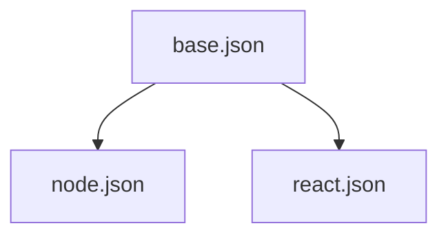

# Other — packages-tsconfig

# @aigency/tsconfig – Shared TypeScript Configuration Package

## Overview
`@aigency/tsconfig` is a **private** npm package that centralises the TypeScript compiler settings used across the monorepo. By publishing a single source of truth for `tsconfig.json` files, the package ensures consistent compilation targets, library definitions, and strictness flags for all TypeScript projects (Node, React, and generic libraries).

## Package Contents
| File | Description |
|------|-------------|
| `base.json` | Core compiler options that apply to every environment. |
| `node.json` | Extension of `base.json` tuned for pure Node.js code. |
| `react.json` | Extension of `base.json` tuned for React applications (includes DOM libs and JSX settings). |
| `package.json` | NPM metadata – declares the package name, version, and which files are published. |

### `package.json`
```json
{
  "name": "@aigency/tsconfig",
  "version": "0.1.0",
  "private": true,
  "license": "MIT",
  "files": ["*.json"]
}
``*The `files` field restricts the published payload to the three JSON configs.*

## Core Configuration – `base.json`
```json
{
  "$schema": "https://json.schemastore.org/tsconfig",
  "compilerOptions": {
    "target": "ES2022",
    "lib": ["ES2022"],
    "module": "ESNext",
    "moduleResolution": "bundler",
    "declaration": true,
    "declarationMap": true,
    "sourceMap": true,
    "strict": true,
    "noUnusedLocals": true,
    "noUnusedParameters": true,
    "noImplicitReturns": true,
    "skipLibCheck": true,
    "esModuleInterop": true,
    "forceConsistentCasingInFileNames": true
  },
  "exclude": ["node_modules", "dist"]
}
```

### Key Options
| Option | Value | Rationale |
|--------|-------|-----------|
| `target` / `lib` | `ES2022` | Aligns with the latest stable ECMAScript features while keeping the emitted code modern. |
| `module` | `ESNext` | Enables native ES module syntax for bundlers that support it. |
| `moduleResolution` | `bundler` | Optimised for bundler‑first resolution (e.g., Vite, Webpack). |
| `declaration` / `declarationMap` | `true` | Generates `.d.ts` files and source maps for library consumers. |
| `sourceMap` | `true` | Facilitates debugging of compiled output. |
| `strict` | `true` | Enforces the full suite of strict type‑checking options. |
| `noUnusedLocals` / `noUnusedParameters` | `true` | Prevents dead code from slipping into the build. |
| `noImplicitReturns` | `true` | Guarantees that all code paths return a value where expected. |
| `skipLibCheck` | `true` | Speeds up compilation by skipping type checking of declaration files. |
| `esModuleInterop` | `true` | Improves compatibility with CommonJS modules. |
| `forceConsistentCasingInFileNames` | `true` | Avoids case‑sensitivity bugs on cross‑platform CI. |
| `exclude` | `["node_modules", "dist"]` | Prevents TypeScript from traversing generated output and third‑party code. |

## Environment‑Specific Extensions

### `node.json`
```json
{
  "$schema": "https://json.schemastore.org/tsconfig",
  "extends": "./base.json",
  "compilerOptions": {
    "lib": ["ES2022"],
    "module": "ESNext",
    "moduleResolution": "bundler"
  }
}
```
*Purpose*: Provides a minimal override for pure Node.js projects. It re‑uses the core `base.json` settings and explicitly re‑declares the `lib`, `module`, and `moduleResolution` fields to make the intent clear for readers and IDEs.

### `react.json`
```json
{
  "$schema": "https://json.schemastore.org/tsconfig",
  "extends": "./base.json",
  "compilerOptions": {
    "lib": ["ES2022", "DOM", "DOM.Iterable"],
    "jsx": "react-jsx",
    "moduleResolution": "bundler"
  }
}
```
*Purpose*: Extends `base.json` with DOM typings and JSX support required for React applications. The `jsx: "react-jsx"` setting enables the new automatic JSX runtime introduced in React 17+.

## Usage in Consumer Projects

### Installing the Package
Since the package is marked `private`, it is intended for internal monorepo consumption. Add it as a workspace dependency:

```bash
# From the monorepo root
pnpm add -D @aigency/tsconfig
# or using npm/yarn workspaces
```

### Extending the Shared Config
Create a `tsconfig.json` (or `tsconfig.app.json`, etc.) in the consumer project and reference the appropriate preset:

```json
{
  "extends": "@aigency/tsconfig/react.json"
}
```

or for a Node library:

```json
{
  "extends": "@aigency/tsconfig/node.json"
}
```

The `extends` path resolves to the published JSON file inside the package, inheriting all core options while applying the environment‑specific overrides.

### Overriding Locally
If a project needs to tweak a single option (e.g., add an additional library), simply add a `compilerOptions` block after the `extends`:

```json
{
  "extends": "@aigency/tsconfig/react.json",
  "compilerOptions": {
    "paths": {
      "@app/*": ["src/*"]
    }
  }
}
```

## Integration with the Build System
- **Bundlers (Vite, Webpack, esbuild)**: The `moduleResolution: "bundler"` flag aligns TypeScript’s module lookup with the bundler’s resolver, preventing duplicate type‑checking of the same file.
- **CI Pipelines**: Because the package ships only JSON files, it adds negligible overhead. Ensure the workspace is built before any downstream packages that depend on it.

## Architecture Diagram

*The diagram shows that both `node.json` and `react.json` extend the shared `base.json` configuration.*

## Maintenance Guidelines
1. **Version Bump**: Increment the `version` field in `package.json` whenever a breaking change is introduced (e.g., changing `target` or adding new compiler options). For non‑breaking additions, follow semver conventions.
2. **Adding New Environments**: Create a new JSON file that `extends` `./base.json` and add any environment‑specific `compilerOptions`. Update the `files` glob in `package.json` if you introduce files with non‑`.json` extensions.
3. **Testing**: Run `tsc -p packages/tsconfig/<env>.json` locally to verify that the configuration is syntactically valid and that the compiler can resolve all referenced types.
4. **Documentation Updates**: Keep this README in sync with any changes to the JSON files, especially when adding or removing compiler options.

## FAQ

**Q: Why is `declaration` enabled by default?**
A: The monorepo publishes several reusable libraries. Emitting declaration files ensures downstream TypeScript projects get accurate type information without needing to ship source files.

**Q: Can I use this config for a non‑bundler environment (e.g., `ts-node`)?**
A: Yes. The `moduleResolution: "bundler"` flag is safe for `ts-node` because it falls back to Node's resolution when the bundler resolver is unavailable. If you encounter resolution issues, override the option locally.

**Q: How do I exclude additional folders (e.g., generated GraphQL types)?**
A: Add an `exclude` array in your project's own `tsconfig.json`. The base `exclude` list is merged, so you can simply append entries.

---

*End of documentation.*