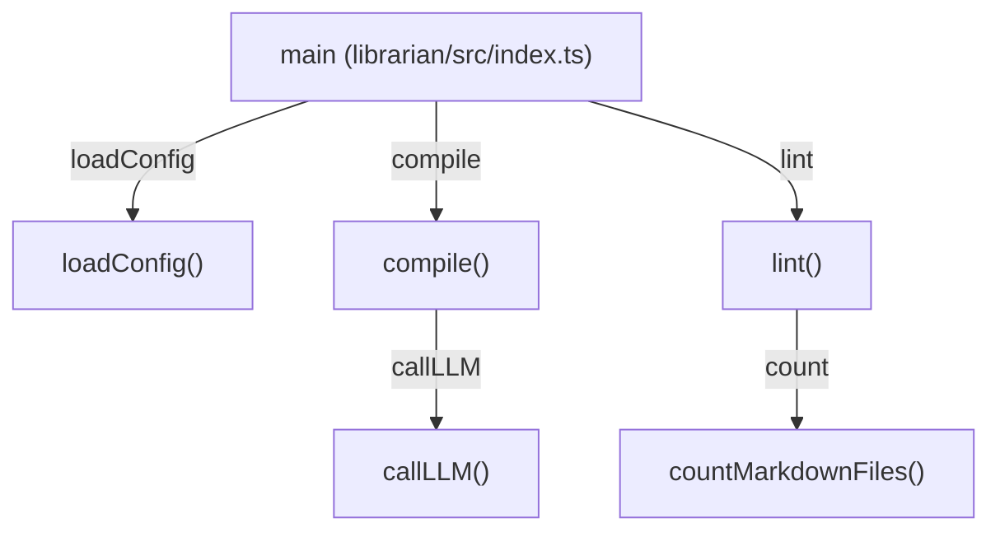

# Other — packages-vault-tools

# @aigency/vault-tools

Utilities for managing the **Aigency Mem_Brain** vault.
The package provides three core command‑line tools and a programmatic API:

* **compile** – transforms raw session notes into polished wiki articles using a configured LLM backend.
* **lint** – evaluates vault health (health score, wiki density, age) against configurable thresholds.
* **flush** – (stub) intended to sync session logs into a SurrealDB timeline table.

All tools share a common configuration model (`VaultConfig`) loaded from `config/vault.json` (or defaults).

---

## Table of Contents
1. [Installation & Build](#installation--build)
2. [Configuration (`VaultConfig`)](#configuration-vaultconfig)
3. [CLI entry points](#cli-entry-points)
4. [Programmatic API](#programmatic-api)
   - `compile(config, target?)`
   - `lint(config)`
   - `flush(config)`
5. [Internal workflow diagram](#internal-workflow-diagram)
6. [Testing & Coverage](#testing--coverage)
7. [Extending the module](#extending-the-module)

---

## Installation & Build

```bash
# From the monorepo root
pnpm install          # installs workspace dependencies
pnpm -C packages/vault-tools run build   # produces dist/
```

The `package.json` defines the following build scripts:

| Script | Purpose |
|--------|---------|
| `build` | Compiles `src/**/*.ts` to both ESM (`.mjs`) and CJS (`.js`) plus type declarations. |
| `dev`   | Watch mode – rebuilds `src/index.ts` on change. |
| `test`  | Runs unit tests with Vitest. |
| `typecheck` | Runs `tsc --noEmit` to verify type safety. |

---

## Configuration (`VaultConfig`)

```ts
export interface VaultConfig {
  vaultRoot: string;                     // Root of the vault (defaults to cwd)
  llmBackend: "mlx" | "llama_cpp" | "claude" | "openai";
  mlxEndpoint?: string;                  // e.g. "http://localhost:8080"
  tailnetNodes?: string[];               // Optional list of remote LLM nodes
  compilationModel?: string;             // Model identifier for compile pass
  lintThresholds: {
    minHealthScore: number;   // default 85
    minWikiDensity: number;   // default 0.70
    minVaultAgeDays: number;  // default 90
  };
}
```

*Defaults* are defined in `DEFAULT_CONFIG`.
`loadConfig(vaultRoot)` reads `config/vault.json` (if present) and merges it with defaults.

```ts
import { loadConfig } from "@aigency/vault-tools";

const cfg = loadConfig("/path/to/vault");
```

---

## CLI entry points

The `bin` field maps three executable commands to compiled binaries:

| Command | Source | Description |
|---------|--------|-------------|
| `vault-compile` | `src/bin/compile.ts` | Walks `raw/` markdown files, calls the LLM, writes `wiki/` output. |
| `vault-lint`    | `src/bin/lint.ts`    | Prints a JSON summary of `lint()` results. |
| `vault-flush`   | `src/bin/flush.ts`   | Placeholder – currently only logs a warning. |

All binaries import the public API from `dist/index.{js,mjs}` and therefore respect the same configuration loading logic.

---

## Programmatic API

### `compile(config: VaultConfig, target = "_global"): Promise<{ compiled: number; skipped: number }>`
* **Purpose** – Convert raw session markdown files into wiki articles.
* **Parameters**
  * `config` – Loaded `VaultConfig`.
  * `target` – Sub‑directory under `vaultRoot` (default `"_global"`). The function expects a `raw/` folder inside this target.
* **Process**
  1. Resolve `targetRaw = <vaultRoot>/<target>/raw` and `targetWiki = <vaultRoot>/<target>/wiki`.
  2. If `targetRaw` does not exist, the function returns `{ compiled: 0, skipped: 0 }`.
  3. Ensure `targetWiki` exists (`mkdirSync(..., { recursive: true })`).
  4. For each `*.md` file in `targetRaw`:
     * Skip if a corresponding wiki file already exists (`wiki-` prefix).
     * Read the raw note, build a prompt (`"Transform this raw session note into a wiki article:\n\n${raw}"`).
     * Call `callLLM(config, prompt)` (see below) to obtain the article.
     * Write the article to `targetWiki` with a `wiki-` filename.
  5. Return a count of compiled vs. skipped files.

* **Return value** – Object with `compiled` (newly generated articles) and `skipped` (already present).

#### `callLLM(config, prompt): Promise<string>`
* Internal helper that selects the appropriate LLM backend:
  * **Claude** – uses `@anthropic-ai/sdk`. Model `claude-sonnet-4-6`, system prompt `COMPILE_SYSTEM_PROMPT`.
  * **MLX / Llama_cpp** – sends a POST to `<endpoint>/v1/chat/completions` (OpenAI‑compatible) with the same system prompt.
* Returns the raw text content of the LLM response.

---

### `lint(config: VaultConfig): LintResult`
* **Purpose** – Compute a health score for the vault and decide whether it is ready for a “harvest” (e.g., publishing to HarvestMoon.sol).
* **Return type** – `LintResult` (see source for full shape). Key fields:
  * `healthScore` (0‑100)
  * `wikiDensity` (0‑1)
  * `vaultAgeDays`
  * `isHarvestReady` (boolean)
  * `breakdown` – detailed counts and lists of issues.

* **Algorithm Overview**
  1. Enumerate agent directories under `<vaultRoot>/agents`.
  2. For each agent, count markdown files in `raw/` and `wiki/` using `countMarkdownFiles`.
  3. Track agents missing `SOUL.md`, missing `RULES.md`, and agents that have raw files but no wiki files.
  4. Add global raw/wiki counts from `<vaultRoot>/_global`.
  5. Compute `wikiDensity = totalWiki / totalRaw` (capped at 1.0).
  6. Derive `healthScore`:
     * Start at 100.
     * Subtract 5 points per stale SOUL, 5 per missing RULES, 3 per agent without wiki.
     * Additional penalty if `wikiDensity` < 0.5 (‑20) or < 0.7 (‑10).
  7. Clamp score to 0‑100.
  8. Compute vault age from a hard‑coded genesis date (`2026‑04‑07`).
  9. Compare score, density, and age against `config.lintThresholds` to set `isHarvestReady`.

* **Helper** – `countMarkdownFiles(dir: string): number` recursively counts `.md` files, returning 0 if the directory does not exist.

---

### `flush(_config: VaultConfig): Promise<{ flushed: number }>`
* **Purpose** – Intended to ingest session logs into a SurrealDB timeline table.
* **Current state** – Stub implementation; logs a warning and returns `{ flushed: 0 }`.
* **Future work** – Wire up `@aigency/surreal` client, walk `agents/<callsign>/session-logs/*.md`, parse front‑matter, and insert deduplicated events.

---

## Internal Workflow Diagram



*The diagram shows the two primary execution paths from the top‑level `main` function:*
* **Compile path** – `main` → `compile` → `callLLM`.
* **Lint path** – `main` → `lint` → `countMarkdownFiles`.

---

## Testing & Coverage

* **Unit tests** – located in `src/index.test.ts`. The only test asserts that the module exports correctly.
* **Vitest configuration** – defined in `vitest.config.ts`. Coverage is collected for all source files except tests, type declarations, the `dist` folder, and CLI binaries.
* **Coverage thresholds** – enforced by external CI scripts (`scripts/automation/coverage-check.sh`). Adjust thresholds in `package.json` scripts if needed.

Run tests locally:

```bash
pnpm -C packages/vault-tools run test
pnpm -C packages/vault-tools run test:coverage
```

---

## Extending the Module

### Adding a new LLM backend
1. Extend `VaultConfig.llmBackend` union type.
2. Implement a branch in `callLLM` that prepares the request for the new service.
3. Update `package.json` dependencies if a new SDK is required.

### Implementing `flush`
* Install `@aigency/surreal` (or the appropriate SurrealDB client) as a dependency.
* Replace the stub with logic that:
  1. Recursively scans `agents/*/session-logs/*.md`.
  2. Uses `gray-matter` (already a dependency) to parse front‑matter.
  3. Generates a deterministic hash of the file content for deduplication.
  4. Calls `SurrealClient.insert` (or equivalent) to add rows to the `timeline` table.
* Add integration tests that mock the Surreal client.

### Custom lint thresholds
Consumers can provide a `config/vault.json` with an overridden `lintThresholds` object:

```json
{
  "lintThresholds": {
    "minHealthScore": 90,
    "minWikiDensity": 0.75,
    "minVaultAgeDays": 120
  }
}
```

The `loadConfig` helper merges these values with defaults, so no code change is required.

---

**End of documentation**