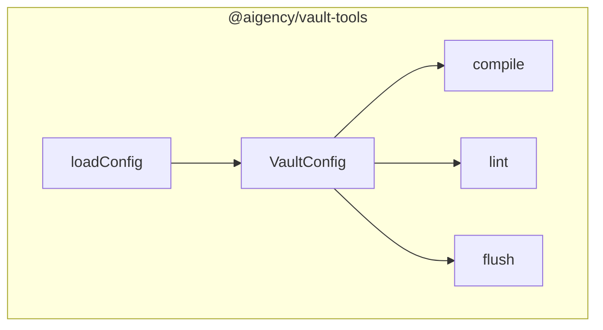

# Vault Tools

# Vault Tools

A TypeScript utility library for working with **Aigency Vault** projects. It provides a thin wrapper around the original Python scripts, exposing compile, lint, and flush operations as well as configuration loading utilities.

---

## Table of Contents

- [Installation](#installation)
- [Overview](#overview)
- [Public API](#public-api)
  - [`compile`](#compile)
  - [`lint`](#lint)
  - [`flush`](#flush)
  - [`loadConfig`](#loadconfig)
  - [`VaultConfig`](#vaultconfig-type)
- [Usage Examples](#usage-examples)
- [Integration Points](#integration-points)
- [Contributing](#contributing)

---

## Installation

```bash
npm install @aigency/vault-tools
# or with Yarn
yarn add @aigency/vault-tools
```

The package is pure TypeScript and has no runtime dependencies beyond the Node standard library.

---

## Overview

The **Vault Tools** module centralises the three core lifecycle steps of an Aigency Vault project:

1. **Compilation** – Transforms source files into a deployable bundle.
2. **Linting** – Runs static analysis and returns a structured result.
3. **Flush** – Cleans up generated artefacts (e.g., build directories, temporary files).

In addition, it supplies a helper to load the project's configuration (`VaultConfig`) from a JSON/YAML file.

All functions are exported from the package entry point (`src/index.ts`) and are deliberately side‑effect free except where the underlying script performs I/O (e.g., writing compiled files or deleting directories).

---

## Public API

### `compile`

```ts
export function compile(config: VaultConfig, options?: CompileOptions): Promise<void>;
```

- **Purpose**: Executes the compilation step using the supplied `VaultConfig`.
- **Parameters**:
  - `config` – The fully resolved configuration object (see `VaultConfig`).
  - `options` – Optional flags such as `watch`, `outputDir`, or `verbose`. The exact shape is defined in `./compile.ts`.
- **Returns**: A `Promise` that resolves when the compilation process finishes. Errors are propagated as rejected promises.
- **Side Effects**: Writes compiled artefacts to the output directory defined in `config` or `options`.

### `lint`

```ts
export function lint(
  config: VaultConfig,
  options?: LintOptions
): Promise<LintResult>;
export type LintResult = {
  errors: Array<{ file: string; line: number; message: string }>;
  warnings: Array<{ file: string; line: number; message: string }>;
  passed: boolean;
};
```

- **Purpose**: Runs the linting pipeline against the source files described by `config`.
- **Parameters**:
  - `config` – The project configuration.
  - `options` – Optional linting flags (e.g., `fix`, `strict`). Defined in `./lint.ts`.
- **Returns**: A `Promise` that resolves to a `LintResult` object summarising errors, warnings, and overall pass/fail status.
- **Side Effects**: May modify files if `options.fix` is enabled.

### `flush`

```ts
export function flush(config: VaultConfig, options?: FlushOptions): Promise<void>;
```

- **Purpose**: Removes generated artefacts (build directories, caches, temporary files) associated with the given `config`.
- **Parameters**:
  - `config` – The project configuration.
  - `options` – Optional flags such as `dryRun` or `preserveLogs`. Defined in `./flush.ts`.
- **Returns**: A `Promise` that resolves when cleanup completes.
- **Side Effects**: Deletes files/directories on the filesystem.

### `loadConfig`

```ts
export function loadConfig(
  path: string,
  overrides?: Partial<VaultConfig>
): Promise<VaultConfig>;
```

- **Purpose**: Reads a configuration file (JSON, YAML, or JS module) and returns a fully typed `VaultConfig` object.
- **Parameters**:
  - `path` – Absolute or relative path to the config file.
  - `overrides` – Optional partial configuration that will shallow‑merge over the loaded file.
- **Returns**: A `Promise` that resolves to a `VaultConfig`.
- **Side Effects**: Performs file I/O; throws if the file cannot be parsed.

### `VaultConfig` (type)

```ts
export type VaultConfig = {
  rootDir: string;               // Base directory of the vault project
  srcDir: string;                // Directory containing source files
  outDir: string;                // Destination for compiled artefacts
  lintRules?: string[];          // Optional list of lint rule identifiers
  compileOptions?: { ... };      // Provider‑specific compile options
  // ...additional fields defined in ./config.ts
};
```

- **Description**: A strongly‑typed representation of the project's configuration. It is the single source of truth for all other utilities.

---

## Usage Examples

### Basic workflow

```ts
import {
  compile,
  lint,
  flush,
  loadConfig,
  type VaultConfig,
} from "@aigency/vault-tools";

async function runVaultPipeline() {
  // Load configuration (e.g., ./vault.config.json)
  const config: VaultConfig = await loadConfig("./vault.config.json");

  // Lint the source tree
  const lintResult = await lint(config);
  if (!lintResult.passed) {
    console.error("Lint failed:", lintResult.errors);
    process.exit(1);
  }

  // Compile the project
  await compile(config, { verbose: true });

  // Optionally clean up after a successful build
  await flush(config, { dryRun: false });
}

runVaultPipeline().catch(err => {
  console.error("Vault pipeline error:", err);
  process.exit(1);
});
```

### Using overrides

```ts
const config = await loadConfig("./vault.config.json", {
  outDir: "./dist/custom",
});
await compile(config);
```

---

## Integration Points

- **CLI wrappers** – The module is intended to be consumed by command‑line scripts (e.g., `vault-compile`, `vault-lint`). Those scripts simply import the functions and forward CLI arguments to the appropriate options objects.
- **CI pipelines** – In CI environments, `lint` and `compile` can be invoked as part of a build step. The `flush` utility is useful for cleaning up workspace artefacts between jobs.
- **IDE extensions** – Because `lint` returns a structured `LintResult`, IDE plugins can map errors directly to editor diagnostics.

The module does **not** depend on any other internal packages, nor does it expose any outgoing calls. It is a leaf node in the dependency graph.

---

## Architecture Diagram



*The diagram shows the flow of data: `loadConfig` produces a `VaultConfig`, which is then consumed by `compile`, `lint`, and `flush`.*

---

## Contributing

1. **Clone the repository** and install dependencies:

   ```bash
   git clone https://github.com/aigency/vault-tools.git
   cd vault-tools
   npm install
   ```

2. **Run tests** (the project includes a Jest suite):

   ```bash
   npm test
   ```

3. **Add or modify functionality** in the individual modules (`compile.ts`, `lint.ts`, `flush.ts`, `config.ts`). Keep the public API surface limited to the functions exported from `src/index.ts`.

4. **Update documentation** in this file whenever you change signatures or behaviour.

5. **Submit a Pull Request** with a clear description of the change and any relevant test coverage.

---

*End of documentation.*